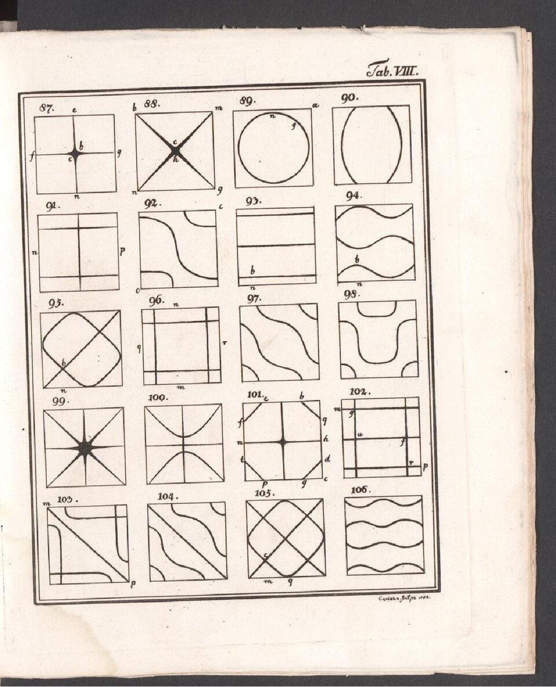

# §3 · #4 — Topology and Musical Resolution

<!-- reader-navigation -->
Movement 29 of 48 · [This room](../ROOM-04-mathematical-substrate.md) · [← Previous](28-s3-p3-projective-dimensional-reframing.md) · [Next →](30-s3-p5-arche-topos.md)
<!-- /reader-navigation -->

## Claim

Topology and music give two **distinct exact forms of return through retained difference**. A torus can carry local closure while a lift retains global displacement; a selected musical span can be completed by an exact multiplicative interval. The essay coordinates these operations as spatial and temporal articulations of the same QL return while preserving what each mathematics actually establishes.

## Toroidal circulation — exact topology first

The torus is the essay's primary kinetic image of retained return because circulation, winding, displacement and local recurrence coexist there. Its mathematical structure is standard:

$$
\mathbb{T}^{2}=\mathbb{R}^{2}/\mathbb{Z}^{2},
$$

with opposite edges of a fundamental square identified. The quotient has two independent generating cycles. Its Euler characteristic is

$$
\chi(\mathbb{T}^{2})=0,
$$

and its fundamental group is

$$
\pi_1(\mathbb{T}^{2})\cong\mathbb{Z}\times\mathbb{Z}.
$$

Within the classification of closed connected orientable surfaces, `χ=0` corresponds to genus one. The fundamental group records the two independent winding directions and their integral combinations. These are ordinary topological facts with their own standing.

The covering projection `π: ℝ² → T²` gives the operation that matters most to the essay. A loop that closes on the torus can lift to a path whose endpoint differs from its start by an integer vector `(m,n)` on the covering plane. **Local closure and retained global displacement therefore coexist exactly.** Rational-slope linear flows can be periodic; irrational-slope flows can wind densely. Return need not mean retracing or erasing the passage.

<!-- figure:torus-path-winding-and-return -->

![Left, the covering plane with its integer lattice and the straight path from the origin to the point two, minus one; the endpoints differ in the plane. An arrow labelled quotient by whole-number steps leads to the unit square on the right, where the same path appears as two parallel segments, from the top-left corner to the middle of the right edge and from the middle of the left edge to the bottom-right corner. All four corners are one point of the torus, so the path closes; its winding class, two turns one way and one back, is retained. Beneath, two linear flows drawn in the unit square: with rates in the ratio three to two the path closes at time one; with rates in the ratio one to the square root of two it never closes and keeps filling the square.](../../../symbolon/matheme/diagrams/torus-path-winding-and-return.svg)

*Diagram 12 — A return that keeps its winding.* The path `γ(t)=[2t,−t]` runs straight in the covering plane from `(0,0)` to `(2,−1)` and closes on the torus `T²=R²/Z²`, where it appears as two segments leaving one corner point and returning to it. The endpoints differ in the plane and coincide on the torus, and the winding pair `(2,−1)` stays with the loop. A linear flow `[αt,βt]` returns exactly when some `T>0` makes both `Tα` and `Tβ` integers: the ratio 3:2 returns at `T=1`, and the ratio `1:√2` never does. **Status: Derived.** Source of record: the essay's display in `§3 · #4`; [[symbolon/episteme/sources/mathematics-logic/hatcher/hatcher-2002-algebraic-topology/hatcher-2002-algebraic-topology|Hatcher, Algebraic Topology]], chapter 1. *Original work for this essay; no third-party imagery.* [Record](../../../symbolon/matheme/diagrams/torus-path-winding-and-return.md)

<!-- /figure:torus-path-winding-and-return -->

The usual polygon presentation of an orientable genus-`g` surface uses `4g` boundary sides before identification and `2g` fundamental generators. At `g=1` this gives the suggestive count `4+2`. QL adopts that as an **Offered structural correspondence**. Its mathematical office is the exact genus-one presentation; the native binary self-relation remains the derivation of the QL sixfold.

The same discipline governs the authorial `∞/0` reading. The infinite covering plane and compact quotient provide an exact relation between infinitely many representatives and determinate points on a zero-Euler-characteristic surface. The essay appoints this as the canonical topological carrier of `∞/0`; that appointment is its own interpretive use of the exact cover/quotient relation.

## Magnetic confinement — a physical witness with its own laws

[[section-rooms/arguments/A17-Toroidal-Circulation-and-the-Arche-Topos|The tokamak]] makes toroidal circulation physical. A toroidal chamber avoids the open axial ends of a straight vessel. Toroidal and poloidal magnetic-field components combine into helical field lines; charged particles tend to follow those lines, helping confine plasma away from material walls.

<!-- figure:tokamak-chamber-and-magnetic-fields-schematic -->

*Image 18 — A tokamak chamber and its magnetic fields.* A schematic of a tokamak chamber and its magnetic fields. Coils around the torus produce the toroidal field, a current in the plasma and the poloidal coils produce the poloidal field, and the two sum to a helical field that winds round the torus. It is a physics-journal schematic of the apparatus the record cites from ITER, not an engineering drawing; the torus parametrisation below is the record's geometric model. Credit: R. A. Pitts, R. J. Buttery and S. D. Pinches, "Fusion: the way ahead," *Physics World* 19, no. 3 (2006): 20. CC BY 4.0. [Record](../../../symbolon/matheme/topology/toroidal-poloidal-confinement.md)

<!-- /figure:tokamak-chamber-and-magnetic-fields-schematic -->

The physical claim is exact and bounded: **organised circulation on a toroidal geometry can make sustained confinement possible under specified physical dynamics**. The essay receives that operation as a physical articulation of retained circulation. Other stable processes may have other geometries, and metaphysical generativity remains the authorial interpretation of the wider field rather than a theorem of plasma physics.

## Numerical and trigonometric neighbours

Several exact elementary identities cluster around six:

$$
1+2+3=1\cdot2\cdot3=6,
$$

and

$$
0+1+2+3=6,\qquad 0\cdot1\cdot2\cdot3=0,\qquad 6\equiv0\pmod6.
$$

Likewise the `3–4–5` right triangle satisfies `3²+4²=5²`, has area `6` and perimeter `12`. Standard trigonometry commonly presents six named functions, with sine/cosine primary and the others defined by reciprocals or quotients. These are genuine facts. Their arrangement as a QL `2+4` family or a sixfold symbolic plate is **Offered mathematical amplification**. The plate earns its place where the generating operations remain visible beside the numerical resonance.

## Musical resolution — exact intervals, interpreted return

The harmonic reading begins from exact interval identities:

$$
\frac{16}{9}=\left(\frac43\right)^2,
\qquad
\frac{3/2}{4/3}=\frac98,
\qquad
\frac{16}{9}\cdot\frac98=\frac21.
$$

In standard just/Pythagorean ratio language, `4/3` and `3/2` name fourth and fifth relations and `2/1` the octave; `9/8` is a whole-tone ratio in the relevant tuning context. QL reads the selected `16/9` span as an incomplete return whose exact complement to the octave is `9/8`. The arithmetic establishes the factor; **remainder, cadence and return** name the essay's interpretation of that exact relation.

<!-- see-figure:gaffurio-1492-pythagoras-and-the-ratios -->*See also Image 9, [Gaffurius, Pythagoras and the ratios](../../../symbolon/episteme/histories/traditions-and-disciplines/ancient-philosophy/HISTORY-ancient-philosophy.md).*<!-- /see-figure:gaffurio-1492-pythagoras-and-the-ratios -->

Music is powerful here because relation is perceptually primary. A pitch can be specified by frequency, an interval by ratio, and consonance/dissonance by relations among sounding components under a tuning and listening context. Cadence returns to a tonal centre while retaining the temporal path by which the return was heard. The exact ratios give this lived temporal relation a quantitative surface; the phenomenology of resolution gives the factor a different, experiential office.

<!-- figure:pythagorean-comma-fifths-and-octaves -->

![Left, the pitch-class circle, pitch reduced by whole octaves, with twelve equal steps ticked around it. Twelve pure fifths, each three halves, are plotted as a chain of points with chords; the twelfth lands a little beyond the starting point, and the red arc between them is the comma. Right, the same journey lifted to pitch height: seven octaves and twelve fifths drawn as two bars that differ by a sliver, then magnified on a ruler to show twelve fifths at 7.0196 octaves against seven octaves at exactly seven. The residual is 531441 over 524288, about 1.01364, or 23.46 cents, and it is not the whole tone nine eighths. Beneath, twelve-tone equal temperament closes exactly with twelve steps of two to the power one twelfth, its fifth being 700 cents against 701.955 for the pure fifth.](../../../symbolon/matheme/diagrams/pythagorean-comma-fifths-and-octaves.svg)

*Diagram 13 — Twelve fifths, seven octaves, one comma.* Twelve pure fifths overshoot seven octaves. On the pitch-class circle the chain of fifths lands past its start; lifted to pitch height it lies above seven octaves by `(3/2)¹² / 2⁷ = 531441/524288 ≈ 1.01364`, 23.46 cents, the Pythagorean comma, which is distinct from the whole tone `9/8`. Twelve-tone equal temperament closes after twelve steps of `2^(1/12)`, and its fifth, 700 cents, departs from the pure 701.955. **Status: Derived.** Source of record: the essay's display in `§3 · #4`; [[symbolon/episteme/sources/mathematics-logic/scholtz/scholtz-1998-algorithms-diatonic-keyboard-tunings/scholtz-1998-algorithms-diatonic-keyboard-tunings|Scholtz, Algorithms for Mapping Diatonic Keyboard Tunings]]. *Original work for this essay; no third-party imagery.* [Record](../../../symbolon/matheme/diagrams/pythagorean-comma-fifths-and-octaves.md)

<!-- /figure:pythagorean-comma-fifths-and-octaves -->

## Warrant — space and time as bounded disclosures

Topology and music disclose different operations:

- the torus/cover relation shows a path closing locally while retaining winding or displacement;
- the selected musical ratios show one span completed by a determinate multiplicative interval.

The essay coordinates them as spatial and temporal forms of **return through retained difference**. Their exactness is what makes the comparison disciplined: winding class and musical interval remain different objects while each demonstrates a determinate way in which return can preserve what happened along the way.

Cymatics supplies a further material bridge under specified boundary conditions: standing waves can produce visible nodal patterns in a driven medium. A sounded dynamic and a visible pattern can therefore be different measurements of one physical process. This gives later nāda/Vāk and Expression comparisons a real physical neighbour while conscious, symbolic and physical registers retain their distinct operations.

<!-- figure:chladni-1787-tab-viii-square-plate-figures -->

*Image 10 — Chladni, nodal figures of a square plate.* Plate VIII of Chladni's *Entdeckungen* (1787): the nodal figures of a square plate, numbered 87 to 106. Each square shows the nodal lines, where sand collects, for one mode of the plate. They are the further observables the record separates from the one-dimensional string mode it derives: a plate has its own equation and boundary conditions. Credit: Ernst Florens Friedrich Chladni, *Entdeckungen über die Theorie des Klanges* (Leipzig: Weidmanns Erben und Reich, 1787), Tab. VIII; page 95 of the digitised copy on Wikimedia Commons. Public domain. [Record](../../../symbolon/matheme/harmonics/cymatics-standing-waves.md)

<!-- /figure:chladni-1787-tab-viii-square-plate-figures -->

[Homologia / Analogia](../../../symbolon/episteme/etymologies/homology-and-analogy/WHOLE-FIELD-homology-and-analogy.md#e5-whole-returns) **qualifies** the coordination through what each exact witness preserves. The lifted torus path retains a homotopy/winding class rather than every detail of the journey. The musical product retains `9/8` as the factor completing the selected `16/9` ratio to `2/1`. **Their comparison is the authorial return through difference:** exact preservation in one register becomes comparable to exact preservation in another without converting vector displacement into musical interval.

## Tension / limit

Each local result keeps the law by which it is true: `χ=0` is Euler characteristic, `4g+2g` is the genus presentation count, tokamak confinement is a physical consequence of specified magnetic dynamics, and the interval identities are multiplicative ratios in a tuning context. **The synthesis begins after those truths have been secured, not by weakening them.** QL coordinates their different forms of closure, remainder, circulation and completion into a larger claim about return through retained difference.

## Transition

The station has now accumulated several rigorously distinct ways of carrying a relation through transformation: differential underdetermination, declared QL traversal, complex phase, changed formal frame, winding on a quotient and harmonic completion. §3 · #5→0 can therefore name their **coordinating authorial field**: [[30-s3-p5-arche-topos|§3 · #5→0 — The Arche-Topos]]. Mathematics has supplied exact local operations; the Arche-Topos names the QL field through which the essay reads their relation.

The [mathematics history](../../../symbolon/episteme/histories/traditions-and-disciplines/mathematics/DEVELOPMENT-mathematics.md#4--commensuration-makes-a-remainder-consequential) **historicises** a distinct musical remainder. The exact completion `16/9 · 9/8 = 2` differs from the Pythagorean comma produced by twelve fifths versus seven octaves, `531441/524288`. Temperament redistributes the latter discrepancy according to a selected criterion. These are different mathematical/musical remainders and should not be merged under one poetic word.

