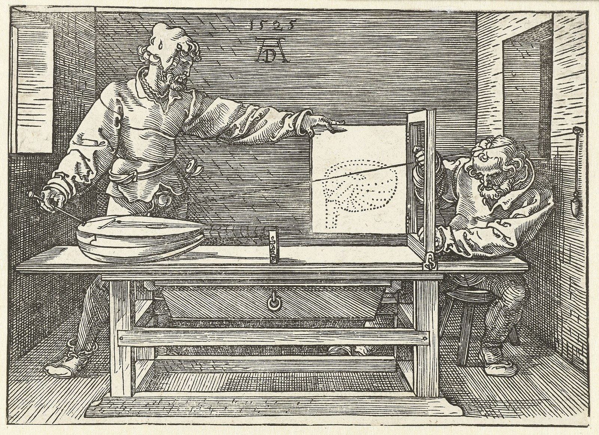

# §0/1 · #4 — Gebserian Diaphaneity

<!-- reader-navigation -->
Movement 05 of 48 · [This room](../ROOM-00-integral-threshold.md) · [← Previous](04-s01-p3-formal-limit-genealogy.md) · [Next →](06-s01-p5-return-zero.md)
<!-- /reader-navigation -->

## Claim
Integral reason is the higher mutation in which the mental-rational structure, whose perspectival achievement built a world from a position, becomes transparent to its origin, its limits and its co-presence with the other structures of consciousness. Its achievement is retained and the position that made it possible comes into view. At **#4**, the position QL names Context, the integral works by contextualising: each way of knowing appears within the circumstances of its use, which voids its claim to stand outside every context. Supermind is the constant passage between **#4** and **#5**, in which a person identifies as the totality of the mutations, and `5→0` is identification with and as the Origin. Here the structures are read as an anatomy of Objective Internality, Life / Mind, each a household of the mind with its own economy of credit, and the movement argues that the Internet and AI make contextuality operative: the conditions through which intelligence acts become elements of the field itself, which demands a diaphanous relation to context.

## Warrant
Perspective is the historical medium. To paint a room in perspective, an artist first decides where it is seen from, and every other decision follows: the far wall shrinks in proportion to its distance, the floor's edges converge on a point on the horizon, and every line runs toward a vanishing point that holds nothing and organises the count of the scene. [[diaphaneity|Jean Gebser]] reads Giotto's weighted bodies, Petrarch's landscape, Alberti's visual pyramid and Leonardo's work as a mutation in how people stood toward their world, in which Mind acquired a method for plotting positions from positions, so that a building could be planned and an instrument aimed before anything was built. A finished picture can conceal the position that made it precise and present a view from somewhere as how things are, and the movement joins this to the reading of Descartes: whoever looks remains involved in producing the view.

<!-- figure:durer-1525-draughtsman-drawing-a-lute -->

*Image 1 — Dürer, the draughtsman and the lute.* Albrecht Dürer's woodcut of a draughtsman drawing a lute (1525), from his book on measurement. A cord from the lute passes through a frame to a fixed point, and each point it marks on the frame is transferred to the sheet. This is perspective as an apparatus: one eye-point, one plane, and the lute reduced to what that position can record. Gebser's account of the perspectival world rests on this operation. Credit: Albrecht Dürer, *Man Drawing a Lute*, 1525, woodcut, from *Underweysung der Messung*; Rijksmuseum, Amsterdam (RP-P-OB-1491). CC0 1.0. [Record](../../../symbolon/episteme/histories/traditions-and-disciplines/zero-subject-advent/HISTORY-zero-subject-advent.md)

<!-- /figure:durer-1525-draughtsman-drawing-a-lute -->

Heidegger names the same mutation from inside Western metaphysics, and the pairing sharpens both diagnoses. "The Age of the World Picture" argues that the modern age is defined by a change in how beings as a whole become present: "world picture, when understood essentially, does not mean a picture of the world but the world conceived and grasped as picture"; "the fundamental event of the modern age is the conquest of the world as picture"; and world-becoming-picture is "one and the same event" as "man's becoming subiectum in the midst of that which is" (Lovitt trans., 1977, pp. 129, 134, 132 — locators under print collation). What Gebser reads in Giotto's depth and Alberti's pyramid as the perspectival fixing of a sector, Heidegger reads as *Vorstellen*, representing: the setting of the world before a subject who measures it. Each supplies what the other withholds, Gebser the art-historical body and the integral future, Heidegger the metaphysical mechanism and the technological consequence, the world ordered as *Bestand*, standing-reserve. At the apex of Alberti's pyramid the eye is the knower made into a place, and the notation writes that place as `Ø`, the crossed zero, so that the slash through which a world is seen fuses with the one who sees and the picture's means pass for its source (defined at M04, returned to here). Jorjani's reading of technoscience through two titans carries the event into myth: Atlas is the world-bearing and world-picturing power, the perspectival picture is Atlas's burden, and Prometheus, the forethinking fire, is what made the picture possible. Thought's fire can consume the notion of *the world*, a category, and what survives is worldhood, the relation in which anything becomes a world for someone; Atlas can then set the sky down, and §3 answers with an atlas of charts.

Gebser came to the question as a poet through repeated displacement, and Jung explains why mutations surface in art first: the artist's unsatisfied yearning reaches back to the primordial image that compensates the one-sidedness of the present, and the new way of painting is a new way of learning to see. Sri Aurobindo pursued the same transformation within the struggle for Indian independence, and his **Supermind** names a knowledge in which the One's differentiation into the Many proceeds through self-knowledge; Gebser set it beside the integral in his preface of 1966 and Mohrhoff developed the comparison. At Sarnath in 1961 Gebser met **primordial trust** (his letter, discussed by Feuerstein), with *pratyabhijñā* and *samāveśa* as its Śaiva names. Of the four terms defined at M03, he met trust in its pure form: *fides*, the reliance already in force before any arbitration, from which *credere*, entrustment renewed once an undertaking has returned its consequences, can be given. Our language of knowing is economic from the start (credit, claim, account, value), and every belief draws on a credit it did not create and takes credit for the truth it borrows. Primordial trust reverses the direction of the account: the reality an explanation was asked to guarantee was already sustaining the asking.

Gebser distinguishes five structures, **archaic, magical, mythical, mental and integral**, easiest to feel in a single life (the infant, the small child, the child of stories, the arguing adolescent, the adult who at best holds all of these at once), and they carry the QL positions in order. Archaic consciousness is undifferentiated participation in the Origin, zero-dimensional (**#0**). Magical consciousness is point-like participation in which a name or a lock of hair shares in its referent by sympathy, with sensation leading and *mana* as the energy of that world, and it is the first home of the matheme (**#1**). Mythical consciousness makes powers distinguishable through their relations and transformations, with feeling leading and the told story as the means of knowing, and it is the first home of the mytheme (**#2**). Mental-rational consciousness makes inherited forms available to explicit examination, gives a person a definite position from which to judge, and is the first home of the episteme; Gebser's distinction of the **arational**, which respects measure and is free of it, from the irrational is how it meets its own thresholds (Russell's paradox, Gödel's sentence, the hard problem) as the first step toward a victory (**#3**). Integral consciousness requires these ways of knowing to be co-present in their operation, and Gebser calls that co-presence diaphaneity, a showing-through (**#4**). Giegerich names the severity of the shift as a birth out of the world of inherited meaning, and the essay's name for its situation is post-symbolic exposure. At **#4** the *legein* inside *Logos*, to gather, is recovered: a Logos that only cuts has forgotten its gathering, which Jung's pairing of Logos with Eros says again, and Gebser's aperspectival and arational follow from the recovery.

Bergson's **durée** and Husserl's **sedimentation** account for the thickness of phenomenal experience: duration thickens it across moments and sedimentation across generations, and the mutations stack as lamination (Bratton's "not a monad but a lamination"), so that a magical reflex, a mythic loyalty and a mental argument can act in one gesture. Gebser's time-freedom releases the exclusive rule of any one temporal form.

Structures are also economies. *Oikonomia* concerns how a household sustains its differentiated members and what becomes of the powers apportioned among them, and *nemein*, to distribute, with *legein*, to gather, gives economy and ecology as two gestures of one household. A coin is a `0/1`: the blank disc is the ground, the die strikes a determination into it, and current value is the relation; a token points past itself to a trust already extended, and interest prices the between itself, the slash, counting it to one side (`(+1)−(−1)=+2` for the lender, `(−1)−(+1)=−2` for the borrower). Divine economy is syn-ballein, `(0/1)/(1/0)`, and Śiva and Śakti are Mono and Poly. Diabolical economy is dia-ballein: its polar form `(−1)/(+1)` holds two parties across a relation both depend on, and its collapsed form cancels them into `0` or lets one count the whole span as its own. *Monopoly* shows the inversion in its etymology (the One standing where the many should be, facing only what is sold), and Aristotle's Thales is the first instance. In the VOC appropriation took institutional form (a trading monopoly joined to the powers of a state), and the mythemic figures (Lucifer as the light that keeps discrimination and loses love, Cain as getting) are read through the same arithmetic. A counterfeit economy is un-dual, un-finite and breeds money as *tokos*; `Ø` is the mark of *hamartia*, and whoever stamps their own ground becomes the first mark of their own con, the **I-Deal**. Evil is coherent as an operation: a part that stops struggling toward the whole and claims to be it, the `1` playing the `0`, which Jung reads against *privatio boni* and finds in the Antichrist as the shadow of the Self (Nietzsche's marketplace, *In God We Trust*, *Schuld* as debt, the wealth gap, Thiel on Girard). Integration is the answer, practised by Aurobindo under colonial rule and posed to the God-image by Jung's *Answer to Job*.

Consciousness research shows every operation of dia-ballein at work. In public, testimony to unusual experience met cancellation, `(−1)+(+1)=0`; in private, institutions that cancelled it studied the malleability of consciousness and kept the whole span, `(+1)−(−1)=+2`, while the subject, entered as the mirror, bore the cost, `(−1)−(+1)=−2`. Cases include MKULTRA's depatterning (which writes a crossed zero into a person, with the archive itself depatterned before the 1977 Senate could read it, and the House task force reopening the matter on 30 June 2026), remote viewing as a test of the capacity Gebser counts among the magical structure, *From PSYOP to MindWar* (the polar axis drawn across a population), the Temple of Set, and the Epstein materials, including the 2017 proposal to make Epstein an "empirical experiment". These make visible a **reality asymmetry**: one population's testimony is disqualified while another institution reserves the right to investigate and weaponise the conditions of it. Jung's **psychic facticity** is the discipline that answers it: before deciding whether a dream or presence corresponds to an independent object, something happened in and to a life, and experience, report, symbolic articulation and causal explanation are different evidential acts, so the experience can be received in full while its ontology stays open. Aurobindo's *Record of Yoga* shows what a science beginning from that side looks like. An institution that controls the aperture while withdrawing its own position from scrutiny plays the `0`; the Epstein redactions invert their professed purpose, and secrecy becomes authority.

Context includes Objective Internality once that layer is unveiled, and the movement places the table at the centre of its argument. QL positions carry Gebser's dimensions (**#0** Ground, archaic; **#1** Definition, magical; **#2** Dynamis, mythical; **#3** Pattern, mental-rational; **#4** Context, integral; **#5** Quintessence, supramental; `5→0` the Möbius return), with `?/!` as the glyph of the `0/1` row. **Context** after **Pattern** has an exact geometry: at **#3** the triangle's internal angles sum to 180 degrees, at **#4** the square's *double* to 360, and a square decomposes into two triangles in co-opposition, so context requires at least two perspectives, the favouring and the unfavouring chiralities. Apoha is the phantom other portion lying outside the frame, and the second triangle haunts a one-sided perspective as its shadow (the Kabbalistic star), so integral understanding is shadow-aware and shadow-inclusive. *Textus*, *contexere*, weaving, give the integral attitude of **being with the text**, a withness of texts that traces resonances between ways of seeing, and Self-Knowledge is the prerequisite that gathers the others; its personal image is the elder, the *senex* at his best. In-formation (*informare*, to give form; *informis*, formless) joins the in-forming of Objective Internality to Subjective Immediacy as its formless *in*, and algorithmic platforms organise internality objectively (Facebook's ranking weighted emoji reactions at five times a "like" from 2017). *Technē*, from the root \*teks-, weaving, is theory become praxis and the weaving of in-formation, and Heidegger read it as revealing hardened into enframing, *Gestell*. Context engineering for AI builds an Objective Internality for a machine, which is the hallmark of the integral turned into a technical concern, and its threshold is the shadow: *ransom* is *redemptio*, and secrets are banked accounts that accrue interest. **Regard**, a looking back through any judgment toward its context, persons and exclusions, is what stands against misuse. Fire and light can be counterfeited: Baudrillard's simulacrum is the `1` occupying the place of the whole `0/1` relation, with Jung's *sol niger* and *antimimon pneuma* as its archetypal names, and the failure of technē that keeps Mind and World stable is a *krisis*. Stained glass answers it: one light entering a differentiated medium appears as many colours, and a **symbolon** works the same way. Wholeness, in the Germanic family *hāl* (whole, holy, health, heal), is the capacity of organs to remain different while taking part in one life, and truth is what an account carries through transformation; QL, through syn-ballein and through dia-ballein read as diagnosis, inverts a determination so that its hidden conditions become available and asks whether it still **runs true**.

## Tension / limit
Heidegger's and Gebser's diagnoses arose independently, and no documented exchange between them has been established: the twinning is the essay's own (**Argued**), and the *Ever-Present Origin* index check is held as intake work. Jorjani's reading of Atlas and the end of "the world" as the end of a category, the Dutch student corps as feeding the financial and industrial establishment, and the Sicilian Mafia as the paradigm of a household taken as possession are the author's own characterisations, and the movement's footnotes say so; none has a source house yet. Every cross-register bridge carries a declared claim status and names the operation shared across distinct objects, and "same problem" licenses comparison only at that stated level. Receiving an experience as a psychic fact leaves its metaphysics open, and that openness preserves the experience for further inquiry. MKULTRA, Stargate, MindWar, Temple of Set and Epstein cases are carried by their sources (Torbay, the Senate hearing, Kinzer's House testimony, Vallely and Aquino, the released records), and the dia-ballein reading of them is the essay's amplification.

## Anchor and transition
**Image:** one light refracted through a differentiated medium, so that the prism becomes visible in the colour it makes possible. **Relational anchor:** a perspective can become transparent to the context that makes its seeing possible without ceasing to see. Handed forward is the question which sign can position the unobjectifiable, opening [[06-s01-p5-return-zero|§0/1 · #5→0 — The Return to Zero]].

The [complete stained-glass whole](../../../symbolon/mytheme/worlds/frank-taylor/stained-glass-refraction/WHOLE.md#stained-glass-projection) **figures** this contextual turn through light, pane, seam, projected image and situated viewer. Its source distinctions stay visible in the resulting display, and recognition returns through the apparatus without completing an exhaustive picture. The [travelling-jigsaw whole](../../../symbolon/mytheme/worlds/frank-taylor/travelling-jigsaw-atlas/WHOLE.md#jigsaw-atlas-return) **figures** the promissory note the movement leaves for §3, the atlas of charts: the initial box-lid whose picture fixes every later placement opens the promise of reconstructive picturing without renouncing the local picture.

Its perspectival turn **returns-to** [Con-text-through-Diaphaneity → Regard](../../../symbolon/episteme/etymologies/arbitration-hybris-regard-anamnesis/WHOLE-FIELD-arbitration-hybris-regard-anamnesis.md#con-text-through-diaphaneity) as the viewer becomes readable within the conditions of the view. Delineation-through-Difference keeps the frame and its exclusions explicit, and Regard makes this disclosure consequential for judgment. More visible context can leave a measure unchanged, so the return must reach the office able to reconsider that measure. Generated relations are authorial developments, with Gebser's historical warrant kept distinct.

The [zero–subject history](../../../symbolon/episteme/histories/traditions-and-disciplines/zero-subject-advent/DEVELOPMENT-zero-subject-advent.md#2--the-seeing-condition-becomes-a-represented-centre) **compares** this return. Gebser's cultural account of perspective and Heidegger's diagnosis of representation make different aspects of the seeing condition available, and their conjunction here is an argued juxtaposition with no documented mutual influence. Taylor's contextual return concerns participation in the view's work, with the source-specific histories and the native double reading preserved.

Held in this note and not in the movement's prose: [P5 - Gebser](../../../../../working/sources-texts-references/Epi%20Paper%20Write-ups/P5%20-%20Gebser.md) **sources** the older reading that context is fourth-person only in the sense the theorem spine requires (it adds no observer beside the first, second and third persons), and the R3 paradigm relation (a lived organisation of mediation whose success lets its pattern of disclosure recede) names the same transparency without reducing Gebser to that vocabulary. Now the manuscript states the transparency through the triangle-to-square geometry and the table.
