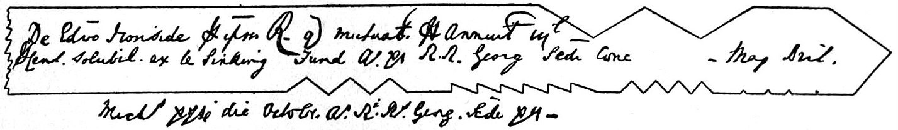

# Historical branches — Symbol, Account and Trust

A matched token, a reckoning and an entrusted office carry different relations into use. Greek recognition, English accounting and the separate histories of *hāl* and *hol* meet five further practices: Sanskrit discrimination, Hebrew counting and telling, Chinese rectification, Arabic reckoning and invocation, and Egyptian remembrance. Their particular uses illuminate [Symbol, Account and Trust](WHOLE-FIELD-symbol-account-and-trust.md) without supplying a common genealogy. Taylor’s [earlier lexical inquiry](HISTORY-symbol-account-and-trust.md) keeps the wider historical leads distinct. The selected witnesses below were consulted on 8 September 2026; dictionary citations of ancient passages remain lexical witnesses until their particular contexts are read.

## Matching tokens and institutional recognition

LSJ, s.v. **σύμβολον**, I.1, records a token consisting of corresponding pieces retained by parties for subsequent recognition. It cites Herodotus 6.86, Euripides *Medea* 613 and Plato *Symposium* 191d among its witnesses. I.3 records guarantee; I.5 records civic tokens through which entitlement and payment were administered. These entries establish differentiated uses, rather than a single abstract definition applicable to every occurrence. [LSJ, Scaife ATLAS](../../sources/classical-philology/liddell-scott-jones/lsj-1940-greek-english-lexicon/lsj-1940-greek-english-lexicon.md#lsj-1940-greek-english-lexicon-q010).

The physical seam makes correspondence inspectable: a present piece directs recognition toward a counterpart and an acknowledged relation. Taylor’s further source-answerability concerns what that correspondence leaves unsettled. An authentic token can identify the parties’ relation while the justice of the obligation and a bearer’s future conduct require different judgments.

Herodotus 6.86’s deposit and token narrative, *Medea* 608–615’s offer and response, and the transformation at *Symposium* 191d remain dictionary-cited contexts here. Their different tellings are not newly collated primary evidence. The matching-token sense is established by the selected lexical witness; συμβάλλω/διαβάλλω morphology and the chronology of accusation require their own lexical witnesses.

In Taylor’s [zero–subject braid](../../histories/traditions-and-disciplines/zero-subject-advent/DEVELOPMENT-zero-subject-advent.md), a sign acquires specified arithmetic powers while psychic and perspectival conditions acquire investigative offices. A symbolic account remains faithful by preserving each achievement and its distinct history. Integral return carries an acquired relation onward; it does not project the final Symbol into every earlier token.

## Reckoning, report and a split debt record

English *account* is traced through Middle English and Anglo-French forms associated with counting. Its attested senses include transaction records, explanations and narrative reports. This relates reckoning and telling without making every act of narration financial. The entry does not warrant promoting the earlier “cut together” gloss to the word’s public etymology. [Merriam-Webster, “account,” Word History and senses 1–3](../../sources/language-literary-studies/merriam-webster/merriam-webster-online-dictionary/merriam-webster-online-dictionary.md#merriam-webster-online-dictionary-q006).

The Bank of England Museum's wooden tally **A013/1** records one of the Bank's first loans to the Government in **1694**. The notched hazelwood was split lengthwise, leaving each party a record of the debt. Its material division and shared reckoning supply an independently documented historical comparison with the Greek token. No borrowing route between the two institutions has been established here. [Bank of England Museum, “Payments through time,” Wooden tally stick](../../sources/political-theory-institutions/bank-of-england/bank-of-england-2019-payments-through-time/bank-of-england-2019-payments-through-time.md#bank-of-england-2019-payments-through-time-q001).

> A diagram of an English exchequer tally of 1739, from the *Encyclopaedia Britannica*: a loan to the Crown, its amount cut as notches and written on the stick. The tally was split lengthwise so that each party kept a half that had to match the other. It is a later specimen of the practice the Bank of England's hazelwood tally of 1694 shows, not that tally itself.
>
> Credit: "Tally," *Encyclopaedia Britannica*, 11th ed., vol. 26 (1911), p. 379, fig. 2. Public domain.

An [account of an obligation](WHOLE-FIELD-symbol-account-and-trust.md#account-does-not-replace-source) can preserve its amount and identity while depending on persons, institutions and resources for discharge. Matching records support its integrity; payment and the conditions of repayment are further events. The particular tally’s museum record establishes neither a universal history of money, the whole Exchequer procedure nor a debt’s moral legitimacy.

The wider *computare*, *reckon*, *rule*, *right*, *credit*, *record*, *coin*, *claim*, *fiat*, *value*, *score* and *digit* histories remain separate from these selected account senses. Proposed heart/credit reconstruction and the legal history of circulating claims have no independently admitted witness here; shared accounting operations supply no common lexical descent.

A sign becomes effective through the [practices of its use and answer](../../histories/traditions-and-disciplines/language-symbol-dialogue/DEVELOPMENT-language-symbol-dialogue.md). Reference, rule-following, situated address and suspended assumption perform different work. A received account carries those conditions into its next use; a shared word for language does not make the practices descend from one source.

In the Baudrillard comparison, an account can help produce what it then describes. The three historical orders and four image phases have different purposes, and symbolic reversibility promises no benign reconciliation. The analysis remains answerable when its source or consequence corrects the explanatory frame; a fitting retained frame still has to receive the finding and its reason.

## Reliance and entrusted office

Merriam-Webster gives Middle English *trust* a **probably Scandinavian** origin, relating it to Old Norse *traust* and Old English *trēowe*. The transmission remains probable. Reliance, contingent hope, custody or responsible office, and credit for future payment are distinct attested senses, with different historical-language offices. [Merriam-Webster, “trust,” senses 1, 4–5 and Word History](../../sources/language-literary-studies/merriam-webster/merriam-webster-online-dictionary/merriam-webster-online-dictionary.md#merriam-webster-online-dictionary-q007).

Knowing the stated obligation still leaves someone to [undertake the relation](WHOLE-FIELD-symbol-account-and-trust.md#trust-keeps-the-return-route-active) in which fulfilment matters. That commitment is Taylor’s further argument; the dictionary’s senses do not derive knowledge’s dependence on trust, a theological doctrine of faith or a covenant architecture. Fides/credere and the particular covenant and institutional histories retain their own sources.

Formation, derivability, elucidation and predication have [different limiting conditions](../../dossiers/formal-limit.md#e3-e4-consumer-return). Inquiry can make those conditions available, while using the examined account requires a further undertaking. A shared word for limit does not manufacture that act of reliance.

## Reference 38 — hāl, whole, holy, health; the separate hole

The distinction between [lexical kinship and poetic crossing](../../../../section-rooms/arguments/concepts/reference-notes/hole-whole-holy-health.md) becomes exact in the two descent lines below. Soundness and entirety belong to the *hāl* family; the hollow-place noun belongs to *hol*. Their English sound-match is a different relation.

| Term | Bounded historical finding | Selected witness |
| --- | --- | --- |
| *whole* | Middle English *hool* continues Old English *hāl*, associated with soundness, freedom from injury and entirety. | [Merriam-Webster, “whole,” Word History](../../sources/language-literary-studies/merriam-webster/merriam-webster-online-dictionary/merriam-webster-online-dictionary.md#merriam-webster-online-dictionary-q008) |
| *holy* | The entry traces the word to Old English *hālig* and states kinship with *hāl*. Its wording “akin” is not represented here as a complete derivational demonstration. | [Merriam-Webster, “holy,” Word History](../../sources/language-literary-studies/merriam-webster/merriam-webster-online-dictionary/merriam-webster-online-dictionary.md#merriam-webster-online-dictionary-q009) |
| *health* | Middle English *helthe* continues Old English *hǣlth*, derived from *hāl*. | [Merriam-Webster, “health,” Word History](../../sources/language-literary-studies/merriam-webster/merriam-webster-online-dictionary/merriam-webster-online-dictionary.md#merriam-webster-online-dictionary-q010) |
| *heal* | Middle English *helen* continues Old English *hǣlan*; the entry relates it to *hāl*. | [Merriam-Webster, “heal,” Word History](../../sources/language-literary-studies/merriam-webster/merriam-webster-online-dictionary/merriam-webster-online-dictionary.md#merriam-webster-online-dictionary-q011) |
| *hole* | Middle English *hole/holle* continues Old English *hol*, the hollow-place noun associated with the adjective for hollowness. This is a separate historical line from *hāl*. | [Merriam-Webster, “hole,” Word History](../../sources/language-literary-studies/merriam-webster/merriam-webster-online-dictionary/merriam-webster-online-dictionary.md#merriam-webster-online-dictionary-q012) |

Soundness and intactness give wholeness a historical semantic field. They do not establish a doctrine that integrity requires sealing every opening. Sacredness likewise cannot be reduced to bodily health through word kinship. Particular attested senses and later institutions retain their differences.

The English sound-match between *hole* and *whole* permits Taylor’s chiasm: “The hole is the false cognate that tells the structural truth: some wholes remain whole only by keeping their opening open.” Its poetic force depends on the two histories remaining separate; no missing etymological connection is supplied by the homophony.

An account preserves integrity through an opening by which source, reply and consequence can correct it. Closing that route can preserve its wording while destroying fidelity. A represented source can contest the [image and valuation](../../../../section-rooms/arguments/A20-Image-Valuation-Possession.md); an office can receive evidence while protecting its [governing criterion](../../../../section-rooms/arguments/concepts/C27-Protected-Account-Occupied-Zero-Source-Claim.md); a description can condition its [later encounter](../../../../section-rooms/arguments/A32-Reflective-Field-The-Mirror-That-Moves-First.md). Their difference gives [opening and integrity](WHOLE-FIELD-symbol-account-and-trust.md#opening-and-integrity) actual work: correct the exposed source, answer, task or model under a fitting criterion, reach the responsible authority when the criterion or permission fails, or retain the adequate condition with reasons. The next use inherits the finding.

The toroidal image has its independently warranted native formal work; English homophony establishes no topological theorem. Lexical descent, poetic crossing and a mathematical object therefore keep different grounds. No universal genealogy of holiness or clinical theory of health follows from these selected entries.

The [functional source-return cycle](../../dossiers/indian-philosophy.md#50--the-next-act-must-inherit-the-return) retains the selected claim and excluded field, exposes judgment’s conditions, performs a counter-reading and carries warranted correction or fitting retention into the next act. Symbolic source, articulated account, committed use and subsequent consequence remain four distinct operations.

## Branches kept in their own soils

Sanskrit enumeration, Hebrew counting/writing, Chinese rectification, Arabic reckoning and Egyptian naming have independent lexical, textual and material practices. They supply no hidden roots for the three English terms. In each case recognition, account, reliance and later consequence preserve what the text prescribes, what object survives and what Taylor’s comparison adds.

### Sanskrit enumeration and discriminative practice

Sanskrit enumeration has both a lexical range and a specified philosophical practice. Taylor’s comparison receives count, warrant and changed appropriation without making the Sanskrit terms ancestors of Symbol, Account and Trust.

[Monier-Williams’s saṃ-√khyā and saṃkhyā entries](../../sources/classical-philology/monier-williams/monier-williams-1899-sanskrit-english-dictionary/monier-williams-1899-sanskrit-english-dictionary.md#monier-williams-1899-sanskrit-english-dictionary-p001) distinguish counting up, a number or total, grammatical number, deliberation and an appellation. The related [sāṃkhya entry](../../sources/classical-philology/monier-williams/monier-williams-1899-sanskrit-english-dictionary/monier-williams-1899-sanskrit-english-dictionary.md#monier-williams-1899-sanskrit-english-dictionary-p002) gives numerical and discriminative uses and the philosophical school’s name. It retains two explanations of that name: discrimination and, in the lexicographer’s qualified preference, enumeration of twenty-five principles. These lexical uses remain distinct from the Kārikā’s own classification, means of knowledge and discriminative practice.

Īśvarakṛṣṇa’s classical formulation is conventionally placed around 350 CE, with the author’s precise date uncertain. The selected primary-language carrier is Ruzsa’s dated 1998 electronic recension, whose header identifies its print sources and variants; the existing 1837 Colebrooke/Wilson translation remains a distinct witness. [Kārikā 3](../../sources/indian-philosophy/isvarakrishna/isvarakrishna-ruzsa-1998-samkhyakarika/isvarakrishna-ruzsa-1998-samkhyakarika.md#isvarakrishna-ruzsa-1998-samkhyakarika-p001) divides the principles by what produces and what is produced. Root prakṛti is not itself a product. Seven principles beginning with mahat are both produced and productive; sixteen are products; puruṣa is neither. The enumeration therefore retains four causal descriptions within its total of twenty-five.

The seven comprise buddhi, ahaṃkāra and five subtle elements. The sixteen comprise the eleven faculties, including manas, and the five gross elements. A count which replaced these relations with twenty-five interchangeable units would lose what the classification explains. Nor does placing puruṣa twenty-fifth mean that only one person exists: verse 18 separately argues for a plurality of puruṣas. Enumeration makes the principles addressable while their causal and cognitive offices remain different. It supplies no equation with Trika’s thirty-six tattvas or Taylor’s eight determinations.

The text then asks how those principles are known. [Kārikās 4–6](../../sources/indian-philosophy/isvarakrishna/isvarakrishna-ruzsa-1998-samkhyakarika/isvarakrishna-ruzsa-1998-samkhyakarika.md#isvarakrishna-ruzsa-1998-samkhyakarika-p002) distinguish perception, inference and trustworthy testimony. Perceptual determination has its objects; inference works through a sign and what it indicates; reliable testimony has a further office where the other means do not establish the matter. Listing the principles and warranting knowledge of them are thus consecutive, distinguishable acts. The source’s admitted testimony is a particular epistemic means. Taylor’s Trust is the broader committed relation within which an examined account can enter action; neither term silently acquires the other’s whole scope.

The enumeration also belongs to a practice. In [Kārikās 64–68](../../sources/indian-philosophy/isvarakrishna/isvarakrishna-ruzsa-1998-samkhyakarika/isvarakrishna-ruzsa-1998-samkhyakarika.md#isvarakrishna-ruzsa-1998-samkhyakarika-p003), repeated discrimination of the principles releases the appropriation of activity and possession to puruṣa. The distinction changes the practitioner’s relation to experience. The continuation of the body through prior dispositions, figured by a turning wheel, is distinguished from final isolation at bodily dissolution. The passage’s direction is Sāṃkhya liberation through discrimination. Taylor’s continuing return through encounters has a different office from that isolating release; it does not turn inactive puruṣa into an agent of mutual revision.

**Symbol answers to source** when a named principle retains the relation through which it is recognised. **Account does not replace source** when enumeration preserves both classification and the means by which it is known. **Trust keeps the return route active** in Taylor’s comparison when reliance on teaching retains access to warrant and use; testimony alone does not show that every teaching permits correction. **Account re-enters source-field** has a particular comparison in practised discrimination changing subsequent appropriation. Sāṃkhya’s isolating release remains different from recursive source-answerability.

An [exact count](../../../../section-rooms/arguments/A15-Ratio-Rationality-Measure-Reckoning-Harmony-Account.md) retains the criterion that made its members countable. An [acquired knowledge claim](../../../../section-rooms/arguments/concepts/C10-Mediation-Pramana.md) retains whether perception, inference or reliable testimony warranted it. Enumeration, knowledge and discriminative practice therefore deepen the comparison while lexical kinship proves neither its ontology nor transmission to another language.

The selected Cologne transcription and GRETIL recension supply scoped paraphrase witnesses; print and constituent-edition collation are not newly established. The uncertain ancient composition date and wider history of the name and practices remain beyond these selected passages.

### Hebrew SPR: counting, writing and entrusted work

The Hebrew entries and selected biblical passages relate count, writing and telling through differentiated forms and offices. Taylor’s Symbol / Account / Trust comparison receives those acts; SPR supplies neither an ancestor of the English words nor a Hebrew name for their whole native relation.

[Brown–Driver–Briggs distinguishes](../../sources/biblical-studies/brown-driver-briggs/bdb-hebrew-english-lexicon-online/bdb-hebrew-english-lexicon-online.md#bdb-hebrew-english-lexicon-online-p001) counting under Qal sāfar from recounting under Piʿel, while also recording precise counting in the latter stem. The sōfēr subentry differentiates an enumerator, muster-officer, secretary and scribe. [Sēfer](../../sources/biblical-studies/brown-driver-briggs/bdb-hebrew-english-lexicon-online/bdb-hebrew-english-lexicon-online.md#bdb-hebrew-english-lexicon-online-p002) includes missive, legal document, book or scroll, and writing or book-learning. [Mispār](../../sources/biblical-studies/brown-driver-briggs/bdb-hebrew-english-lexicon-online/bdb-hebrew-english-lexicon-online.md#bdb-hebrew-english-lexicon-online-p003) includes number and a separately attested recounting sense. These are related forms with differentiated offices. The lexicon’s probable derivation of sāfar from sēfer, and its probable Assyrian explanation of sēfer, remain qualified historical proposals. A confident story in which one primordial tally generates all writing would exceed the admitted evidence.

The primary carrier is Mechon Mamre’s Hebrew text with English based on JPS 1917. Its edition date is distinct from the chronology narrated within Kings and from the unresolved dating of textual composition. [Genesis 15:1–6](../../sources/biblical-studies/anonymous/hebrew-bible-mechon-mamre-jps1917/hebrew-bible-mechon-mamre-jps1917.md#hebrew-bible-mechon-mamre-jps1917-p001) places counting the stars within Abram’s question about an heir and a promise in which he comes to believe. The SPR forms perform the count. Believing belongs to ʾMN; the reckoning in the next clause belongs to ḤŠB. Their encounter in one passage therefore gives count, reliance and reckoning a textual relation without inventing lexical identity among them.

A public account receives a different consequence in [2 Kings 8:1–6](../../sources/biblical-studies/anonymous/hebrew-bible-mechon-mamre-jps1917/hebrew-bible-mechon-mamre-jps1917.md#hebrew-bible-mechon-mamre-jps1917-p002). A woman returns after seven years away during famine and petitions for her house and land. The king has asked Gehazi to recount Elisha’s deeds; while he tells the story of her son, she appears. Gehazi identifies her, but the king also asks her directly, and she gives her account. He then commissions an officer to restore her possessions and the field’s produce since her departure. SPR forms mark both the prior telling and her answer. Her account confirms the narrative here; the text does not report her correcting Gehazi. What changes is its office: a remembered deed enters a current claim upon property and a consequential order. The passage records that order, not an independently verified execution of it.

[The repair narrative in 2 Kings 12:5–17](../../sources/biblical-studies/anonymous/hebrew-bible-mechon-mamre-jps1917/hebrew-bible-mechon-mamre-jps1917.md#hebrew-bible-mechon-mamre-jps1917-p003) supplies a dated practice within its own chronology. In Jehoash’s twenty-third regnal year, the building remains unrepaired. The king challenges the failed arrangement; a chest receives the money; the royal scribe and high priest count it; funds go to workers and materials. The count serves a material purpose whose failure had already prompted a change of arrangements. Yet 12:16 says that no reckoning was made with the entrusted men because they dealt faithfully. The SPR term here names the scribe; the counting verb is MNH, the reckoning verb ḤŠB and faithfulness ʾMN. The narrative differentiates recorded resources, their actual use and confidence in persons. It resists treating more accounting as a sufficient cause of trust.

The same relation acquires a written authority in [2 Kings 22:3–20](../../sources/biblical-studies/anonymous/hebrew-bible-mechon-mamre-jps1917/hebrew-bible-mechon-mamre-jps1917.md#hebrew-bible-mechon-mamre-jps1917-p004), placed in Josiah’s eighteenth year. Shaphan the scribe is sent about repair funds. Hilkiah gives him the found law-book; Shaphan reads it and then reads it before the king. Hearing it changes the king’s response into mourning and a commission to inquire, which leads to Huldah. The book and scribe are SPR forms; the acts of reading and reporting use other roots. The source presents a sequence of entrusted offices and consequential reception. It does not settle the found book’s composition date or authenticate an unrestricted contemporary claim to speak in its name.

**Symbol answers to source** when scribe, text or teller retains the particular relation claimed. **Account does not replace source** when counted money differs from repaired fabric and a narrated person can answer directly. **Trust keeps the return route active** as Taylor’s requirement that consequences and affected persons can reach an undertaking’s commission; praise of faithful biblical work does not prescribe that whole requirement. **Account re-enters source-field** has concrete comparisons in the altered repair arrangement and the telling that becomes a restoration order. Narrated action and a further norm of revisability remain different.

[Resource, record and criterion](../../../../section-rooms/arguments/A15-Ratio-Rationality-Measure-Reckoning-Harmony-Account.md) remain different, as do an [account’s received consequence](../../../../section-rooms/arguments/A33-Epistemic-Cultivation-Operational-Parity.md) and a claimed implementation. Evidence can establish a restoration order while leaving execution unproved; that distinction changes the next permissible assertion. The particular Hebrew practices retain their history beside Sanskrit enumeration, Greek tokens and later English accounting.

BDB’s selected online explanations retain their proposed, qualified derivations without print/typesetting collation. The narrated regnal dates and commissions do not establish absolute composition chronology, archaeological verification or execution of the orders.

### Chinese rectification of names — speech must sustain its office

*Zhèngmíng* concerns a name sustaining the action it authorises. In the [Ministry of Education’s selected lexical entry](../../sources/classical-philology/ministry-of-education-taiwan/moe-2021-revised-mandarin-dictionary/moe-2021-revised-mandarin-dictionary.md#moe-2021-revised-mandarin-dictionary-q001), correction brings names toward correspondence with actuality, with Analects 13.3 cited as an example. The separate sense of substantive appointment is another use, not the hidden meaning of that exchange. Chinese semantic evidence supplies no ancestry for the English terms.

In the [received exchange, Analects 13.3](../../sources/chinese-philosophy/confucius/analects-ctext-legge/analects-ctext-legge.md#analects-ctext-legge-q001), Zilu asks what should come first if the Master governs Wei. Rectification initially appears to him remote from practical affairs. The answer makes that apparent remoteness consequential: names condition speech, speech the conduct of affairs, affairs the flourishing of rites and music, and these the fitting administration of punishment. The final exposure falls upon people who can no longer orient their actions. The opening restraint concerning what one does not know and the closing demand that speech be practicable belong to the same argument. A name has not answered merely because an authority has pronounced it. This is the received text's normative political sequence; its representation of government does not establish that the sequence was implemented or empirically verified.

Symbol, Account and Trust follow different offices through this sequence. **Symbol answers to source:** the designation must retain a relation to the conduct or role it presents. **Account does not replace source:** an orderly description of office cannot alone perform its obligations, and the consequences of its administration remain part of what the description must answer for. These operations keep the political specificity of the source: 名 names an office in that passage, and the passage is a historical text read beside QL, so no QL derivation is drawn from it.

**Trust keeps the return route active** adds Taylor’s requirement that declared office and practicable speech remain answerable to their consequences. In [Analects 13.15](../../sources/chinese-philosophy/confucius/analects-ctext-legge/analects-ctext-legge.md#analects-ctext-legge-q002), delight in never being contradicted becomes dangerous when the ruler’s words are bad. The passage distinguishes unopposed good counsel and denies that one sentence mechanically makes or ruins a state. It institutes no modern right of dissent; its warning locates a failure where bad counsel’s office is insulated from correction. In Taylor's signed arithmetic (Argued; the Analects teach none) a ruler whom no one may contradict reads the span of the whole polity from his own end, `(+1)−(−1)=+2`, and those who must act under his word carry the same span at `−2`, while counsel that can be opposed keeps the held polarity `(−1)/(+1)` in which the office and its subjects each have their sense through the other.

**Account re-enters source-field:** consequences can reach the authority and criterion sustaining a name instead of every failure being blamed upon those named. A corrected report or application under good counsel differs from failed counsel requiring revision; adequate counsel can be retained with its reasons. The received text makes naming’s cost concrete, while the effective route by which judgment changes or confirms a later act is Taylor’s further argument. Trust here is an enacted relation, not a Chinese lexical translation in 13.3.

A [measure remains answerable](WHOLE-FIELD-symbol-account-and-trust.md#account-does-not-replace-source) by retaining the [office and obligations it judges](../../../../section-rooms/arguments/A15-Ratio-Rationality-Measure-Reckoning-Harmony-Account.md). The [continuing undertaking](WHOLE-FIELD-symbol-account-and-trust.md#trust-keeps-the-return-route-active) distinguishes warranted stable counsel from an [office immune to correction](../../../../section-rooms/arguments/concepts/C27-Protected-Account-Occupied-Zero-Source-Claim.md). Critical manuscript and selected Legge print collation, the particular Wei succession context and historical implementation or reception are not supplied by these selected witnesses.

### Arabic reckoning and the Names — an account, an address and an undertaking

Arabic reckoning and retention have several offices. [Lane’s ḥisāb entry](../../sources/classical-philology/lane/lane-arabic-english-lexicon-online/lane-arabic-english-lexicon-online.md#lane-arabic-english-lexicon-online-p001) includes computation and presenting an account; the separate form-IV [aḥṣā entry](../../sources/classical-philology/lane/lane-arabic-english-lexicon-online/lane-arabic-english-lexicon-online.md#lane-arabic-english-lexicon-online-p002) includes enumeration, registration, memory and knowledge. They are different roots. The English gloss *counting* cannot decide what either does in a particular passage.

In [Qur’an 17:12–15, as rendered by Arberry](../../sources/religion-theology/quran/quran-arberry-corpus-selected/quran-arberry-corpus-selected.md#quran-arberry-corpus-selected-p001), the signs that make years reckonable lead to the personal book confronted at resurrection. Its bearer reads, and accountability returns to the recorded life. The adjacent verse retains individual responsibility. Taylor receives that demand for answerability while divine judgment keeps its own office; it is not a human institutional ledger whose criterion the judged person can revise.

[Qur’an 7:180](../../sources/religion-theology/quran/quran-arberry-corpus-selected/quran-arberry-corpus-selected.md#quran-arberry-corpus-selected-p002) enjoins invocation through God’s Names without specifying their number. [Al-Bukhārī 7392](../../sources/religion-theology/al-bukhari/bukhari-sahih-sunnah-online/bukhari-sahih-sunnah-online.md#bukhari-sahih-sunnah-online-p001), in a ninth-century collection whose compiler died in 870 CE, separately reports ninety-nine Names. The displayed Muhsin Khan translation renders *aḥṣāhā* through memorisation, one interpretation beside its wider lexical range. Neither passage lists all the Names or prescribes a bead-recitation protocol. Textual invocation and its attributed undertaking remain different from an observed later devotional performance.

A [name as address](WHOLE-FIELD-symbol-account-and-trust.md) keeps its tradition of attribution, and the interpreter gains no possession of what is addressed: **Symbol answers to source**. **Account does not replace source** when a finite count organises an undertaking and neither numeral nor translation exhausts its religious object. **Trust keeps the return route active** in Taylor's comparison when an undertaking stays oriented toward fulfilment and answerable to its conditions, and that further answerability is Taylor's own and is attributed to the hadith nowhere. **Account re-enters source-field** when retained wording conditions a later invocation or a reader's account of responsibility. The use proposed here is a reading, and it reports no executed psychological experiment and no fulfilment of an afterlife promise.

The count does not stand for the whole event: the object counted, the act performed, the attribution and the promised consequence remain separately available. Its Qur’anic, hadith and nineteenth-century lexicographic witnesses retain their own times and textual offices. No descent into the English words Symbol, Account or Trust, and no identity with the Egyptian name-preserving practice, follows.

The [counted object and subsequent act](../../../../section-rooms/arguments/A15-Ratio-Rationality-Measure-Reckoning-Harmony-Account.md) retain their textual warrant; an [undertaking](../../../../section-rooms/arguments/A23-Trust-Faith-and-the-Formal-Limit.md) remains different from empirical verification of its promised outcome. Neither native argument is derived from the numerical formula. Complete Names lists, particular recitation technologies and dates of individual Qur’anic verses remain outside these selected witnesses.

### Egyptian rn — the name retained for a particular deceased person

The [TLA hieroglyphic/hieratic entry for rn, lemma 94700](../../sources/classical-philology/tla/tla-hieroglyphic-hieratic-lexicon/tla-hieroglyphic-hieratic-lexicon.md#tla-hieroglyphic-hieratic-lexicon-p001) identifies a noun for name. Continued personhood requires a particular practice beyond that gloss. Its corpus-wide attestation span dates neither every use nor Reri’s papyrus, and separate Demotic relations do not erase changes of language and period.

[Reri’s funerary papyrus, British Museum EA75044,4](../../sources/religion-theology/reri/reri-ptolemaic-funerary-papyrus/reri-ptolemaic-funerary-papyrus.md#reri-ptolemaic-funerary-papyrus-p001) belongs to Ptolemaic Thebes. The museum’s range 305–30 BCE is not an exact production year. In its hieratic Book of the Dead arrangement, spell 25 occupies the top of column 3 and concerns remembrance of the deceased’s name. Neighbouring spells restore speech and protect the heart. The name appears in a provision for this person’s continued capacities, not an isolated item in a universal inventory of soul-parts.

The medium performs a prospective act. A surviving written arrangement supplies what the ritual anticipates the deceased needing beyond death. Its intended result is preservation of named continuity; the papyrus’s existence and the museum’s identification establish that this provision was made. They do not demonstrate the promised continuation itself. The consulted museum account labels spell 25’s purpose but does not furnish a complete hieratic transcription. Its illustrative translations for other spells come from a revised Faulkner rendering of Ani and are not silently reassigned to Reri. The present case therefore rests on a dated, identified funerary practice, not a manufactured quotation.

**Symbol answers to source** through the name’s reference to this particular deceased person. **Account does not replace source** because the surviving provision leaves Reri himself beyond its reach and proves his continued existence by no empirical means. **Trust keeps the return route active** in Taylor’s comparison as an entrusted preservation whose intended recipient exceeds present verification; the Egyptian ritual conception keeps its difference from the native formal-limit argument. **Account re-enters source-field** when the name and arrangement condition later remembrance or interpretation. Material survival permits a later encounter, and whether any reader remembered Reri or the rite achieved its intended result is a further question.

The historical person cannot be made to answer a modern curator as a living interlocutor. Answerability instead falls upon the present account: retain the object’s identity, period, attributed purpose and limits, and let a corrected reading change what is said of the person. The record can sustain an address without owning its bearer. Preserving the name is thereby a determinate practice with a source, not evidence that Egyptian rn and an Arabic divine Name name the same kind of being or derive from one word.

A [preserved sign](../../../../section-rooms/arguments/concepts/C21-Living-Symbol-Idol.md) has an office beyond possession of its bearer. Material survival alone decides neither living symbol nor idol. The identified object and attributed funerary purpose stand without a fabricated transcription; a full reading and translation of spell 25 are not supplied by the admitted museum explanation.

The five comparisons give source-return different work. Discriminative classification retains warrants; an entrusted record remains answerable to material purpose; a designation sustains practicable speech; a religious enumeration retains its act and promise; a funerary name preserves its particular person and provision. The Greek token, English tally and *hāl/hol* branches keep independent sources. Primary collation, detailed chronology, reception and empirical efficacy remain specific limits of those witnesses, not a missing universal genealogy.

In the [Bohm comparison](../../dossiers/bohm.md), physical interpretation, the 1975 conversation, the independently admitted handout and SEED’s later programme remain different practices. Dialogical suspension makes an assumption available; a contributor’s correction can change a subsequent shared question while its originating authority remains attributable. Fitting retention carries its reason into that next use.

[Qualitative succession, concrescence, biological production, formal self-reference and symbolic transformation](../../dossiers/process.md) each specify what an achieved form makes possible next. A record and lived duration remain different, as do a self-editing instrument and an autopoietic production network. Source-return receives the relevant transformation or warranted retention without forcing those distinct operations into one changed criterion.

The [process-science continuations](../../histories/traditions-and-disciplines/process-systems-science/DEVELOPMENT-process-systems-science.md) have their own editions, practices and instruments, with no single asserted chain of influence. A subsequent inquiry receives the object, transformation and conditions that its particular source makes available.