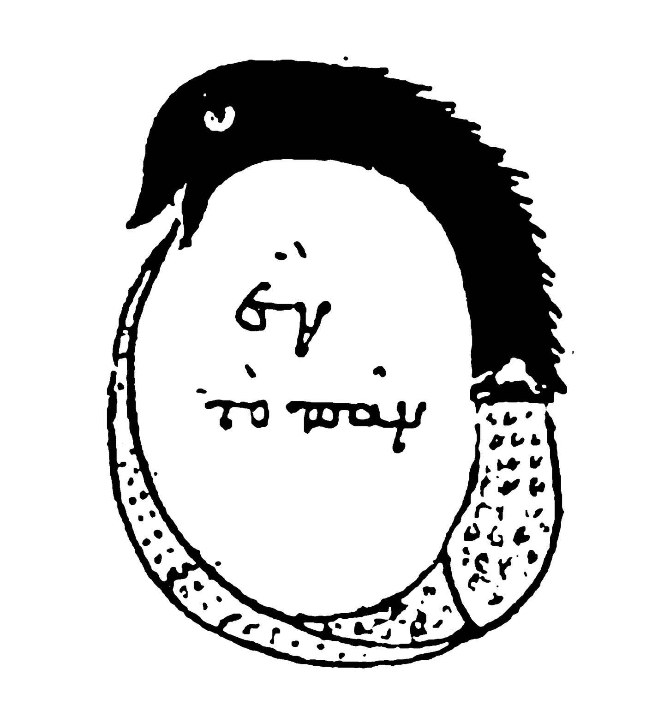

# Uroboros, circulation and trickster

This record serves the toroidal opening and return that the Neumann whole leaves for it to develop. It lays the three layers together: the mathemic (signed cancellation, `(0/1)/(1/0)`, the torus and its winding), the epistemic (the quilt, Neumann, Jung, Gebser and the argument records) and the mythemic (the serpent that takes its tail, and the trickster who wears the circle). Each layer amplifies the others and keeps its own office. Its status is Argued.

## #0

The snake bends until its head meets its tail. Its mouth receives its own body, and the body curves around an opening. Hunger moves along a relation in which eater and eaten belong to one life. What enters is worked on, incorporated and returned, and the creature that receives its tail is implicated in what it consumes. To follow this movement is to bring the eye home through the body, with the passage still belonging to the return.

> The ouroboros of the *Chrysopoeia of Cleopatra*, a Greek alchemical manuscript of the tenth or eleventh century. The serpent that takes its tail encloses the words *hen to pan*, "the one, the all". It shows the closed circle the record begins from. The record's own reading, that the uroboros is toroidal and keeps the opening around which it takes form, is Taylor's; the manuscript supplies the image's tradition only.
>
> Credit: *Chrysopoeia of Cleopatra*, Venice, Biblioteca Marciana, Codex Marcianus graecus 299, fol. 188v, tenth–eleventh century. Public domain; reproduction from Wikimedia Commons.

We develop the whole image here in Taylor's **native QL/Mytheme register**. The uroboros is toroidal, and its wholeness keeps the opening around which it takes form. Its trickster wears the circle as a costume. Head and tail appear to complete a circumference, and that visible completion offers itself as the whole truth of the creature, while the body's depth, its mouth, the difference between inside and outside, and the opening through which self-relation stays possible disappear into the outline. That costume succeeds by making a real feature exhaustive.

Two consequences are already present in the mouth. Assimilation lets what enters change the life that receives it. Devouring closure takes everything into an order whose continuation must leave that order untouched, and in Taylor's Saturnine image the gut is blocked, so that consumption arrests the generation it claims to sustain. A snake's return becomes living when its apparent perfection can be reopened to the condition its own shape presupposes. Recognition restores that relation inside the differentiated body: the head stays head, the tail stays tail, and what the passage has changed stays changed.

The [authored whole-image recovery](../../../../quilt/final-argument-quilt-2026-08-23/MYTHEME-AND-DEEP-SOURCE-SEAMS.md#6-ouroboros--torus--trickster--the-whole-that-keeps-its-hole) **sources** this complete movement, and the [final quilt, §§3–6 of the final weave](../../../../quilt/27-07-26-QUILTING-FOR-FULL-ARGUMENT.md) **grounds** its ratified toroidal correction. Neumann's round image and genesis sequence give a shared archetypal articulation through which the movement is read, and his chronology does not delimit the native operation. What is claimed universally is self-differentiating relation, its occlusion and its return in the authorial field, and the claim does not depend on attributing QL to every historical serpent image or on making every culture follow one empirical developmental schedule.

Taylor's quilt gives the serpent a differentiated movement in four steps: a closed costume yields to head and tail, their mutual consumption opens transformation, and a retained hole lets the whole return. Eden's fork tests whether discernment can recover its relation to that opening, and the eight determinations unfold what each turn makes possible.

## #1

**Position** gives the creature a face. Seen as an outline, its curved body becomes a circle, and conceived as a filled perfection the round becomes a sphere. This is the trickster's first office: the determinate image can be seen while the conditions of seeing it stay hidden. A circle is real as a circle, and the error enters when its completeness answers for the living whole whose outline it presents.

Through the signed cancellation the quilt makes this closure sharp:

$$
(−1)+(+1)=0.
$$

The arithmetic is exact. In the authorial image the cancelling zero is a terminated account, in which the opposed terms have been exhausted by the measure used to combine them. No property of circles or spheres is proved by the equation, and its mythemic work is to make the cost of the costume felt, since once all difference has been rendered as inverse quantity the outcome has no place for the mouth's activity or for the body's changed return.

**Opposition** restores head and tail as oriented terms. Head reaches and tail is reached, and hunger gives that orientation urgency, because the body is at once what seeks nourishment and what enters the seeking mouth. No neutral circumference can show the relation alone, since the different offices of receiving and being received do work within it, and need and capacity, intake and expenditure, reserve and issue give the encounter its pulse.

In the mouth the polarity becomes intimate. A hungry being's relation to what sustains it enters its own continued formation. In Taylor's [Neumann encounter](../../../episteme/sources/psychology/neumann/neumann-1954-origins-history-consciousness/neumann-1954-origins-history-consciousness-NOTES.md), the p.27–35 sequence follows nourishment through hunger, ingestion, excretion and self-formation, and the digestive image gets its strength from the whole passage: the life that receives nourishment becomes capable of acting and forming itself. Systole and diastole supply a rhythmic comparison within that encounter, and gut and pulse keep their different bodily operations.

What the costume conceals is preserved by the **two Ones**. In the native relation `0` is One as non-objectifiable Self-Identity, and `1` is All as Self-Difference, the manifest field with its indefinite particulars. One becomes manifest through All, and All receives its determining reality through the One, so neither office can simply swallow the other. [The Two Ones — 0 = One, 1 = All](../../../../section-rooms/arguments/A11-The-Two-Ones-0-One-1-All.md) **grounds** this differentiated reciprocity, and [Mono/Poly — One / All, Whole / Many](../../../../section-rooms/arguments/A12-Mono-Poly-One-All-Whole-Many.md) **extends** its failure into monopoly: one local formation occupies the office of the whole and makes every further arrival answer to its measure. A hungry head turns tyrant at exactly this crossing from local appetite to exhaustive authority. Read through the signed arithmetic, such a head counts the whole span from its own pole, `(+1)−(−1)=+2`, and the tail it has made food bears the same span charged from the other end, `(−1)−(+1)=−2`. Each reckons the whole distance as the other's departure, and neither keeps the zero through which both had their sense.

## #2

**Superposition** is self-eating made bodily. Taylor's notation holds the relation through both orientations:

$$
(0/1)/(1/0).
$$

The form proceeding from its source and the form returning toward its source stay active together, and the slash between them keeps their mutual relation without making eater and eaten indistinguishable. Through the mouth, as the operative opening, the two orientations meet. At this scale the image gives the outline an inside and gives the meeting of its ends an activity: the snake's own formed life comes back through the aperture that allows it to be transformed.

Ordinary division defines `0/1` and leaves `1/0` undefined, and holding both orientations in QL assigns them no equal scalar value. Bodily, the image lets representable form meet its unrepresentable condition without turning that condition into another morsel. [Immutable Gap / Formal Limit](../../../../section-rooms/arguments/A03-Immutable-Gap-Formal-Limit.md) **grounds** the limit: every successful representation is a further determination, including a representation of the act that made it. A mouth can be drawn, described and understood as an organ, and the originating condition it figures is not exhausted by that description.

Assimilation works a real change in what receives. Nourishment enters the creature's powers of movement, response and formation, and the body lives through a traffic whose achieved results become conditions for later life. Taylor's **meta-ballein/metabolism** articulation names this transformative passage, with **samāveśa** carrying the assimilative relation in the authored cross-reading. What has been assimilated becomes a changed capacity to receive, so the body carries its encounter into a further act.

Saturn-devouring is the obstructed version of the same pressure. A consuming power takes generation back into itself so that what issues from it cannot acquire a life able to exceed its rule. Such a mouth receives, and reception becomes detention. In the quilt's bodily formulation monopoly has a blocked gut, and abundant intake disguises the loss of circulation. This is the ratified Saturnine refraction of the uroboric whole. It supplies no independently reconstructed narrative, genealogy or ending of Cronus or Saturn.

Love shows the same distinction: a relation nourishes both participants only while their differences can still affect it, and refusal, resistance and an unexpected answer belong to that capacity. [Fusion](../../../../section-rooms/arguments/concepts/C24-Fusion.md) **qualifies** the digestive image at its ethical crossing: taking part in a whole gives one participant no authority to assimilate another person into its possession. The Other can be within Mono without being within me, and [Self and Other — Unity without Possession](../../../../section-rooms/arguments/A27-Self-and-Other-Unity-without-Possession.md) **extends** that asymmetry. A mouth that takes every answer as confirmation has already become the closed account, however warmly it calls its consumption love.

At this turn of the authored composition the Eden serpent enters, and the final quilt calls it the same figure in a fallen register: **the hole traded for the fork**. An opening that kept the relation to its source becomes a deciding division whose opposed values claim the entire field, and good and evil become a fork severed from the condition of their discrimination. Taylor's Neumann encounter at pp.114–121 reads the gain of differentiation together with guilt, suffering and loss, and then asks whether distinction sustains a bond or tries to deny it. This operation gives the fall a felt consequence: the discriminating life can come to experience its necessary differentiation as exile. This is Taylor's QL refraction of the Eden relation, and Genesis is not credited with naming a torus or teaching these equations. Its return is the recovery of relation within discernment, and the difference between actions and their consequences continues to matter.

## #3

**Interposition** gives the complete creature its winding. Mouth, head, tail, body, inner and outer surfaces and the retained opening now belong to one articulated movement. Taylor's `4+2` appointment keeps four explicate twisting field-lines and two implicates in play. In the final quilt's image the axis and the hole are gathered at `#0`, and `#5` is the whole enfolding the differentiated winding, so the fourfold can turn and return because its implicate conditions stay operative.

Taylor's [matheme of torus, covering and winding](../../../matheme/topology/torus-cover-winding.md) **grounds** the exact topological neighbour:

$$
T^2=\mathbb{R}^2/\mathbb{Z}^2,
\qquad \chi(T^2)=1-2+1=0,
\qquad \pi_1(T^2)\cong\mathbb{Z}\times\mathbb{Z}.
$$

Its square has four sides before gluing and, after gluing, two generating edge classes, one vertex and one face. In the matheme four sides correspond to two generators, and in the quilt four field-lines surround an axis and hole, and the two appointments count different objects, so the relation has to stay readable across that change of register. A drawing's central aperture, in particular, is neither a third generating loop nor an extra surface cell.

Let a path on the torus be `γ(t)=[2t,−t]`, for `0≤t≤1`. It returns to its starting address, while the lift beginning at `(0,0)` ends at `(2,−1)`. For the creature's homecoming there is now an exact neighbouring operation: local closure can keep a difference in the wider relation. The integer pair records the winding class, while the lifted path carries more of the traversal than its endpoint does. Our mythemic comparison keeps that retained difference. [Toroidal Circulation and the Arche-Topos](../../../../section-rooms/arguments/A17-Toroidal-Circulation-and-the-Arche-Topos.md) **grounds** the return with retained displacement, and [Dimensional Reframing at Zero and Infinity](../../../../section-rooms/arguments/concepts/C52-Dimensional-Reframing-at-Zero-and-Infinity.md) **qualifies** the distinct quotient, covering and reframing operations. The infinite plane cover differs from the two-sheeted torus-to-Klein one.

**Anuttara/Paramaśiva owns the opening in the authorial appointment. Māyā is the measure-field wound around it.** Śakti's winding makes the formal patterns through which manifestation reflects toward prakāśa in vimarśa, and pattern, measure and contraction give a determinate world its real capacities. Their opening never becomes one more bounded patch among them. Śakti's joy in Māyā belongs to this generative movement: articulation is a power of manifestation, and the particular body is its positive achievement. Each of [Tattvic Differential Field](../../../../section-rooms/arguments/A09-Tattvic-Differential-Field.md), [Māyā / Operative Measure](../../../../section-rooms/arguments/concepts/C14-Maya-Operative-Measure.md) and [Paśu / Bounded Subject-Position](../../../../section-rooms/arguments/concepts/C15-Pasu-Bounded-Subject-Position.md) **grounds** the distinction among originating condition, operative measure and bounded knower.

A trick succeeds when the formed pattern makes its dependence unavailable to its own account and can then present its measure as self-grounding. Filling the hole in the familiar toroidal image would change the form whose wholeness was to be perfected, and the same demand lived psychically makes coherence depend on excluding whatever could alter the achieved identity. [Arche-Topos as Differential Field](../../../../section-rooms/arguments/A16-Arche-Topos-as-Differential-Field.md) **grounds** the field of possible differentiation, while [Paradox / Transforming the Containing Field](../../../../section-rooms/arguments/concepts/C64-Paradox-Transforming-the-Containing-Field.md) **extends** the need to transform a containing account while keeping the local truths it had made incompatible.

The matheme **defines** the [complete eight determinations](../../../matheme/ql/eight-determinations.md) that stay active through this image: the parent `/ = −/−` opens into `0/1`, appearance questions and asserts as `?/!`, hunger and issue articulate `−/+`, recurrent capacity becomes legible through the particular as `X/x`, `AM/IS` makes the relation personed, `∞/dx` holds the definite passage against its inexhaustible horizon, and `1/0` returns the formed relation toward its source. These are the whole field's eight turns, with six interior determinations bracketed by parent and return, and they are not eight chronological phases assigned to a snake. [Primordial Symbolon and Its Eight Determinations](../../../../section-rooms/arguments/A18-Primordial-Symbolon-and-Its-Eight-Determinations.md) **grounds** their sequence and inversions: Being, Becoming and Knowing/unKnowing stay crossed by Essence, Constitution and Text–Texture. Both orientations carry the complete relation, and Name and Power stay together, so an achieved Image also carries the Work, expenditure and transformation of its coming to be.

The reserve also enters Taylor's [final-quilt energetics](../../../../quilt/27-07-26-QUILTING-FOR-FULL-ARGUMENT.md), which **sources** the earthlight and tokamak pair. In that authored comparison earthlight carries unconfined discharge: what the completed surface left out becomes an event it must receive. Tokamak confinement carries a different relation to energetic power, since the field holds charged plasma so that its activity can continue within an arranged containment. Release and holding therefore do different work, an opening is not simply a leak to be sealed, and containment need not be the devouring closure that prevents return.

In the quilt the latent dot sits at the reserve beneath extension, the `−` under the manifest `+`, and the reserve deepens the creature's metabolic fork. A formed field that denies its conditions cannot account for their return, and a field that holds activity through an answerable arrangement can sustain a further passage. What matters is what the containing form permits and acknowledges, and it makes neither every discharge liberating nor every confinement healthy. A uroboros's return has to keep both the source it cannot fill and the differentiated field through which power acts.

[ITER's canonical source house](../../../episteme/sources/physics/iter/iter-what-is-tokamak/iter-what-is-tokamak.md#iter-what-is-tokamak-q001) **sources** the bounded technical instance: a doughnut-shaped vacuum chamber, charged plasma and magnetic confinement. It establishes neither all field-line geometry nor a universal preference for toroidal confinement. Earthlight is the quilt's named image of unconfined discharge and of the excluded ground's return, and no particular observation, location, plasma mechanism or causal explanation of an earthlight event is verified here. Libido, prāṇa, Śakti, spanda and technical energy keep their distinct registers. Taylor's discharge and confinement comparison follows what release or holding makes possible: the bounded result has to keep its relation to the power and field through which it became actual. This relation **returns-to** [Toroidal Circulation and the Arche-Topos](../../../../section-rooms/arguments/A17-Toroidal-Circulation-and-the-Arche-Topos.md) with that bounded physical neighbour, and **returns-to** [Primordial Symbolon and Its Eight Determinations](../../../../section-rooms/arguments/A18-Primordial-Symbolon-and-Its-Eight-Determinations.md) with the reserve and extension relation intact.

The [self-rolling wheel in the Neumann whole](../neumann-images/WHOLE.md#neumann-self-rolling-wheel) **extends** this continuing formation from its exact p.18 authorial encounter. Its winding composes the formed round about an opening it cannot turn into surface, and its movement and the paper's renewed inscription are two different ways of making the next act possible. En-Soph's terminology belongs to that whole, and this return keeps the wheel within the shared whole and does not treat its name as an interchangeable circular emblem.

## #4

The [Neumann whole](../neumann-images/WHOLE.md#neumann-round) **grounds** the shared archetypal articulation: genesis and separation lead through heroic emancipation and transformation to centroversion, and its complete source sequence and changing parental offices stay there. [Neumann's source house](../../../episteme/sources/psychology/neumann/neumann-1954-origins-history-consciousness/neumann-1954-origins-history-consciousness.md) **historicises** the comparative psychological account, and the present whole follows the bodily circulation and its trickster occlusion through that articulation.

So the uroboric round is met inside a sustained account of formation and differentiation. Taylor's notes at p.11 follow the round image's capacity to gather paradox in a single apprehension. At pp.12–18 the womb, the parents, the mark and page, and the self-rolling wheel open different ways into genesis. At pp.27–35 the round acquires appetite, digestive passage, formative power and the relation among introversion, extraversion and centroversion. A self-eating creature belongs to this whole source encounter, and extracting only a perfect circle would lose the bodily and developmental middle that gives it life.

Within that encounter the variants keep their own offices. Mother and child show nourishment through differentiated dependency. Prajāpati's self-creation and self-offering, with the horse and universe image at p.29, carries a generative body in the material Taylor records through Neumann's account of Deussen's interpretation, so it is a nested encounter and no newly verified primary Vedic telling. En-Soph at p.18 and the darkness and tohubohu discussion at p.106 belong to different inherited traditions, and the authorial recapitulation reads them at the indistinct pole without making them historically identical. At pp.104–121 the world parents carry separation, light, orientation, opposing valuations, guilt and the enduring relation through which differentiation proceeds, and their four directions and day and night pair supply another located `4+2` refraction in Taylor's p.108 note. These differ substantially in what the images do, and none is an interchangeable costume for the snake.

At pp.33–35 the encounter follows the differentiation of active and passive striving within the nutrient flow. Conception through eating and birth through excretion give distinct offices to what the uroboric image had held together. Its own output returning as food figures self-sufficiency, an image of autarchy that makes no biological claim that a living organism needs no exchange with its environment. Both the earlier self-contained generative relation and the later sexual relation keep their distinct phases in this source encounter, and they license no fixed masculine or feminine assignment to any QL pole. Centroversion then gives the return a purpose beyond gathering more objects, inward or outward, because the materials of both directions enter self-formation. In Taylor's reading a differentiated life can be an end in itself while remaining related to the wider field that makes it possible, which is the autonomy Saturnine detention prevents.

The same horse and universe passage mentions a bull comparison without recovering its particular telling. A footnote at p.31 leads through Neumann to Guénon's comparison of nutritive and cognitive assimilation and to the proposed taste and knowing lexical branch. These leads matter because they ask how receiving becomes understanding, and they establish neither a universal sacrificial animal nor a verified etymology. Mother and child likewise carry Taylor's proposed Mary and Sophia connection as a further whole-to-whole return, with its own source and amplification work still required.

The [mark, paper and erasure scene](../neumann-images/WHOLE.md#neumann-paper-eightfold) **compares** a second performable return: the completed inscription can disappear while the capacity to inscribe remains. Its complete act belongs to the Neumann whole, and here its consequence returns to the mouth, since releasing an achieved form can renew the capacity by which another is received.

The [world-parent and paśu correction](../neumann-images/WHOLE.md#neumann-world-parent-separation) **qualifies** the return of this body. In Taylor's reading of the Ātman passage met at p.105, I-am recognition precedes the separation into husband and wife, and prakāśa–vimarśa already belongs to the field within which the bounded subject-position forms. The eightfold above keeps that ontological order, and the psychic relation of Self and ego remains a refraction of Taylor's native `X/x`.

[Jung's *Aion*](../../../episteme/sources/psychology/jung/jung-1978-aion-cw9-2/jung-1978-aion-cw9-2.md) **sources** the distinct historical Self and shadow horizon. A developed psychic relation keeps ego, persona, complexes, archetypal agencies and the wider Self differentiated, and the Self is no larger complex entitled to consume the others. [Complex](../../../../section-rooms/arguments/concepts/C31-Complex.md) **defines** the local affective organisation, and [Archetype](../../../../section-rooms/arguments/concepts/C32-Archetype.md) **defines** the generative-pattern office. [Complex as Local Arbitration Regime](../../../../section-rooms/arguments/A19-Complex-as-Local-Arbitration-Regime.md) **extends** the hungry local authority, [Image / Valuation / Possession](../../../../section-rooms/arguments/A20-Image-Valuation-Possession.md) **tests** what its image makes available and excludes, and [Individuation / Recognition](../../../../section-rooms/arguments/A21-Individuation-Recognition.md) **extends** the altered relations through which a particular life returns.

[Gebser](../../../episteme/sources/phenomenology-continental-philosophy/gebser/gebser-1985-ever-present-origin/gebser-1985-ever-present-origin.md) **historicises** a further, distinct change in seeing: perspective's achievement becomes readable within a context that releases its exclusive claim. That relation returns here to the eye that first saw only a circle. [Diaphaneity / Contextual Transparency](../../../../section-rooms/arguments/A04-Diaphaneity-Contextual-Transparency.md) and [Diaphaneity](../../../../section-rooms/arguments/concepts/C09-Diaphaneity.md) **extend** the visibility of the view's conditions, and [World-Picture → World-Atlas](../../../../section-rooms/arguments/A22-World-Picture-to-World-Atlas.md) **qualifies** the passage among views, since the atlas coordinates situated disclosures without manufacturing an all-containing final picture. Now the eye can return to its earlier outline with the activity and conditions of its seeing available.

Neumann's consulted Hull translation is the 2014 Princeton Classics reissue, and the page numbers in Taylor's protected notes are encounter locators pending collation, including comparison with the 1954 pagination. Their copied sentences are not verified quotations. The Jung house holds no verified excerpts, and Gebser's direct quotations still need selected locators. Historical ouroboros artifacts and the independent Eden, Saturn and Vedic tellings carry their own textual and historical warrants, as do the Greek and Sanskrit lexical histories of the metabolic comparison. This whole develops the already authored composition and supplies no invented episodes to settle those tasks.

## #5→0

The snake returns with its hole intact. What seemed an absence in the account becomes intelligible as constitutive of the form. Hunger still moves, but a received thing can now change the terms of receiving, and an image still gives a face to the life, but another encounter can alter that face's authority. [Living Symbol / Idol](../../../../section-rooms/arguments/concepts/C21-Living-Symbol-Idol.md) **defines** this return: the image's efficacy stays in relation to what it cannot exhaust, and the same image becomes an idol when its success is made a reason to forbid that relation to change it.

The whole [Arbitration / Hybris / Regard / Anamnesis field](../../../episteme/etymologies/arbitration-hybris-regard-anamnesis/WHOLE-FIELD-arbitration-hybris-regard-anamnesis.md) **grounds** the lived consequence through a finite deciding office, its source relation and the possibility of reconciliation. **Arbitration-in-Crisis** gives a finite deciding office its actual task, and hybris flowers when the local measure claims source authority. **Con-text-through-Diaphaneity** permits Regard, in which the context and the Other become visible through the determination. **Resolution-in-Reconciliation** permits anamnesis, recognition and return. Generated relations do their work before their semantic flowerings are named, so the serpent's recognition is more than learning that it has a hole: its achieved settlement becomes answerable to the conditions and lives it had excluded.

[Objective Internality — Mind as Worldhood](../../../../section-rooms/arguments/A26-Objective-Internality-Mind-as-Worldhood.md) **extends** this return into worldhood. Intake, response and durable result take part in the formation of the operative interior, and the interior's real boundaries exist through a wider field. [Idealism / Order of Dependence](../../../../section-rooms/arguments/A34-Idealism-Order-of-Dependence.md) **grounds** the native order of dependence without turning the world into a private ego's contents. A local constructed world has a knower, mediating means and known contents: its reading and judging agent, its source-selection and acting apparatus, and what that apparatus makes available. Within a person's inquiry the complete machinery itself enters among the means through which a World is encountered, and the account of those means can return through another source or response and change the next act. A formed interior stays effective while its relation to the containing Life stays available.

There is also a completion in which the next circuit need not be demanded. [Toroidal Circulation and the Arche-Topos](../../../../section-rooms/arguments/A17-Toroidal-Circulation-and-the-Arche-Topos.md) **qualifies** circulation: a completed act can return into another performance, and it can come to rest in recognition of the silence from which performance issues. Making wholeness depend on perpetual production would restore the consuming hunger at the very point of release. Its mouth's opening allows both renewed articulation and the relinquishing of an achieved form's demand to continue.

The [Draft 3 source](../../../episteme/sources/internal-corpus/taylor/taylor-2026-definition-god-draft3/taylor-2026-definition-god-draft3.md) **sources** the terminal authorial consequence: the completed offering is released into lives whose future it cannot command, and remembering returns as a daily office. The released offering **returns-to** [Advent of Integral Zero](../../../../section-rooms/arguments/A36-Advent-of-Integral-Zero.md) through that consequence, as the exact sign returns into living Symbol, with arithmetic keeping its exactness and the image its history. The whole [Homologia / Analogia field](../../../episteme/etymologies/homology-and-analogy/WHOLE-FIELD-homology-and-analogy.md) **qualifies** the crossing: the mathematical lift, psychic transformation, digestive image and ontological return preserve a specified relation while keeping their different objects and warrants.

Its head no longer has to claim the entire creature, and its body can receive, transform and release. Its winding stays determinate, its source stays inexhaustible, and the life that returns has another encounter before it.
