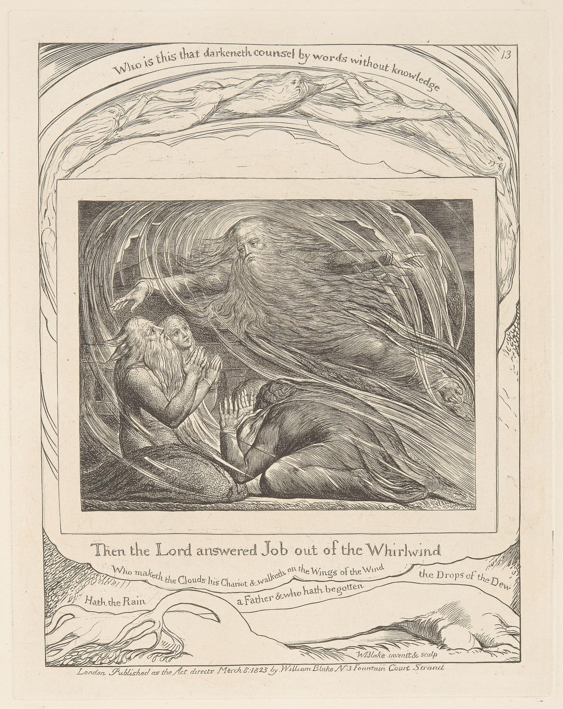

# Job

This record tells the biblical Job whole, in the selected KJV witness, and then lays three layers beside it: the mythemic (a witness whose contradiction forces a governing account to become answerable), the mathemic (the signed polarity and its collapses) and the epistemic (Jung's reception, the argument records and the sources). Each layer amplifies the others and keeps its own office, so that the book speaks for itself, Jung's interpretation is Jung's, and the operation read out of both is the essay's. Its status is Argued.

## #0

Job's fidelity is questioned before his suffering begins. We are shown the councils which Job never hears; the friends who later explain his losses have not heard them either. This difference in knowledge runs through the whole encounter. An account in which suffering proves wrongdoing will have to confront a man whose integrity the opening has already affirmed.

The biblical telling here follows all forty-two chapters of the [eBible King James (Authorized) Version, `eng-kjv2006`](../../../../episteme/sources/biblical-studies/anonymous/biblical-job-kjv-ebible-eng-kjv2006/biblical-job-kjv-ebible-eng-kjv2006.md). This is the provider's digital witness of the standardized 1769 text, in its PDF generated in August 2026. Its translation and editorial notes retain that identity. Jung's subsequent interpretation enters separately below, before the essay's own appointment of the whole.

In Uz, Job's uprightness has a household: seven sons, three daughters, livestock, servants and the recurring feasts of his children. His sacrifices reach toward a fault he has not witnessed, lest the children have sinned inwardly. Care for their relation to God precedes the calamity. When the sons of God present themselves before the LORD, Satan comes among them. The LORD points to Job's integrity. Satan answers by questioning its conditions: “Doth Job fear God for nought?” Protection, prosperity and blessing could make reverence a profitable exchange. Remove the hedge, he proposes, and Job will curse the giver. The LORD permits an assault on what Job has, while withholding permission against his person. [Job 1:1–12; passage q001](../../../../episteme/sources/biblical-studies/anonymous/biblical-job-kjv-ebible-eng-kjv2006/biblical-job-kjv-ebible-eng-kjv2006.md#biblical-job-kjv-ebible-eng-kjv2006-q001).

Losses arrive through exhausted human mouths. A survivor reports the Sabeans taking the oxen and asses and killing the servants; another brings the fire that consumed sheep and servants; another, the Chaldeans' raid on the camels. Each messenger is still speaking when the next comes. Last, a messenger reports a great wind striking the house where the children were feasting. Job tears his mantle, shaves his head and worships. His acknowledgement of receiving and losing does not disclose the council to him. The narrator says that he has not sinned or charged God foolishly; we have watched servants and children die in a test addressed to someone else's fidelity.

At the second council the pressure becomes more exact. The LORD affirms Job's continuing integrity and names the destruction as without cause. Satan shifts the proposed bargain from possessions to body: a man will give what he owns to preserve his life. Permission now reaches Job's flesh, but his life must be spared. Sores cover him from sole to crown; he sits in ashes, scraping himself with a potsherd. His unnamed wife asks whether he still retains his integrity and urges him to curse God and die. Job answers through the difficulty of receiving evil as well as good. The narrator's statement that he has not sinned with his lips belongs here. His body, his wife and the speech that follows keep it from becoming a summary of an untroubled life. [Job 1:13–2:10](../../../../episteme/sources/biblical-studies/anonymous/biblical-job-kjv-ebible-eng-kjv2006/biblical-job-kjv-ebible-eng-kjv2006.md#biblical-job-kjv-ebible-eng-kjv2006-q001).

Eliphaz the Temanite, Bildad the Shuhite and Zophar the Naamathite come to mourn and comfort him. At a distance they scarcely recognise their friend. They weep, rend their clothing, cast dust above their heads and sit with him on the ground. For seven days and seven nights none speaks, because his grief is very great. This first companionship must remain within the story of their later failure: they initially allow suffering to be present without explaining it. [Job 2:11–13](../../../../episteme/sources/biblical-studies/anonymous/biblical-job-kjv-ebible-eng-kjv2006/biblical-job-kjv-ebible-eng-kjv2006.md#biblical-job-kjv-ebible-eng-kjv2006-q002).

## #1

Job breaks the silence by cursing the day of his birth. Darkness should reclaim the day; the night should have prevented his conception. He asks why death did not receive him at birth, why light is given to those whose life is bitterness. Kings, prisoners and exhausted servants would find their distinctions stilled in the grave. He directs the curse at the arrival of his life. It is not simply the curse against God predicted by Satan, and its extremity cannot be reduced to the measured acceptance of the opening. His lament makes his continued existence the question the friends will try to answer. [Job 3](../../../../episteme/sources/biblical-studies/anonymous/biblical-job-kjv-ebible-eng-kjv2006/biblical-job-kjv-ebible-eng-kjv2006.md#biblical-job-kjv-ebible-eng-kjv2006-q002).

Eliphaz begins from Job's former strength: the man who upheld others now faints when suffering touches him. His question about the innocent perishing already places the loss within a moral order. A frightening night vision establishes mortal impurity before God; affliction can be chastening, and seeking God promises a restored life. Job answers with the weight of his grief. His strength is flesh, not stone. He asks for the pity which a friend owes and compares his companions to seasonal brooks that fail the caravans which relied on them. Let them identify a real error; words driven by despair cannot bear the judgement being placed upon them. Through sleeplessness, corrupted flesh and the brevity of breath, the address turns toward God: why must such a frail life be watched without respite? Their explanation has begun to add an injury of its own. [Job 4–7](../../../../episteme/sources/biblical-studies/anonymous/biblical-job-kjv-ebible-eng-kjv2006/biblical-job-kjv-ebible-eng-kjv2006.md).

Bildad insists upon divine justice. Children's deaths can then be understood through their transgression; a pure Job can seek God and prosper again. Ancestral wisdom supplies the pattern, with the fragile growth and insubstantial house of those who forget God. Job does not answer by denying divine power. In chapters 9–10 he makes its magnitude the difficulty of obtaining a hearing. He cannot meet God in an equal court, and there is no daysman to place a hand upon them both. Terror obstructs the speech by which he would answer. His maker fashioned him as clay, clothed him with skin and flesh, joined his bones and sinews: why should that care end in the destruction of its own work? Bodily genesis and bodily affliction now address the same maker.

Zophar's first intervention intensifies the accusation. Divine wisdom exceeds Job's reach, and God is exacting less than his iniquity deserves. Repentance would make a secure life possible. Job replies across chapters 12–14 that wisdom is not the exclusive possession of his companions. Robbers' secure dwellings trouble their account; the animals themselves can witness divine power. He wishes to reason with God and asks whether the friends will speak dishonestly on God's behalf. Their advocacy has made partiality look like piety. In this KJV witness, Job's willingness to trust under mortal threat occurs together with his determination to argue his ways. His hope moves painfully between the tree that can sprout after cutting and the human life that dies, between concealment in the grave and the imagined call to which he would answer. His request for an answer survives without becoming a steady mood. [Job 8–14; passage q003](../../../../episteme/sources/biblical-studies/anonymous/biblical-job-kjv-ebible-eng-kjv2006/biblical-job-kjv-ebible-eng-kjv2006.md#biblical-job-kjv-ebible-eng-kjv2006-q003).

In the second round Eliphaz makes Job's words evidence against him and returns to the fate of the wicked. Job calls his friends miserable comforters. Were their positions exchanged, he says, he could strengthen them with his mouth. Here neither speech nor silence relieves his pain. God appears as the assailant who sets him as a target, while the appeal for a witness in heaven persists. A grave replaces the house; corruption and the worm take the names of family. Bildad answers with a landscape of snares, extinguished light, lost descendants and erased remembrance. These figures approach Job's actual losses so closely that the general doctrine becomes an accusation without needing to name him. [Job 15–18](../../../../episteme/sources/biblical-studies/anonymous/biblical-job-kjv-ebible-eng-kjv2006/biblical-job-kjv-ebible-eng-kjv2006.md).

Job's response follows the break through his relations. Kindred withdraw, servants fail to answer, his breath estranges his wife, and those he loves turn against him. He asks for pity from friends whose words continue the assault upon his flesh. Yet he also wants his speech preserved beyond this encounter: written, engraved with iron and lead, cut into rock. In chapter 19 the living redeemer and the hope of seeing belong to this appeal against disappearance. Their wording here is the selected English witness; it does not settle the passage's translation or identify its redeemer with a later Christian figure. Zophar answers with wealth that tastes sweet and becomes poison, goods swallowed and forced back out of the oppressor. Job then brings the prosperous wicked before the friends' rule: old age, children, music and apparent security do not distribute themselves according to their explanation. Different lives arrive together in the dust. He calls for attention to what travellers can report, exposing the distance between the maxim and the world it claims to judge. [Job 19–21](../../../../episteme/sources/biblical-studies/anonymous/biblical-job-kjv-ebible-eng-kjv2006/biblical-job-kjv-ebible-eng-kjv2006.md).

In the third round the protected explanation becomes especially visible. Eliphaz now alleges concrete acts: withholding water and bread, stripping the needy, sending widows away and crushing the fatherless. These are his accusations, not facts supplied by the narrator. Job again seeks a hearing and cannot locate the judge. His claim to emerge as gold does not give him access to the court. Chapter 24 widens the witness beyond his own house: boundaries are moved, animals taken, poor people displaced, workers go hungry while handling food and thirsty while pressing wine. This violence has a social body. Bildad's short final speech returns to the impurity of mortals. Job answers with an account of divine might which makes their help look small, then continues his own discourse, refusing to relinquish his integrity. Chapter 27 also describes the wicked person's ruin. Job's speech retains that complexity; the poem has not turned him into a simple spokesman against every moral judgement. Nor does it supply a third speech by Zophar to complete a symmetrical scheme. [Job 22–27](../../../../episteme/sources/biblical-studies/anonymous/biblical-job-kjv-ebible-eng-kjv2006/biblical-job-kjv-ebible-eng-kjv2006.md).

## #2

Between the disputed judgements and Job's final oath, chapter 28 follows human skill underground. People open shafts, bring hidden ore to light, cut channels through rock and restrain water. Earth, which feeds them, has another interior which their labour can reach. Wisdom's place does not become available by the same achievement. Depth and sea cannot supply it; gold and precious stones cannot purchase it. God knows its way, within an ordering of wind, water, rain and thunder that exceeds the miner's reach. Chapter 28 gives human beings reverence and departure from evil as their relation to wisdom and understanding. Its movement honours the reality of discovery while asking after a knowledge that extraction cannot secure. No character named Sophia enters this biblical scene. Its composition and speaking voice remain separate historical questions; the poem here places wisdom between exhausted explanation and renewed testimony. [Job 28; passage q004](../../../../episteme/sources/biblical-studies/anonymous/biblical-job-kjv-ebible-eng-kjv2006/biblical-job-kjv-ebible-eng-kjv2006.md#biblical-job-kjv-ebible-eng-kjv2006-q004).

Job returns to the life he remembers in chapter 29. God's light accompanied him; his children surrounded him; the gate and assembly recognised his counsel. His account of righteousness has concrete recipients: the poor, the fatherless, the widow, the blind and the lame. He remembers judgement as the breaking of the oppressor's jaws to recover the prey. In chapter 30, that public standing is inverted. Those whose fathers he formerly despised now mock him. His description preserves his own harsh social distinctions alongside his suffering; the witness has not become an ideal person emptied of history. His body burns, his crying goes unanswered, and his music has become mourning.

His oath in chapter 31 binds his claim to particulars which can be contested. Desire, adultery, treatment of servants, hunger, nakedness, the widow and the orphan enter it. Against contempt for a servant's cause he invokes their common making in the womb. He denies making wealth his confidence or worshipping sun and moon; he includes the stranger's lodging and his conduct toward an enemy. This is more than a repetition of innocence. It names the relations under which innocence could be examined. At the close he asks for the Almighty's answer and the adversary's written charge. He would carry that charge openly, upon his shoulder and as a crown, and declare the number of his steps. Even the land is given the possibility of crying against him. His words end with an oath that joins hearing, testimony and consequence. [Job 29–31; passage q003](../../../../episteme/sources/biblical-studies/anonymous/biblical-job-kjv-ebible-eng-kjv2006/biblical-job-kjv-ebible-eng-kjv2006.md#biblical-job-kjv-ebible-eng-kjv2006-q003).

Elihu then takes six chapters. He is angry both because Job has justified himself rather than God and because the three friends have condemned Job without answering him. Youth had made him defer to their age; their failure releases his speech. Understanding, he says, comes through spirit and divine inspiration rather than seniority alone. His belly is like wine requiring an outlet. He claims a freedom from flattering titles and invites Job to answer him as a fellow creature formed from clay, without the terror that obstructs an encounter with God. His proposed mediation has its own manner and warrant. [Job 32–33](../../../../episteme/sources/biblical-studies/anonymous/biblical-job-kjv-ebible-eng-kjv2006/biblical-job-kjv-ebible-eng-kjv2006.md#biblical-job-kjv-ebible-eng-kjv2006-q005).

Elihu also changes the proposed work of suffering. Dreams, bodily pain and a messenger or interpreter can instruct a person, turn them from pride and save them from the pit. Affliction need not merely disclose a completed offence; it can act upon a life. In chapters 34–35 he nevertheless defends divine justice by bringing Job's speech under fresh judgement. The ear, he says, must test words as the palate tests food. God is impartial, cannot do wickedness, and is not enriched by human righteousness. Human actions affect other people; unanswered cries can themselves carry vanity and pride. Elihu's intervention must therefore be heard in its tension: the offered explanation is more various, yet the need to defend justice can again condemn the sufferer's address.

Chapters 36–37 develop instruction, obedience and the danger of choosing iniquity under affliction, then gather clouds, rain, snow, frost, light and thunder. Weather begins to displace the imagined human courtroom. Elihu tells Job to attend to wonders beyond his knowledge and closes upon divine majesty. The LORD's speech will follow from the whirlwind, and the narrator does not identify Elihu's six chapters with that answer. Nor does Elihu's absence from the named rebuke in chapter 42 certify each of his claims. He remains a distinct speaker whose attempt to interpret the pain belongs between the oath and the encounter. [Job 32–37; passage q005](../../../../episteme/sources/biblical-studies/anonymous/biblical-job-kjv-ebible-eng-kjv2006/biblical-job-kjv-ebible-eng-kjv2006.md#biblical-job-kjv-ebible-eng-kjv2006-q005).

## #3

The LORD answers Job out of the whirlwind. The answer begins by questioning the knowledge of the questioner. Where was Job when the earth's foundations were laid, its measures determined, and the morning stars and sons of God rejoiced? Sea comes from a womb, receives cloud as clothing and darkness as swaddling, and meets doors and bars set against its proud waves. Morning, death's gates, light and darkness, snow and hail open different reaches of the field. These images take up measure, birth and boundary on a scale which the friends' explanation has never met. [Job 38:1–24](../../../../episteme/sources/biblical-studies/anonymous/biblical-job-kjv-ebible-eng-kjv2006/biblical-job-kjv-ebible-eng-kjv2006.md#biblical-job-kjv-ebible-eng-kjv2006-q006).

> William Blake's engraving *The Lord Answering Job out of the Whirlwind* (plate 13 of the *Illustrations of the Book of Job*, 1825). Here the answer arrives as a funnel of wind that carries the divine figure down to the group. Blake fills the margins with the verses the record lists: clouds, rain, the deep, the measure of the earth.
>
> Credit: William Blake, *Illustrations of the Book of Job*, plate 13, 1825, line engraving; Yale Center for British Art, Paul Mellon Collection (B1978.43.1515). CC0 1.0.

Rain falls where no human lives, satisfying wilderness and causing grass to grow. Its place is consequential precisely without serving Job's household or a human spectator. Questions about the parentage of rain and ice lead into constellations, clouds and lightning. Feeding the lion and the raven places need within an order that also contains predation. Chapter 39 follows birth among wild goats and deer, the freedom of the wild ass beyond the driver's voice, and the animal named unicorn in this translation which cannot be relied upon for the plough or harvest. An ostrich combines harsh exposure of its eggs, deficient wisdom and extraordinary speed. A horse meets battle with terrifying force; hawk and eagle belong to lives which human judgement has not designed. These creatures are neither a reassuring pastoral backdrop nor a catalogue of tools awaiting use. Their difference changes the extent of the question. [Job 38:25–39:30](../../../../episteme/sources/biblical-studies/anonymous/biblical-job-kjv-ebible-eng-kjv2006/biblical-job-kjv-ebible-eng-kjv2006.md#biblical-job-kjv-ebible-eng-kjv2006-q006).

There is a first answer from Job inside the encounter. At 40:3–5 he lays his hand upon his mouth and declines to continue as before. Then the LORD speaks from the whirlwind again. Would Job condemn God in order to establish his own righteousness? Can he clothe himself in majesty, abase the proud, bring the wicked low and thereby establish that his own arm can save him? That challenge turns the wish for just judgement toward the power and extent required to administer it. This second speech cannot be collapsed into the first silence, as though the arrival of overwhelming force had already completed the poem.

Behemoth is presented as a creature made with Job. It eats grass, rests among reeds and willows, carries strength through loins, bones and sinews, and remains untroubled before the rushing river. Mountain beasts play where it feeds. Leviathan brings the question of capture into successive human practices. Can Job draw it out with a hook, pierce it, make it plead, bind it by covenant as a lasting servant, keep it as a plaything, or distribute it through trade? Weapons and scales, breath and flame, the boiling sea and luminous wake develop a strength that these imagined uses cannot master. The passage closes by naming its kingship over the children of pride. The LORD displays these creatures; Job does not slay them. The selected witness identifies Leviathan neither with Satan nor with a determinate QL position, and the same holds for Behemoth. [Job 40:6–41:34; passage q006](../../../../episteme/sources/biblical-studies/anonymous/biblical-job-kjv-ebible-eng-kjv2006/biblical-job-kjv-ebible-eng-kjv2006.md#biblical-job-kjv-ebible-eng-kjv2006-q006).

> William Blake's engraving *Behemoth and Leviathan* (plate 15 of the *Illustrations of the Book of Job*, 1825). The creatures occupy their own register, one standing and one coiled in the water, under the words "Behold now Behemoth which I made with thee". Blake's design is an early reading of the displayed animals; the record's selected witness identifies neither animal with Satan.
>
> Credit: William Blake, *Illustrations of the Book of Job*, plate 15, 1825, line engraving; Yale Center for British Art, Paul Mellon Collection (B1978.43.1517). CC0 1.0.

No council transcript is delivered to Job. No list of his secret offences vindicates the friends. The cosmic answer transforms the field in which he sought to make his case: the world includes births, hungers, powers, places and creatures which exceed his administration. That transformation does not remove the losses with which the poem began. It makes the relation between suffering, knowledge and authority more difficult than either an exhaustive moral ledger or the assertion that power has nothing to answer for.

## #4

Job answers again in chapter 42. He acknowledges having spoken of things beyond his understanding and turns from report toward encounter: “I have heard of thee by the hearing of the ear: but now mine eye seeth thee.” This KJV witness follows with abhorrence and repentance in dust and ashes. The text's wording stays as it is, and it does not suppress what immediately follows. The LORD turns to Eliphaz, expresses anger against him and his two friends, and says that they have not spoken rightly as Job has. Job's humbled response and this judgement stand together. They prevent either all his accusations or all their explanations from becoming the final doctrine of the book. [Job 42:1–7; passage q007](../../../../episteme/sources/biblical-studies/anonymous/biblical-job-kjv-ebible-eng-kjv2006/biblical-job-kjv-ebible-eng-kjv2006.md#biblical-job-kjv-ebible-eng-kjv2006-q007).

The man they had instructed to correct himself becomes their intercessor. They must bring seven bullocks and seven rams; Job will pray, and his acceptance becomes consequential for them. This changes the relation among the speakers. Their admission back into a right relation passes through the person whose witness their account could not receive. Restoration accompanies Job's prayer for his friends. His wider family and former acquaintances return, eat with him, comfort him concerning the evil the LORD has brought upon him, and give gifts. That attribution remains in the epilogue; the narrative has not quietly transferred every responsibility to Satan.

Livestock numbers double. Seven sons and three daughters are again reported; Jemima, Kezia and Keren-happuch are named, and their father gives them inheritance among their brothers. Job lives another 140 years, sees four generations and dies old and full of days. The ending restores social relation, fruitfulness and time, and the daughters' names and inheritance give the renewed household its own particulars. It does not report the resurrection of the first children or turn the dead servants into a loss cancelled by a larger inventory. The book returns to household life carrying a history that household prosperity cannot erase. [Job 42:8–17; passages q007–q008](../../../../episteme/sources/biblical-studies/anonymous/biblical-job-kjv-ebible-eng-kjv2006/biblical-job-kjv-ebible-eng-kjv2006.md#biblical-job-kjv-ebible-eng-kjv2006-q008).

Jung's *Answer to Job* takes this encounter into a second whole, with a further theological sequence. Our recovered reading places the moral contradiction within the God-image: Job bears a consciousness of the contradiction that Yahweh's power and omniscience have not yet brought into self-reflection. The wager makes that asymmetry acute, because the human witness can be morally more conscious than the image of omnipotence confronting him, and the encounter puts divine self-reflection under a demand that arises through the creature. Satan belongs to Jung's account of the contrary within this divine drama. These are interpretive appointments in Jung's reception, and the biblical book contains no such speeches or narrator statements.

The same distinction governs the evidence. The [CW11 source house](../../../../episteme/sources/psychology/jung/jung-1969-psychology-religion-cw11/jung-1969-psychology-religion-cw11.md) now carries source-matched primary paraphrase cards for §§609–628 and 746–757, including Sophia's remembrance and the witness's effect on the God-image. [The Job seam](../../../../../quilt/final-argument-quilt-2026-08-23/MYTHEME-AND-DEEP-SOURCE-SEAMS.md) **sources** the broader reception that follows, together with [the late Q27 development](../../../../../quilt/27-07-26-QUILTING-FOR-FULL-ARGUMENT.md), and the unread portions of Jung's sequence and the exact quoted wording remain separate source tasks.

In that recovered sequence Sophia names the remembered wisdom through which the one-sided God-image acquires a further relation to itself. Her place opens toward incarnation: the divine contradiction comes to be borne in human life, and Christ and then the Paraclete extend the demand for conscious relation. Continuing incarnation puts responsibility in empirical human consciousness. This sequence reaches beyond Job 42 into Jung's interpretation of Christian development. Wisdom in chapter 28 is no concealed entrance for Sophia as a character, and Job's repentance cannot be reassigned to the LORD as though the epilogue had narrated Jung's thesis. Both wholes meet through an interpretation whose change of register stays visible.

Adjacent to it, the [*Aion* source](../../../../episteme/sources/psychology/jung/jung-1978-aion-cw9-2/jung-1978-aion-cw9-2.md) carries the distinct field of the Self, Christ and Antichrist, and historical symbol. Its relation helps situate the problem of an image that claims wholeness while its contrary stays active, and its programme is no further series of events in Job. We can receive the psychological efficacy of God-images without turning that efficacy into a proof about transcendent existence and without treating psychic facts as disposable fictions. Our authorial return places responsibility in finite bearers who can recognise, answer and change their relation to the governing image. Job's intercession has an effective mediating office, received through the encounter and never acquired as possession of its source. A public God-image can undergo conscious return through the people it affects, and those people keep their lives and differences beyond its claim to wholeness.

## #5→0

The shared archetypal relation is differentiation through an encounter that changes the authority of the governing image. That operation **returns-to** the [Neumann whole](../../../archetypal-ground/neumann-images/WHOLE.md#neumann-hero-centroversion) through Job's sustained address and the friends' later dependence on his intercession, passing by way of local arbitration, image valuation and changed recognition. Biblical telling, Jung's reception and Taylor's appointed operation stay distinguishable. Uz names the narrated land without fixing a modern location, and the Hebrew work, the selected KJV witness and Jung's later reception have distinct textual times.

What the friends do is easy to follow in sequence. Comfort becomes explanation, explanation becomes accusation, and Job's refusal to confess the fault the explanation requires becomes a further reason to discredit him. A **protected account** makes its contradictory witness defective so that it can remain right, and the encounter **returns-to** the operation developed in [Image, Valuation and Possession](../../../../../section-rooms/arguments/A20-Image-Valuation-Possession.md), where the image through which the witness is judged has to stay right whatever the witness says. Job's sustained address keeps open the possibility that what judges him must itself be addressed. At the ending the return becomes concrete: the friends' account is rejected and their relation passes through his intercession. That changed authority **returns-to** [Protected Account](../../../../../section-rooms/arguments/concepts/C27-Protected-Account-Occupied-Zero-Source-Claim.md) with its criterion, which asks whether the witness can alter the authority of the account under which the witness is received. Taylor's comparison makes the witness's power to address judgment the condition of the account's return.

Laid beside the signed arithmetic, the friends' reckoning is appropriation charged in both directions. They count the whole span between a moral order that distributes suffering by desert and a man in affliction from the order's pole, `(+1)−(−1)=+2`, so that the distance is Job's departure and the order has nowhere to be wrong. Charged from Job's end the same span is his fault, `(−1)−(+1)=−2`, and no suffering can now count against the order. His demand for a hearing asks for the held polarity, `(−1)/(+1)`, in which the order and the sufferer each have their sense through the other and the zero between them is a place where either can be addressed. The amplification lays the mythemic action (the friends' speeches and the ending), the mathemic operations and the record of the protected account together. Its status is Argued, and the narrated speakers keep their particular lives, so no fixed psychic function is assigned to any of them.

That question **returns-to** [Complex as Local Arbitration Regime](../../../../../section-rooms/arguments/A19-Complex-as-Local-Arbitration-Regime.md) and [Complex](../../../../../section-rooms/arguments/concepts/C31-Complex.md) at the point where a governing image selects what can count as evidence. An image acts through feeling, valuation and expectation, and a proposition that could be corrected in isolation is only part of how it acts. [C21 defines](../../../../../section-rooms/arguments/concepts/C21-Living-Symbol-Idol.md) the specific return as the difference between a God-image through which address remains possible and an image protected by denying the life that contradicts it. Job's anguished knowledge is made holy by none of its anguish, and its power lies in the integrity of the relation it refuses to falsify. These are authored psychic refractions of the narrated encounter and no clinical diagnosis of its speakers.

The same operation **returns-to** [Counterfeit Gathering](../../../../../section-rooms/arguments/concepts/C25-Counterfeit-Gathering.md) and [Monoisation / Counter-Generation](../../../../../section-rooms/arguments/concepts/C26-Monoisation-Counter-Generation.md). Friends can include Job in a shared moral world while excluding his capacity to change its governing interpretation, and such inclusion keeps the appearance of relation while arresting its return. Judgement, shared order and unity are not condemned by this, and what the encounter eventually changes is who can speak rightly and who must receive another's prayer. Taylor's psychic comparison concerns the friends' selective reception and the changed authority to answer.

The disputed court **returns-to** [Arbitration and the Usurpation of Measure](../../../../../section-rooms/arguments/A24-Arbitration-and-the-Usurpation-of-Measure.md). A criterion usurps when its relation to the field can no longer be questioned. The [Arbitration / Hybris / Regard / Anamnesis field](../../../../episteme/etymologies/arbitration-hybris-regard-anamnesis/WHOLE-FIELD-arbitration-hybris-regard-anamnesis.md) **grounds** the authored relation, which runs through Arbitration-in-Crisis, Con-text-through-Diaphaneity and Resolution-in-Reconciliation. Job's oath makes a hearing possible in particulars, the whirlwind changes the context of judgement, and intercession returns the changed relation among the speakers. Regard and anamnesis name the possibilities of renewed attention and return that this complete field generates. Taylor's operational comparison follows hearing, changed context and reconciled relation, and the Greek lexical branches and the biblical telling keep distinct histories, so neither gives the biblical book authorship of the sixfold construction.

The movement **returns-to** [Trust, Faith and the Formal Limit](../../../../../section-rooms/arguments/A23-Trust-Faith-and-the-Formal-Limit.md) and [Trust / Faith](../../../../../section-rooms/arguments/concepts/C48-Trust-Faith-under-Formal-Limit.md) through an address that persists after its first account of safety has failed. Job's speech asks, protests and risks, and the friends' certainty can betray the relation it means to defend. The [Symbol / Account / Trust field](../../../../episteme/etymologies/symbol-account-and-trust/WHOLE-FIELD-symbol-account-and-trust.md) **defines** the exact return: a symbol discloses, an account makes disclosure answerable, and trust sustains reliance through encounter and possible revision. An account also changes its next encounter, since the friends' explanations help produce the isolation their later speeches receive, and Job's intercession for them changes the relation from which another account can be made. This authorial circuit warrants no requirement that a harmed person stay exposed to harm, because a living relation can require refusal, withdrawal or changed reliance. Job figures this problem and supplies no universal instruction to endure.

Intercession **returns-to** [Covenant / Mediating Office / Source Authority](../../../../../section-rooms/arguments/A25-Covenant-Mediating-Office-Source-Authority.md) with a differentiated office. Job takes a consequential part in the friends' restoration without becoming the source of the relation, and the positive possibility is real mediation that stays received and answerable. This authored comparison does not make the poem a general history of covenant. It also **returns-to** [Self and Other: Unity without Possession](../../../../../section-rooms/arguments/A27-Self-and-Other-Unity-without-Possession.md): the renewed relation includes lives whose loss, testimony and difference the account of restoration cannot appropriate, and it makes mediation effective while each participant keeps the capacity to answer, withhold or refuse.

The council's permissions and the losses borne beneath them raise a question about where consequence can arrive, and each of [Power / Delegated Labour / Return](../../../../../section-rooms/arguments/A29-Power-Delegated-Labour-Return.md) and [Power / Delegated Labour](../../../../../section-rooms/arguments/concepts/C53-Power-Delegated-Labour.md) **extends** that question. This bounded authorial comparison asks whether the people who bear a decision's costs can change the terms under which its power operates. It makes neither the wager an exemplary commission nor the killed servants incidental materials in Job's spiritual improvement. Each of [Compassion as Sensitivity to Origins](../../../../../section-rooms/arguments/A35-Compassion-Sensitivity-to-Origins-Epi-Logos-as-Vocation.md) and [Compassion](../../../../../section-rooms/arguments/concepts/C56-Compassion-Sensitivity-to-Origins.md) **extends** that return through the first silence, the repeatedly wounded body, the common making of servant and master, and the deaths the renewed household cannot undo. Origins are something to care for in judgement, and they are no information collected to complete a moral dossier. Taylor's compassion comparison turns knowledge of those origins into care for the lives judgment affects, and a changed institutional practice would need its own enactment and consequence.

Passing from inherited explanation to changed encounter **returns-to** [Deferential Intelligence](../../../../../section-rooms/arguments/A31-Deferential-Intelligence.md). An answer can require revision of the criterion that produced it, and the friends' deference to their own account of God shows why obedience or certainty alone cannot do that work. [The Mirror That Moves First](../../../../../section-rooms/arguments/A32-Reflective-Field-The-Mirror-That-Moves-First.md) **extends** the point with a further authored question: can the image start its own return toward what exceeds its measure before it requires the interlocutor to conform? Its three motions, exteriorised measure, the measure's effect on its bearer and initiated return, remain the technical vocation of that argument, and the Job whole gives the vocation a contrary witness and an encounter that changes the frame. Technically, the return asks whether the received witness can reach the measure that would otherwise discredit it. An instrument that exposes its source and criterion gives that witness a place to correct the next judgment, and the affected interlocutor keeps the power to answer or refuse the account. A construction has to enact the witness's route into judgment and show which later act inherited the correction or the reasoned refusal.

The native field supplies the terms in which the authored return is made: `/ = −/− → 0/1 → ?/! → −/+ → X/x → AM/IS → ∞/dx → 1/0`. These are Taylor's eight determinations, with their sequence and inversions, grounded in the [native core source](../../../../episteme/sources/internal-corpus/taylor/taylor-2026-core-theorems-pithy/taylor-2026-core-theorems-pithy.md). Singular One (`0`) and manifest All (`1`), which comprises the articulated field and every particular, keep their different offices, and the indefinite particular is not exhausted by an achieved determination. `X/x` belongs to that authorial field before any psychic or theological refraction is made, and it is neither a notation taken from Jung nor a code extracted from biblical characters. Six movements of this telling do not replace the eightfold field, and no speaker is assigned one determination as a fixed identity.

Within that field the determinate account **returns-to** [Subject, God and Faithful Definition](../../../../../section-rooms/arguments/A01-Subject-God-and-Faithful-Definition.md): it can state a real relation while remaining answerable to what it cannot contain. The [Definition of God manuscript's source house](../../../../episteme/sources/internal-corpus/taylor/taylor-2026-definition-god-draft3/taylor-2026-definition-god-draft3.md) **sources** this positive authorial proposition and its double devotion to whole and particular. Job's encountered limit **returns-to** [Immutable Gap / Formal Limit](../../../../../section-rooms/arguments/A03-Immutable-Gap-Formal-Limit.md) as a mythemic figure of changed knowing, without supplying the formal argument's proof. Job's missing council information is a narrative asymmetry, and the native gap is the continuing distinction between a representation and the act and field through which it represents. Both stay distinguishable even where the story makes their pressure felt.

The telling **returns-to** [Individuation / Recognition](../../../../../section-rooms/arguments/A21-Individuation-Recognition.md), which receives a relation changed by encounter and no ego promoted into possession of the whole, and to [Advent of Integral Zero](../../../../../section-rooms/arguments/A36-Advent-of-Integral-Zero.md), which receives the finished telling as an achieved form capable of return. Taylor's native field receives the changed encounter and the achieved form's return, and the telling supplies their particular lives and consequences without a biblical derivation of QL. A renewed family, Job's prayer and the judgement against his friends let the account end, and the first losses and the creature's continuing difference from any account of the whole keep that ending from owning its source. So the witness returns to life with an altered relation, and the completed account returns to the lives it has undertaken to tell.
