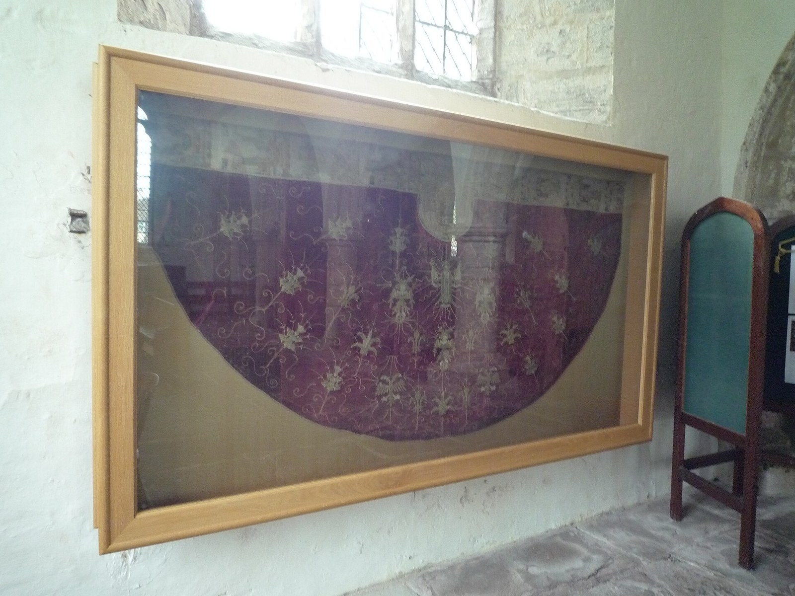
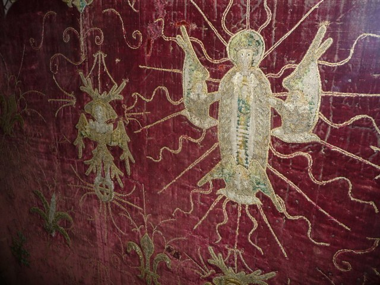

# Mother, Assumption and chiasm

This record serves the essay's account of how a recognised whole has to receive the body that bore it. It works in the mytheme register, and it takes a particular object as its image: the cope at St Bridget's in Skenfrith, read through Jung's discussion of the Assumption and through Taylor's own notation. Its image discloses a relation through what its figures do together, a mother lifted, six-winged forms on wheels and eagles with two heads, and the operations read from that action are the essay's. Taylor's encounter and corrections are the authorial ground, and the cope itself answers to an object witness, so that nothing here makes the medieval makers possessors of QL.

## #0

Taylor visited the cope at St Bridget's, a visit that was personal, and what he saw there drew a recollection of Jung's discussion of the Assumption in *Answer to Job* and *Aion*. On the cope Mary is being lifted. Beside her are figures he perceived as rabbits, six-winged seraphic forms, wheels, and eagles with two heads. His recollection met a relation already established in his work, the three recognised as one, and that recognition has an articulation of its own, so the cope became a place to work the relation through in a body.

> The Skenfrith Cope displayed in St Bridget's Church, Skenfrith, the object of Taylor's visit. The record's identification of its figures (Mary lifted, rabbits beside her, six-winged forms, wheels, two-headed eagles) comes from his encounter and remains answerable to the vestment. The photographs let the reader look at it for themselves.
>
> Credit: Fabian Musto, *The Skenfrith Cope*, photograph, 29 August 2018 (geograph.org.uk 5945604). CC BY-SA 2.0. Jeremy Bolwell, *Detail of the Skenfrith Cope*, photograph, 3 March 2013 (geograph.org.uk 3356940). CC BY-SA 2.0.

The reading was worked out in dialogue, and the [Skenfrith dialogue](../../../../episteme/sources/internal-corpus/taylor/chat-logs/taylor-2026-skenfrith-cope-jung-ql/taylor-2026-skenfrith-cope-jung-ql.md) records where Taylor's corrections changed it. His opening observation starts the inquiry, a proposed reading follows, and he rejects pairings that lose the established operations of his notation. The [complete local conversation](../../../../../../../working/sources-texts-references/chat-logs-for-quilting/07-08-2026-jung-marie-skenfrith-cope.md) keeps those differences consequential: an identification of the embroidered figure answers to the object, and an interpretation of his notation answers to his correction.

Taylor's rabbit belongs first to the encounter: he reports rabbits lifting Mary, and the dialogue answers that the figures are supporting angels, citing a description of the cope that cautions against the mistake. His seeing remains a datum of the encounter: the experienced figure starts an interpretation that has to stay answerable to the object, and a further object witness could change both the identification and the relation the image makes available. Perceiving, interpreting and intended iconography are three different things here, and the ambiguity keeps them apart in an actual encounter.

Taylor also looked into the power dynamics of the surrounding area, and the dialogue expanded this into a history of castles, lordship and imperial imagery. His later [Mother-flow correction](../../../../../quilt/27-07-26-QUILTING-FOR-FULL-ARGUMENT.md) returns the encounter to its occasion: the visit was personal and the essay's relation is the Mother flow, Assumption and chiasm. The site locates the encounter, while the symbolic movement concerns the maternal body and its recognitional return.

Mary stays a particular mother throughout. Biblical Mary, the mother of Jesus, gives the later maternal reception its name and body, the Assumption develops through a later doctrinal and interpretive history, and Jung's psychological reception and Taylor's chiasm carry that relation into further reflection in which every transformation keeps the body that made it possible.

## #1

Incarnation and Assumption run in two directions. In the first, a maternal matrix receives the Logos into bodily life, so that what is articulated as divine Word comes through a body that bears it. In the return that maternal body is itself received, and the condition of embodiment stays present in what is recognised as whole. This is the force of the quilt's correction: the Assumption is of Mary, her body received, and no ascent away from the body. Return carries what made manifestation possible, where a return that left it behind would treat it as a vessel to discard once its work was done.

Mary is both the receiving matrix and the bodily figure received. If only a general feminine principle entered the final account, the particular body that bore the relation would vanish just where recognition claims completion, and the chiasm keeps that body across the change of direction. Mother, child, receiving and being received remain different relations within the circulation, and their difference gives the crossing something to carry.

Jung's *Answer to Job* develops a particular psychological reception of this embodied return. His [Sophia and Assumption sequence](../../../../episteme/sources/psychology/jung/jung-1969-psychology-religion-cw11/jung-1969-psychology-religion-cw11.md), §§609–617, 625–628 and 746–757 with their intervening and adjacent context, passes through wisdom, incarnation, perfection and completeness, maternal reception and conscious individuation, and each turn changes the preceding God-image and adds no general feminine principle to an account left unchanged.

Jung begins the Sophia movement by turning from Job toward Wisdom in other texts. In §609 he takes up the pre-existent feminine wisdom of Proverbs, and §610 relates Sophia to Hebrew Chochma and the Johannine Logos while invoking Indian Śakti as a comparison. Jung's discussion then passes through Ecclesiasticus and the Wisdom of Solomon, where speaking, pervading, world-building, loving, guiding and reflecting give Sophia more than a generic receptive property. These are Jung's readings of several textual witnesses, and Job alone does not yield this Wisdom. His historical proposals about contact and descent carry their own evidential burden. [CW11 §§609–613](../../../../episteme/sources/psychology/jung/jung-1969-psychology-religion-cw11/jung-1969-psychology-religion-cw11.md).

From there the sequence returns to the tested righteous person, and Jung sets the oppression of the righteous in the Wisdom of Solomon beside Job and reads Yahweh's behaviour as a crisis of faithfulness and self-knowledge. Sophia's remembrance answers the demand for divine self-reflection, and the human being's knowledge of God becomes consequential for the God-image. His argument moves through an interpretation of creation and its familial counterparts toward a changed incarnation. In §625 the Second Eve has temporal and material priority, since the God-man is to be born through a woman. Mary receives the appointment of Sophia's embodiment, friend and intercessor, while Christ is related to the pre-existent Logos and to the figure of the master workman, and Jung expressly develops the mother–son relation through that shared symbolic office. [CW11 §§614–628](../../../../episteme/sources/psychology/jung/jung-1969-psychology-religion-cw11/jung-1969-psychology-religion-cw11.md).

Jung's image of completion also exposes a difficulty within its own reception. In §§626–627 he argues that the exceptional protections surrounding Mary can separate her from ordinary humanity: perfection brought close to Christ can impair the feminine completeness meant to compensate it, and an incarnation protected from the actual human condition risks being only partial. This is his psychological critique of the doctrine as he reads it, and the Church's account of its own teaching is a different matter. His accompanying generalisations about men and women do not become the native meaning of Taylor's poles. That tension matters to the Mother flow, because exaltation can either receive embodied life or produce an ideal too purified to bear it. [CW11 §§625–628](../../../../episteme/sources/psychology/jung/jung-1969-psychology-religion-cw11/jung-1969-psychology-religion-cw11.md).

His later Assumption discussion follows the burden of continuing incarnation in the empirical creature. Jung interprets the longing for a maternal intercessor, the heavenly bride and the marriage imagery as a movement toward further incarnation, in which recognition and declaration by human beings enter its temporal fulfilment. He insists on personal feminine representation and expressly distinguishes his psychological reading from a dogmatic assertion that Mary has become a goddess. Jung then moves into conscious individuation: a person encounters the unconscious, recognises its opposites and takes responsibility for a relation whose process would otherwise remain obscure. Psychological efficacy is real for Jung, and it licenses no simple identification of God with the unconscious as a whole. [CW11 §§746–757](../../../../episteme/sources/psychology/jung/jung-1969-psychology-religion-cw11/jung-1969-psychology-religion-cw11.md).

We receive the maternal body through differentiated relations. Sophia, biblical Mary, the mother in Jung's reconstruction and Taylor's embodied return give wisdom, incarnation and recognition different offices, and Jung's difficulty of perfection and completeness stays active: an ideal too purified to bear ordinary embodied life can fail at the very completion it announces. In [*Aion*](../../../../episteme/sources/psychology/jung/jung-1978-aion-cw9-2/jung-1978-aion-cw9-2.md), Self, Christ-symbolism, opposites and symbolic totality develop through another sequence, and their meeting in Taylor's recollection lets the maternal return be read through these different movements.

Jung's comparison of Sophia, the Johannine Logos and Śakti opens three distinguishable tasks, which are knowing and recognising, articulating form, and the power of manifestation. In the account proposed in the dialogue, Sophia carries recognitional wisdom, Logos the intelligibility of articulated form, and Śakti the power through which the relation acts. Taylor's invitation to explore Jung's comparison makes this an inquiry into how recognition, articulation and manifestation cooperate. Jung's §610 relates the essential qualities and evokes Śakti, and the three-office allocation is a further proposed differentiation whose adequacy depends on what each name's source account actually does.

Śakti matters here because receiving and recognising already act. A matrix does not become operative only when a supposedly active term arrives from elsewhere, and [luminous appearing and reflexive power](../../../../../section-rooms/arguments/A05-Prakasa-Vimarsa.md) **ground** this through their [inseparable relation](../../../../../section-rooms/arguments/concepts/C13-Prakasa-Vimarsa.md): appearing and self-apprehension are distinguished in an act that cannot divide them. In the maternal crossing active reception becomes tangible, since bearing lets articulation become embodied and recognition can transform the bearer's relation to what appears.

## #2

Taylor's correction identifies the live pressure. Read functionally, masculine and feminine cross the physical and mental poles that his work had given. By operation, articulation, differentiation and explication make the block `1–2–3` masculine, and receiving, containing, reflecting and gathering make `4–5–0` feminine. The older symbolic assignment under examination runs the other way: associating physical matter and nature with the feminine and mental or spiritual life with the masculine, it associates physical matter and nature with the feminine and mental or spiritual life with the masculine, so that reading what a pole does and reading the field it bears produce different gender valences.

A chiasm keeps both readings as the object of inquiry. The first block is masculine articulation in a feminine material field, and the second is feminine recognition in a masculine mental field. These are symbolic assignments whose crossing is being developed, and they determine nothing about what men and women essentially are. Neither can be stabilised by taking one assignment as the literal meaning of the numbers, because each pole's operation already reaches into the field conventionally attributed to the other.

Christ–Logos and Mary give this crossing a body. Spiritual articulation becomes embodied, and the embodied mother is received into spiritual recognition. The two directions stay distinguishable even as each makes the other intelligible, If embodiment were only a descent to be reversed, the return would undo the very relation it completes, and if recognition retained only an image of the mother, her bodily condition would vanish from the proclaimed whole. and the Mother flow returns bodily and recognitionally together, so that what made manifestation possible is received within its completion.

[Neumann's developmental morphology](../../../../episteme/sources/psychology/neumann/neumann-1954-origins-history-consciousness/neumann-1954-origins-history-consciousness.md) differentiates bodily dependence, nourishment, engulfment, separation and a transformed relation to the mother. Nourishing reception sustains a life's differentiation, and consuming reception closes that possibility within the receiver. A maternal image can bear both relations, and a particular mother or goddess has to be encountered through what she does in her whole telling, since her actual bearer and history make the distinction consequential.

Asking the same question of the nourishing and devouring faces, the [need and Desire comparison](../../../../../quilt/27-07-26-QUILTING-FOR-FULL-ARGUMENT.md) puts it this way: does reception sustain another life as other, or consume it within the receiver's satisfaction? Locally it matters to a body received and not discarded. A common doctrinal identity between the two accounts would need more than this shared question, and the comparison follows the actual relation of sustaining, differentiating and receiving before it can judge that stronger claim.

Taylor's native `3:1 = 3:3` states the operation. At the opening of the dialogue he says that the one in `3:1` is the three encapsulated or recognised: the first block, `1–2–3`, is known through `4–5–0`, which are void, unity and their paradoxical oneness `0/1`. That one is the unitive condition of the three, and its recognitional constitution can itself be unfolded. It is no extra count appended without relation, and no featureless terminus, because the second three disclose what the recognising one does. Taylor's phrase for the objection is that `3:1` is no straight `3+1`: the one is the three as their unitive condition, which is why `3:1 = 3:3`.

Through matrix, mediation and recognition the Mother image makes this operation felt. Receiving gives the articulated life somewhere to arise, bearing sustains its differentiation, and recognition receives that differentiation as belonging to a whole. Because the body persists on return, the recognitional pole stays related to what it had to bear, and the unitive one opens through the threefold work of recognising and keeps `3:1 = 3:3` active in the embodied encounter.

## #3

Two wheels give the crossing a second form. Taylor directs attention to the full sequence `0/1 → 1/0 → (0/1)/(1/0)`, in which a first orientation meets its inverse and their relation becomes explicit. A wheel need not be reduced to an isolated zero, since a complete orientation already relates the singular One and the manifest All, and its inverse changes how that relation is met. Its outer slash retains the two orientations in operative self-difference and divides no numerical quantity by zero.

As an encountered image a wheel permits changing orientation while its whole form persists, so that two wheels can bear conjugate orientations within one relation. Moving through one view and its inverse differs from holding their relation together, and the final compound matters because the whole can now carry the reversal it underwent. [The two Ones](../../../../../section-rooms/arguments/A11-The-Two-Ones-0-One-1-All.md) and [their reciprocal offices](../../../../../section-rooms/arguments/concepts/C49-The-Two-Ones-0-One-1-All.md) **define** One and All as differentiated, and [Arche-Topos](../../../../../section-rooms/arguments/A16-Arche-Topos-as-Differential-Field.md) **extends** the point by developing orientation as a relation through which positions become possible. A wheel gives that changing view a persisting body.

Taylor reports six wings and asks after `3:3`, and the seraphic forms give the orientation a sixfold articulation: the dialogue develops two wheel-bearing six-winged forms as a conjugate pair. The whole visual reading holds one sixfold and its primed counterpart, `6` and `6′`, with each retaining the two blocks `(1,2,3):(4,5,0)`. A single body is the condition through which the wings belong together: it adds no seventh wing, and a second body does not turn the first six into a series of unrelated numbered items. The proposed `6+6′` develops two articulations in relation, and the exact historical details of the cope still need their object witness.

Taylor corrects the dialogue's first attempt to map the wings into vertical pairs, rejecting `2↔5` and `3↔0`, because only `1↔4` belongs to the established pairings in that arrangement and nothing in the harmonic theory relates the others. The native complementary folds are `0↔5`, `1↔4` and `2↔3`, with their own harmonic work, and they cannot be manufactured by setting the two recognitional blocks in adjacent columns. A single body can sustain both the `3:3` reading and the native complementary relations without pretending that they are one partition, and the operation that matters here is blockwise and recursive recognition.

Invoking Isaiah's wing functions and Ezekiel's intersecting wheels proposes a further comparison, in which the encountered wing-and-wheel relation keeps its symbolic work: a body bears differentiated wings, and a changed orientation returns through that body. Their scriptural and iconographic combination needs the particular textual and object witnesses before it is read as a historical programme.

Returning to wheel and wing preserves the Mother movement. The body that bears the differentiation remains its condition when the differentiation is recognised, and recognition opens the one where it might have evacuated it. In the Assumption chiasm the same pressure keeps the maternal body from vanishing into a final spiritual account of what it supposedly meant.

## #4

With the eagle the operative question changes. Its two heads direct one body toward opposed orientations, and the governing relation here is signed valence and power. Taylor corrects the attempt to give the eagle the wheels' Spanda equations and a `1/1` reconciliation. He had pointed to `−1` and `+1`, and to the difference between a relation that keeps their polarity and operations that cancel or amplify through negation, so that the one body does not establish in advance that its power is reconciled.

Held polarity is `(−1)/(+1)`, in which each pole keeps its sign across the relation. Dia-ballein can also collapse that polarity by arithmetic between isolated terms, and then three distinct results appear. Addition cancels the signed quantities, `(−1)+(+1)=0`. Subtraction magnifies one pole through the negation of the other, and in both chiralities it reads `(+1)−(−1)=+2` and `(−1)−(+1)=−2`, so that one head's `+2` is the other head's `−2` and `±2` is the polarity hardened into opposition. Taylor's political and psychic reading uses the three results to separate held polarity, cancellation and one valence's amplification through the other's negation, and the sign of a pole does not by itself decide its moral worth.

We can therefore ask of the eagle's power-body which operation it carries. Does its unity retain the opposed orientations in relation? Does an apparent agreement cancel their difference? Does one direction acquire its enlarged power by negating the other? Those questions give the shared body an accountable office, and they stop the Mother flow from ending in a picture where completion means that the differentiated life has disappeared. A whole that receives has to be able to sustain a difference within what it receives.

[The two logics](../../../../../section-rooms/arguments/A13-Two-Logics-of-Two-Dia-Syn.md) and [Dia / Syn](../../../../../section-rooms/arguments/concepts/C50-Dia-Syn.md) **define** what the eagle's common body can carry. Dia gives difference a determinate orientation, and syn keeps the relation through which differentiated terms can be recomposed and returned. Healthy polarity holds signed difference together, addition cancels it, and directed subtraction magnifies one valence by negating the other, so the power-body becomes legible through the operation that actually acts and not through an appearance of unity alone.

With the signed-valence correction the eagle asks how power operates within one body: held polarity, cancellation, or amplification through negating another. The journey gave the inquiry its encountered image, and the quilt's Mother-flow correction keeps bodily and recognitional return as its direction.

## #5→0

In [Neumann's maternal relation](../../../archetypal-ground/neumann-images/WHOLE.md#neumann-metabolism), nourishment lets a received life become differentiated and capable of another relation. Taylor's chiasm keeps the maternal body within what returns. Incarnation and Assumption reverse receiving and being received, Jung's reception of the 1950 declaration brings that movement into psychological reflection, and Taylor's later encounter makes it a place of corrected recognition, so that their temporal differences give the return its concrete bearers.

The completed constellation returns through distinct offices: the wheels carry inverse orientations and their recognised relation, the wings articulate the three through the three that know them with their bodily coherence intact, and the eagle carries the signed alternatives of power. the Mother flow crosses embodiment and recognition while it receives the maternal body in its return. These relations can act together because none has been reduced to one number, one sex assignment or one emblem of undifferentiated divinity.

The [eight determinations](../../../../../section-rooms/arguments/A18-Primordial-Symbolon-and-Its-Eight-Determinations.md) unfold `/ = −/− → 0/1 → ?/! → −/+ → X/x → AM/IS → ∞/dx → 1/0`. Under their prior relating stroke a determination becomes available, is questioned, bears a signed relation, manifests determining capacity through a particular, reaches personed presence and effects an exact difference before returning to its source. The [native core](../../../../episteme/sources/internal-corpus/taylor/taylor-2026-core-theorems-pithy/taylor-2026-core-theorems-pithy.md) **derives** that whole traversal with its inversions and relations. Sixfold recognition through the cope articulates the knowing relation in this embodied encounter, and `X/x` distinguishes the determining capacity from the particular maternal image through which it becomes legible.

In the Name series, Name, Truth, Mind, Word, Logos, Son, Image, each term keeps its coequal Power relation, Power, Play, Need, Sacrifice, Decision, Love, Work. An articulated name or image has been borne, sustained and brought into life, and recognition returns upon that bearing. The Mother chiasm makes their conjunction concrete: Logos and Son acquire embodied force through matrix, labour and consequence, and the achieved image keeps this cooperation available when what bore it is received into the whole.

The [tattvic differential field](../../../../../section-rooms/arguments/A09-Tattvic-Differential-Field.md) **grounds** manifestation in a source-related genealogy of local capacities, and recognition changes the relation to embodiment while the differentiated world stays. [Reflexive appearing](../../../../../section-rooms/arguments/A05-Prakasa-Vimarsa.md) and [its active power](../../../../../section-rooms/arguments/concepts/C13-Prakasa-Vimarsa.md) keep receiving distinct from a passive second image. The maternal crossing follows the same practical pressure through its own body, since receiving and recognising act on a relation whose differentiated life persists.

A maternal image can organise dependence, fear, protection, receptivity or a claim to possess what it bears. Its [local valuation](../../../../../section-rooms/arguments/A19-Complex-as-Local-Arbitration-Regime.md) belongs to a [lived affective organisation](../../../../../section-rooms/arguments/concepts/C31-Complex.md), so the same visible figure can have different consequences through the relation actually lived. [Archetype](../../../../../section-rooms/arguments/concepts/C32-Archetype.md) **defines** the difference between that particular image and the determining capacity made legible through it. Neumann's morphology follows another set of whole transformations, and the cope's encounter gives this image its own body and history.

[Image, valuation and possession](../../../../../section-rooms/arguments/A20-Image-Valuation-Possession.md) **qualifies** the point at which recognition either restores the body's standing or replaces it with an authoritative image of what the body is for. A [living symbol](../../../../../section-rooms/arguments/concepts/C21-Living-Symbol-Idol.md) keeps its represented life able to answer, and the ambiguity of angel and rabbit gives this relation a modest exact test: the experienced image stays correctable through encounter with the object. In the Assumption chiasm the same obligation is bodily, since the recognised whole retains the condition it receives. [Individuation and recognition](../../../../../section-rooms/arguments/A21-Individuation-Recognition.md) change the relation to embodied dependence and let differentiation succeed without turning its sustaining relation into possession.

A body changes what a return owes. A [mediating office](../../../../../section-rooms/arguments/A25-Covenant-Mediating-Office-Source-Authority.md) bears consequential work within a field it did not originate, and matrix, mediator and recogniser perform real work, so that receiving their result owes recognition to the relation through which it arrived. [Delegated labour](../../../../../section-rooms/arguments/A29-Power-Delegated-Labour-Return.md) **extends** the corresponding obligation into a commission: encountered cost, resistance and possibility can reach the office that governs the next act. The Mother flow makes the sustaining body present within completion, so that a received product cannot hide what bore it.

[Trust](../../../../../section-rooms/arguments/A23-Trust-Faith-and-the-Formal-Limit.md) continues through reliance that precedes an exhaustive account of what bears it. The mother and child give that received dependence a body, and its return keeps dependence distinct from ownership. [Unity without possession](../../../../../section-rooms/arguments/A27-Self-and-Other-Unity-without-Possession.md) holds the difference, since a life borne within a relation remains capable of answering beyond its bearer's account. [Compassion](../../../../../section-rooms/arguments/A35-Compassion-Sensitivity-to-Origins-Epi-Logos-as-Vocation.md) directs care toward the body, history and work through which the achieved form became possible, and recognising those conditions returns responsibility to them: bodily suffering is no necessary price of completion.

[Homological agreement and analogical proportion](../../../../episteme/etymologies/homology-and-analogy/WHOLE-FIELD-homology-and-analogy.md) **compare** what changes, what is retained and what returns through maternal body, recognitional triads, inverse wheels and signed power. Across reversed reception the body persists, the recognitional one opens through its threefold activity, inverse views remain related, and signed poles differ through the operation performed. Numerical recurrence can suggest these crossings, and the complete relations give each comparison its warrant. [Symbol, Account and Trust](../../../../episteme/etymologies/symbol-account-and-trust/WHOLE-FIELD-symbol-account-and-trust.md) **define** how the return holds together: the encountered form discloses, its account stays answerable to its source, trust carries it into inquiry, and the resulting interpretation becomes a condition of the next encounter. Taylor's correction enacts this circuit when the account of wings and eagle changes through what it had misread.

[Devotion to the whole and the particular aperture](../../../../episteme/sources/internal-corpus/taylor/taylor-2026-definition-god-draft3/taylor-2026-definition-god-draft3.md) **grounds** the double obligation of the return. [Integral zero](../../../../../section-rooms/arguments/A36-Advent-of-Integral-Zero.md) receives an achieved determination through its exceeding source-relation, and in the Mother flow recognition receives the matrix within the whole it bore: the completed account returns to the particular body in place of abandoning it as the price of completion. A further inquiry can keep the interpretation with reasons or correct the answer, model, source or governing condition that the new encounter exposes. Where an interpreting agent compares an image with a witness, the agent is the local functional knower, image and witness are known, and memory, comparison rule and instruments are means. That same interpreting apparatus belongs among the means of the person's containing inquiry, and its later act has to inherit the warranted correction or retention while the encountered body stays able to answer.

## Source standing

The Skenfrith conversation is provenance of Taylor's thinking and corrections. Identification of rabbit or angel, the cope's making and its intended iconographic programme need an object witness, and lunar, fertility or resurrection symbolism cannot be attributed to a medieval rabbit whose identification is unverified. Its castle and imperial history is likewise unverified, and the quilt re-keys the visit as personal and the essay relation as Mother flow, Assumption and chiasm. Wing-and-wheel parallels in Isaiah and Ezekiel need their own selected primary passages. Encountered geometry gives inverse orientations a symbolic body and proves no geometric theorem.

No Gospel witness is selected here for the Assumption's official definition. The locally held Hull second edition of *Psychology and Religion: West and East* supplies the selected *Answer to Job* primary spans and six source-matched paraphrase cards, and the account uses numbered paragraphs with their stated context, without exact quotation wording or newly verified print-page citations. Jung's Sophia discussion gathers Proverbs, Ecclesiasticus and the Wisdom of Solomon and finds no such sequence in Job. His comparison with Śakti and his historical contact proposals carry distinct evidential obligations, and his psychological reception of Mary and the Assumption is no official four-person Trinity and no dogmatic identification of Mary as a goddess. This Sophia–Logos–Śakti three-office formula remains a proposed comparison, with no standing as source doctrine or as a Mary-tattva assignment.

A separate *Aion* house keeps contextual paraphrases from the consulted 1979 paperback, and collation against the selected 1978 hardcover and verification of quotation remain Open. Neumann's morphology, Levinasian need and Desire, and the Christian maternal reception each have their own source sequences. The sustained operations above test their relation, and a common historical descent or doctrine would need separate evidence. The corrected signed eagle retains `(−1)/(+1)` and the distinct operations of addition and subtraction, and a sign gives no automatic moral identity.
