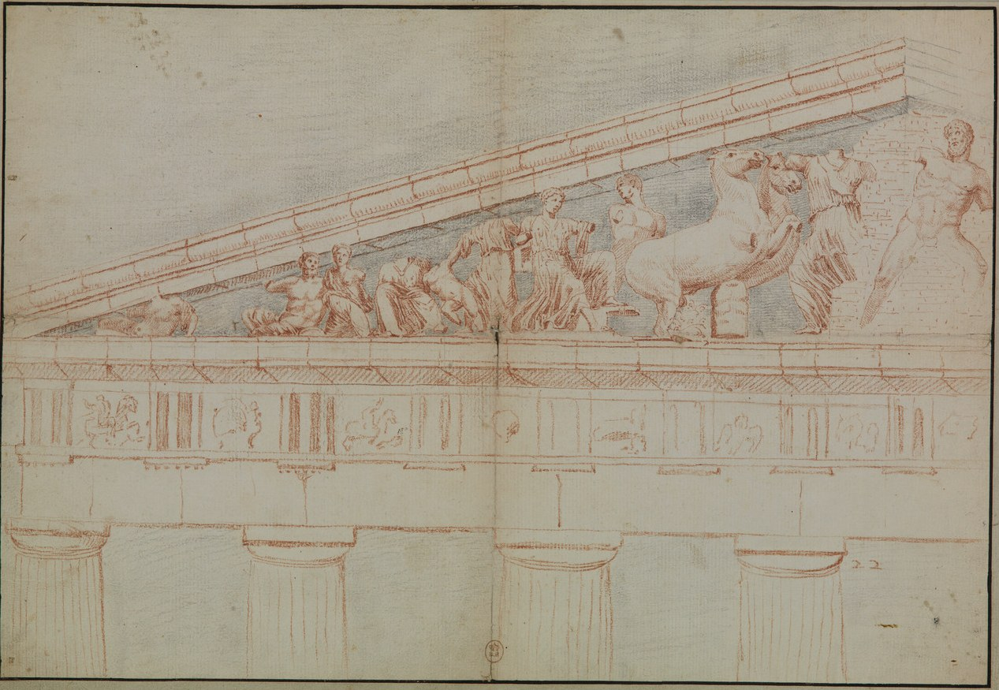
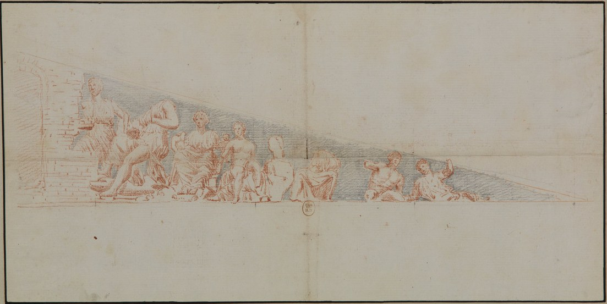
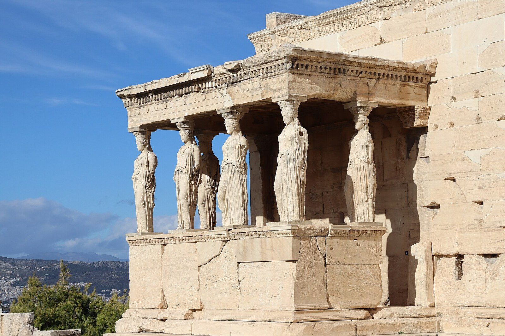

# Attica — Athena, Poseidon, Cecrops, Olive, Sea, Verdict, and the Remembered Counter-Claim

This record serves the essay's account of how a binding judgment can govern a place without exhausting it. It works in the mytheme register: the contest for Attica is told whole from its selected tellings and its surviving monuments, and the relation is read from what the whole image does, which is the office of a myth, where proof and historical attribution are other offices. Taylor's reading, in which the formed city is wound toroidally around a depth it cannot fill, comes after the telling and keeps its own authorship.

## #0 — A city named, a place still answering

Athena wins the city's name, and Poseidon's sign stays in its sacred centre. A civic determination genuinely governs while its contrary remains real, and sea, olive, witness, arbiters, naming and aftermath each enter the one image through their own acts. Taylor reads this city toroidally, as a formed order around a depth it cannot fill, and his olive chain follows rooted life through cultivation and transformation into light.

[Taylor's reading of the contest](../../../../../quilt/final-argument-quilt-2026-08-23/NATIVE-020-DEEP-SEAM-RECONCILIATION.md) **grounds** the first of these: the verdict determines the city without exhausting the place. His [root-to-light comparison](../../../../../quilt/final-argument-quilt-2026-08-23/ETYMOLOGICAL-ARCHAEOLOGY-TREE-SEAMS.md) **extends** the second, following the olive's material life beside that determination. The ancient tellings give the competing signs and the decisions, and Taylor develops the particular civic, psychic and material relations across them.

## #1 — Claim, witness, verdict and flood

### Pseudo-Apollodorus, *Library* 3.14.1 — the complete contest

In this telling Cecrops, first king of Attica, a son of the soil whose body is compounded of man and serpent, is already there. The land has entered a naming history through him, since the country once called Acte is named Cecropia after him.

Then the gods look for cities in which each will receive a peculiar worship. Poseidon arrives first and strikes the middle of the Acropolis with his trident, and a sea appears, which the telling calls Erechtheis. Athena arrives after him, calls Cecrops to witness her act of taking possession, and plants an olive tree.

Now the two gods strive for possession of the country, and Zeus separates them and appoints arbiters, who in this version are the twelve gods. They award the country to Athena because Cecrops bears witness that she planted the olive, and Athena calls the city Athens after herself. The verdict does not dissolve Poseidon's force, and in anger he floods the Thriasian plain and lays Attica under the sea.

In the [Frazer translation of 3.14.1](../../../../episteme/sources/classical-philology/pseudo-apollodorus/pseudo-apollodorus-library-frazer/pseudo-apollodorus-library-frazer.md#pseudo-apollodorus-library-frazer-q001), twelve divine arbiters judge and Cecrops witnesses. Nor is the adjudication a simple choice of the gift the king preferred, since his testimony to Athena's planting is the stated ground of the award, and the olive's later material transformations belong to Taylor's further comparison.

## #2 — Variant aftermaths and material memory

### Hyginus — the flood prevented

In [*Fabulae* 164](../../../../episteme/sources/classical-philology/hyginus/hyginus-fabulae-macfarlane-digital/hyginus-fabulae-macfarlane-digital.md#hyginus-fabulae-macfarlane-digital-q001), Neptune and Minerva submit the city-founding contest to Jupiter, and Minerva wins by planting the first olive. Neptune means to inundate the land, but Mercury prevents him on Jupiter's orders, and Minerva then founds Athens in her own name, the first city established in the land according to the telling. A higher authority intervenes again here and restrains the defeated claimant's force, which differs from the accomplished flood of Pseudo-Apollodorus, and neither Mercury's intervention nor the single divine judge belongs inside the twelve-god version. Roger T. Macfarlane's translation is the English witness, and the separate [Latin 164](../../../../episteme/sources/classical-philology/hyginus/hyginus-fabulae-macfarlane-digital/hyginus-fabulae-macfarlane-digital.md#supporting-latin-164) also gives the prevented inundation.

### Augustine's Varro-derived account — the victors punished

In [Augustine's *City of God* 18.9](../../../../episteme/sources/religion-theology/augustine/augustine-city-god-dods-digital/augustine-city-god-dods-digital.md#augustine-city-god-dods-digital-q001), an olive and water appear, and Cecrops consults Delphi, whose response leaves the naming to the citizens. Both sexes vote. The women outnumber the men by one and choose Minerva, and the men choose Neptune, who devastates the land. To appease him the women lose their votes, the right to give children maternal names, and the designation Athenian. Augustine presses the reversal: the goddess whose voters won cannot protect them, and he treats the quarrel as demonic mockery. This is his polemical use of a narrative attributed to Varro and no independent evidence that Athenian women historically acquired and then lost these rights.

### The Parthenon's monumental contest

On the west pediment the contest has a monumental civic image, in which local kings, heroes and river-personifications surround the two divine claimants. In the [Acropolis Museum's description of Poseidon, Ακρ. 885](../../../../episteme/sources/classical-philology/acropolis-museum/acropolis-museum-west-pediment-poseidon/acropolis-museum-west-pediment-poseidon.md#acropolis-museum-west-pediment-poseidon-q001), the sculpture dates to 437–432 BCE, and its reconstructed trident action has two possible readings, withdrawal after creating the spring or striking to flood the city. The museum interprets the local heroes as judges, which differs from Pseudo-Apollodorus's tribunal, so that the surviving monument, the reconstructed scene and the literary narrative remain different witnesses.





> Jacques Carrey's drawings of the Parthenon's west pediment, made in 1674, in two halves (north above, south below). They record the sculpted contest of Athena and Poseidon thirteen years before a Venetian shell destroyed much of the building. Where the record's pediment is cited from the Acropolis Museum's description of Poseidon, these drawings are the earlier witness to the composition around him.
>
> Credit: Jacques Carrey (attributed), *Temple de Minerve, à Athènes*, drawings of the west pediment of the Parthenon, 1674, made for the Marquis de Nointel; Bibliothèque nationale de France. Public domain; reproduction from Wikimedia Commons. Jacques Carrey (attributed), second sheet of the same drawing, south half, 1674; Bibliothèque nationale de France. Public domain.

### The sanctuary remembers both claims

In the [Acropolis Museum's account of the Erechtheion](../../../../episteme/sources/classical-philology/acropolis-museum/acropolis-museum-erechtheion/acropolis-museum-erechtheion.md#acropolis-museum-erechtheion-q001), the eastern room was dedicated to Athena, while the lower western room accommodated shrines that included Poseidon-Erechtheus. The complex also took in the sacred signs of the contest: Athena's olive, Poseidon's trident marks in the bedrock and the spring of salty water associated with his strike.



> The Erechtheion's south porch on the Acropolis, from the southeast. The building, dedicated in its eastern room to Athena and in its western rooms to cults that included Poseidon-Erechtheus, kept the signs of the contest in its precinct, the olive and the marks of the trident among them. The record reads this as a later material memory of the whole contest.
>
> Credit: Coolcaesar, *Porch of the Caryatids, Erechtheion, Acropolis of Athens, From Southeast*, photograph, 23 November 2025. CC BY 4.0.

This is no further episode in the narrative sequence. It is a later material memory of the whole contest, in which the victorious civic form keeps the counter-claim inside its sacred architecture.

### Herodotus and Pausanias — witnesses within a surviving place

In [Herodotus 8.55](../../../../episteme/sources/classical-philology/herodotus/herodotus-histories-macaulay/herodotus-histories-macaulay.md#herodotus-histories-macaulay-q001), the Athenians report olive and sea as the gods' witnesses in Erechtheus's sanctuary, and after its burning sacrificial visitors report a shoot about a cubit long on the next day. The sanctuary of this narrative precedes the later Erechtheion that the museum describes, and the two are not automatically one unchanged building.

In [Pausanias 1.26.5–7](../../../../episteme/sources/classical-philology/pausanias/pausanias-description-greece-jones-1918/pausanias-description-greece-jones-1918.md#pausanias-description-greece-jones-1918-q001), altars for Poseidon with Erechtheus, Butes and Hephaestus, a sea-water cistern, its reported wave-sound in a south wind, and a trident mark accompany Athena's continuing civic honour. His [olive-regrowth paragraph, 1.27.2](../../../../episteme/sources/classical-philology/pausanias/pausanias-description-greece-jones-1918/pausanias-description-greece-jones-1918.md#pausanias-description-greece-jones-1918-q002) gives the legend of two cubits on the day of burning, a timing and height distinct from Herodotus's report. The sacred place keeps the rival signs in these witnesses, and their coexistence gives Taylor's reading its material relation. Pausanias also describes an oil-fed lamp, a separate cultic object which gives no evidence that the contest olive supplied its oil or that the source taught the full root-to-light chain.

Literary tellings and later material accounts carry different kinds of evidence. Mythic action is received as narrative, reported regrowth and wave-sound keep their reported standing, and the museum's reconstruction remains a modern interpretation of surviving material.

## #3 — Sea-depth and olive

Taylor reads the retained sea-depth and the living olive together: the instituted civic orientation remains real without claiming to contain every condition of the place.

### 3.1 Poseidon's well / sea as the archaic-magical depth retained at the centre

Poseidon's sea or well is read as the archaic, magical, unconscious or pre-rational depth that is **enshrined within the heart of Athena/Minerva's rational-civic form**, and it is more than superseded by that form.

Toroidal and not linear is the strongest image. Athena's civic-rational order is no later layer that leaves Poseidon in a dead past, since the formed city is organised **around an opening/depth it cannot convert into itself**. Poseidon's sea remains a living interior contrary, watery, affective, archaic and mobile, prior to the clean civic surface and yet materially retained within it.

That unobjectifiable or archaic-magical depth stays within the differentiated rational field. To say that Poseidon "equals #0" would replace this relation with a dictionary key, and the whole city-image holds a governing rational determination together with the depth that determination cannot exhaust, a condition that `#0` names in Taylor's local reading.

This is why the Erechtheion continuation matters so strongly to us. The sacred centre does not behave as though Athena's verdict made Poseidon unreal, and the city whose name carries Athena materially remembers the sea-sign of the defeated claimant.

### 3.2 Minerva/Athena as rational-civic differentiation rather than total reason

Athena or Minerva carries the rational, strategic, civic and technical differentiation through which a polity becomes articulate, ordered and self-conscious.

Her rationality stays healthy through its relation to what it did not become. Poseidon holds no deeper truth that makes Athena merely the fall: Athena actually wins, the city is genuinely named through her, and her gift is genuinely instituted. The danger would lie in a later psychic or civic reading in which the winning determination declared the whole field identical with itself, and the retained Poseidon-sign prevents that closure.

### 3.3 The torus with Poseidon's well at its centre

The Attic sacred and civic field can be held as a toroidal image: a differentiated surface or order wound around an unfilled depth, with Poseidon's well or sea marking the archaic-magical centre that Athena's rationality does not abolish.

This is Taylor's composed image and no topology attributed to ancient Athenians. It stands beside the torus and the uroboros: a rational-civic form becomes whole through its relation to an interior depth, and it does so without filling that depth with its own image. The formed city keeps the condition of its order present through the counter-claim:

> **the condition of the whole may remain present without becoming one more positive content of the governing form.**

### 3.4 The olive chain

Athena's gift carries the authored symbolic chain:

```text
root → tree → fruit → pressing → oil → anointing → flame / light
```

The chain is grounded in the material. The olive roots into earth, persists through seasons and generations, bears fruit, and becomes useful through cultivation and transformation; pressing releases oil, and the oil nourishes, anoints and burns, so that the fruit of rooted life can become light. Inside this story the chain takes on a political and psychic office that a free-standing tree symbol would lack, because it is **the gift through which Athena's claim is witnessed, preferred and made civic**, and the living, cultivated form becomes part of the polity's chosen self-image.

Cultivation, pressing, nourishment, anointing and burning have distinct material effects. Their comparison with technē follows how rooted life becomes usable and luminous, and it identifies no particular Epi-Logos implementation merely because Athena is a goddess of craft.

### 3.5 A valid verdict is not an exhaustive ontology

Athena's victory is a real determination, and Poseidon's retained presence shows that a determination need not make its contrary unreal. A judgment can bind, a city can receive a name, and a civic orientation can become dominant. **Hybris begins when the achieved determination retroactively claims that what it did not choose never belonged to the field.** The contrary's continuing presence is what makes the difference between a binding judgment and an exhaustive source-claim consequential.

The Attic whole refuses that simplification: the city is Athena's and is also a place in which Poseidon's sign, cult and force have standing, so that the civic decision and the place keep different offices:

> **the verdict determines the city; it does not exhaust the place.**

The name likewise stays related to the character and acts of what it names:

> **a name can be valid without being the whole character of what it names.**

## #4 — The psychic whole and its shared relation

The psychic reading begins from the whole drama: a place is claimed by differentiated powers, and each makes a material sign. An autochthonous witness mediates what has happened, a higher arbitration establishes a conscious and civic determination, and the polity takes a name. The unchosen power returns, and later cultic form retains both sides, and the figures acquire their offices through these different relations, and a list of god-equivalences would give them none.

The relation can be asked through what the whole retains:

> **What kind of psychic and civic whole is formed when Athena's determination wins the name of the city while Poseidon's sea remains in its sacred centre?**

A successful `1` can become explicit and governing without exhausting the `0`, the ground through which the whole relation stays alive. Water, cultivation, testimony, decision and continuing force give Taylor's psychic comparison more than a fixed opposition of Athena as reason and Poseidon as instinct.

The psychic subject of the story is the whole Attic field, and Athena and Poseidon are agencies or powers within that whole. The symbolic question is how a differentiated conscious and civic orientation arises without severing itself from the archaic-magical depth that remains constitutive of the psyche. Poseidon's water makes that depth mobile and no inert substrate, for it can surge, flood, sound and re-enter. Athena's olive makes conscious and civic differentiation living and no mere abstraction, since it is rooted, cultivated, fruitful, transmissible, and transformable into nourishment, anointing and light. The two signs are therefore more than rival objects: they dramatise different modes by which the underlying world becomes present to the emerging polity.

Arbitration gives the conscious field a real orientation. Individuation does not require the ego or the conscious function to refuse every determination, because a choice can give conscious life an effective orientation while that orientation stays answerable to the wider psyche. The Symbolon problem is whether the chosen orientation can remain related to its unchosen depths, and the later cultic coexistence of Athena and Poseidon makes this relation visible at the level of civic image. The rational-civic achievement does not become integral by dissolving back into Poseidon's sea, and it does not become whole by pretending the sea is gone. **Wholeness is the maintained relation between differentiated civic form and the depth it cannot assimilate.**

A toroidal relation separates the formed surface from the opening, which is no further patch of that surface. The Poseidon-well image lets the psyche or city remember that its explicit order depends on a depth it does not positively contain, and it gives the two powers a more precise relation than a generic integration of opposites.

### Shared archetypal structuration, situated Attic whole

In [genesis, differentiation and transformed return](../../../archetypal-ground/neumann-images/WHOLE.md), distinguishable powers and an effective centre emerge through relations that the centre's achieved orientation cannot exhaust. Attica gives Taylor's comparison a particular body: competing claims upon a place, witnessed signs, a binding decision and the sacred retention of the counter-claim. The comparison relates their operations, assigns no new parentage to Athena or Poseidon, and does not make an ancient telling originate in Neumann's twentieth-century psychology.

In [Taylor's complete relation](../../../../episteme/sources/internal-corpus/taylor/taylor-2026-core-theorems-pithy/taylor-2026-core-theorems-pithy.md), `/ = −/−`, `0/1`, `?/!`, `−/+`, `X/x`, `AM/IS`, `∞/dx` and `1/0` keep their different offices. Relation precedes the named contestants, conscious circumstance becomes question and assertion, force acquires pattern, the pattern enters personed context, and an exact determination keeps a horizon and returns toward its condition. The harmonics and complementary folds keep these operations mutually implicated, and the tale's figures remain participants in their own narrative and are not assigned to eight slots. In particular, `X/x` is Taylor's relation of determining capacity to indefinite particular, and no Jungian reception owns the notation.

[Neumann's mythic-psychological morphology](../../../../episteme/sources/psychology/neumann/neumann-1954-origins-history-consciousness/neumann-1954-origins-history-consciousness.md) **compares** the same relation: it receives differentiation within a whole and the centre's changing relation to its contrary, and Taylor's Attica reading has its own civic signs and decisions beside that sequence. The interpretation of the contest belongs to Taylor and is not attributed to [Jung](../../../../episteme/sources/psychology/jung/jung-1978-aion-cw9-2/jung-1978-aion-cw9-2.md).

This toroidal reading keeps its scale. Poseidon's well gives the civic image an interior depth, and a formal torus's opening is not itself a well filled with water, so Taylor's image relates formed order to its unassimilated condition. In the [uroboros's round, opening and circulation](../../../archetypal-ground/uroboros-trickster/WHOLE.md), measurement and the unobjectifiable opening also keep different offices. A material sanctuary does not prove a topology, and the Attic image does not erase Māyā's measure by identifying it with the opening.

## #5→0 — The verdict returns to the place

<a id="attica-verdict-retained-contrary"></a>
A [binding verdict](../../../../../section-rooms/arguments/A24-Arbitration-and-the-Usurpation-of-Measure.md) **qualifies** the contest: it has real competence while its consequence remains within a larger field. Witness, tribunal and civic naming each do something definite, and retaining Poseidon's sign does not revoke Athena's award, so that the decision binds without making its result an exhaustive account of the place.

Laid beside the signed arithmetic, the contest's two outcomes separate. Where the sanctuary keeps Poseidon's sign, the verdict is one pole of a held polarity, `(−1)/(+1)`: Athena's name governs and the sea stays in the centre. Where the verdict is taken for the whole, it appropriates the span between the claims, and the appropriation has both chiralities, `(+1)−(−1)=+2` for the winner and `(−1)−(+1)=−2` for the defeated, so that Athena's gain is charged as Poseidon's loss. The punishment of the voters in Augustine's telling and the flood in Pseudo-Apollodorus can then be read as that reckoning coming due, which is the proposal of 5.3 below. This is the essay's reading, Argued from [the two logics](../../../../../section-rooms/arguments/A13-Two-Logics-of-Two-Dia-Syn.md), which **grounds** the signed arithmetic and the psychic return of the denied pole, and none of the tellings states it.

The [place's prior and continuing relations](../../../../episteme/etymologies/arbitration-hybris-regard-anamnesis/WHOLE-FIELD-arbitration-hybris-regard-anamnesis.md) **define** what stays available through Continuity-in-Indeterminacy. Criterion-through-Distinction and Delineation-through-Difference make the terms of judgment and its addressed field distinguishable, and Arbitration-in-Crisis gives conflict a binding determination. Con-text-through-Diaphaneity relates that determination to its contrary and its consequences, and Resolution-in-Reconciliation retains an achieved civic orientation with its history, while regard and anamnesis flower from these generated relations. Neither a Greek lexical derivation nor a flood as a compensatory psychic force follows merely from comparing the acts.

### Geography and time

Attica, the Acropolis, the Thriasian plain and the sanctuary precinct stay distinct places within the account, and the mythic reign of Cecrops gives the telling its time of action and dates none of the surviving literary witnesses. Herodotus's account of the burning, the late-fifth-century material monuments, Pausanias's visit, the Greek mythographic telling, the Latin variants and the modern museum interpretation each have their own temporal and evidential offices, and Taylor's 2026 reception gathers them through the retained-contrary relation. That gathering supplies no transmission chain between witnesses and no chronology in which Athena simply replaces Poseidon as an obsolete stage of mind.

### Source and authored scope

Greek telling, Latin variants, reported sacred signs and surviving monuments remain distinct witnesses. Taylor's sea-depth, civic differentiation, toroidal image, olive chain and valid-verdict comparison develop relations across them, and the five further comparisons below remain proposed interpretations and are no addition to those established authored meanings. A new digital witness decides neither their symbolic identity nor any historical transmission between the tellings.

An interpretation can receive the whole contest again when another sign, source or consequence challenges the account. In a delegated comparison the interpreting agent is the local functional knower, the compared tellings and material signs are what it knows, and source selection, records and criteria are its means. The complete comparison becomes a means within the containing person's inquiry. A returned discrepancy can correct an attribution or representation, expose a faulty criterion or require a change in permitted use, and a fitting criterion or judgment can also stay with reasons. What is warranted is inherited by the next account or act, and a stronger claim that the producing organisation changed needs an identifiable change in what that later act inherits.

### Arbitration

The contest passes through difference, witness, judgment, instituted consequence and remainder. In [arbitration, hybris, regard and anamnesis](../../../../episteme/etymologies/arbitration-hybris-regard-anamnesis/HISTORY-arbitration-hybris-regard-anamnesis.md), which **historicises** the same relation, an achieved judgment likewise stays answerable to the field and history in which it acts. These different operations meet without reducing the story to the sixfold.

### Fides / Topos / Logos / Nomos / Natio / Credere

The whole comes especially close to the historical fourfold of Topos, Logos, Nomos and Natio:

```text
Topos     Attica / Acropolis as claimed place
Logos     rival signs, testimony, naming
Nomos     divine arbitration / verdict / civic institution
Natio     Athens as named civic belonging
```

The relation is analogical and operational, and the myth did not encode the later etymological sixfold.

### Name / character / act

Athena's name becomes the civic noun, and Poseidon's continued force shows that the noun does not exhaust the living character of the place. **What the polity is called and what continues to act within it need not coincide exhaustively**: naming can determine civic belonging while the place keeps a different force within that belonging.

### Ouroboros / torus / hidden zero

The Poseidon-well image relates explicit form to an unfilled condition, so that the centre or depth stays constitutive without becoming governing surface-content.

### Technē

Athena's olive gives cultivation, transformation, nourishment and light a living material continuity, and their order keeps rooted time and the particular acts through which fruit becomes oil and fuel. A technical comparison can follow those operations without attributing the complete chain to the ancient contest and without claiming an implemented product from it.

### Five further proposed comparisons

The following comparisons propose further ways to receive the whole. Each names a possible relation beyond the ancient events, and none is asserted as Taylor's established interpretation or as the source telling's own psychology.

#### 5.1 Cecrops as psychoid mediator

Cecrops's earth-born, serpent-human form may image a mediator between chthonic ground and emergent human-civic consciousness. His capacity to witness both divine signs would then be inseparable from his double nature, since the witness of the civic decision is himself still continuous with the soil and serpent-depth of the place. His serpent-human body and his witnessing are narrated, and the identity of that double nature with a psychoid mediating capacity is the further proposition under consideration.

#### 5.2 The sea-sign and olive as two modes of power

Poseidon's strike may figure eruptive elemental potency, immediate, vertical, forceful and oceanic, while Athena's olive figures cultivated power, rooted, temporal, generative, technical and socially renewable. The contest would then concern two modes through which power becomes inhabitable and would not be a contest of nature against reason. The two gifts have different material acts, and that difference alone establishes neither their pairing as modes of power nor their proposed QL office.

#### 5.3 The flood as return of excluded psychic force

Poseidon's flood after the verdict may be read in a Jungian register as the return of a rejected, unintegrated power: conscious arbitration can establish an orientation without removing the affective and archetypal energy of the contrary, which may return catastrophically when it is excluded from the account. Compensation or enantiodromia would give the flood a specific psychological office, and the narrated flood and the retained counter-claim do not alone establish that mechanism.

#### 5.4 Cecrops's first naming and Athena's second naming

The story contains two naming events before any later abstraction: Cecrops names the prior land Cecropia, and Athena later names the city Athens after herself. This may offer a rich archaeology of the Name in which autochthonous human kingship and divine civic patronage successively rename one place without either name exhausting its deeper continuity. The two naming events are narrated, and their symbolic relation to different grounds of kingship and civic patronage is a further comparison, neither an inferred etymology nor an established interpretation.

#### 5.5 Erechtheion as a historical complexio oppositorum

The historical cultic architecture may be read as a civic *complexio oppositorum*, in which the conscious city houses the victorious goddess and the defeated sea-god together with both rival signs. The cultic coexistence is materially described, and its proposed identity as a *complexio oppositorum* is a later interpretation and no archaeological fact.

The city's determination and the place's continuing forces stay related through what the sources actually tell: a claim can be judged, a name can bind, and the contrary can still have a sign and a history. That retained difference lets the achieved account receive what it did not settle.
