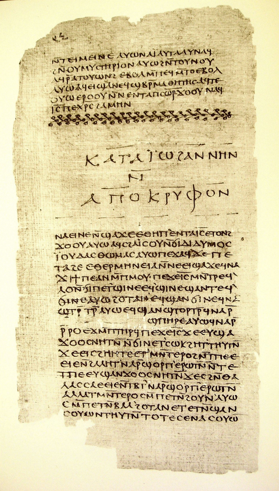

# The *Hypostasis of the Archons* — Sophia, Veil, Rulers, Adam, Norea, Eleleth, and the Root Above

This record serves the essay's account of how a local power comes to claim the whole, and what answers it. It works in the mytheme register and its status is Offered: the tractate of Nag Hammadi Codex II,4, usually titled *The Hypostasis of the Archons* or *The Reality of the Rulers*, is told whole in the order of its own sequence, and the comparisons read from it afterwards are the essay's proposals and no ancient teaching. In the tractate a ruler forms and claims, a woman eludes possession, Norea refuses an imposed ancestry, and Eleleth answers her question about where the rulers came from. What these acts disclose is a relation between effective power and the origin that power cannot own, and the myth discloses it through the action of its whole image.

Creation, human formation, coercion, resistance, retrospective revelation and promised liberation make up the telling, and its cosmological hierarchy becomes consequential through what the rulers can do to the lives within it and what those lives can answer.

---

## #0 — The question addressed to the rulers

### Source identity and structure

This tractate is a Gnostic exposition of the origin, nature and power of the rulers or authorities, and its surviving Coptic text belongs to Nag Hammadi Codex II. Modern editions and translations differ in title and wording, and Bentley Layton's *Hypostasis of the Archons* and Willis Barnstone and Marvin Meyer's *Reality of the Rulers* are separately named English translations.

Scholarly description gives the essential cosmological distinction: a veil divides an incorruptible, invisible realm above from the corruptible, visible realm of matter and ignorance below, and the lower rulers arise inside the shadowed realm and reproduce a hierarchy modelled on what lies above them. Its narrative then moves through creation, human formation, domination, resistance and revelation and offers no single static map.

It survives as a late-antique Coptic tractate, the fourth of Codex II. Its manuscript provenance in Egypt, its proposed composition, its narrated cosmography and its modern reception have separate offices. Stephen E. Robinson's [Coptic Encyclopedia account, CE 1261a–1262a](https://ccdl.claremont.edu/digital/api/collection/cce/id/1001/download) places a Greek composition before AD 350 and notes Jewish or Jewish-Christian connections, and that dating is a scholarly attribution, with no exact city of composition established here. Heavens, abyss, garden and ark belong to narrated space, and Taylor's contemporary reception belongs to a different historical moment from the ancient story.

> Folio 32 of Nag Hammadi Codex II, a fourth-century Coptic papyrus codex. The leaf carries the end of the *Apocryphon of John* and the beginning of the *Gospel of Thomas*. The *Hypostasis of the Archons*, the fourth tractate of the same codex, follows later in the book. The page shows the codex the record's tractate survives in.
>
> Credit: Nag Hammadi Codex II, folio 32, fourth century; photograph reproduced on Wikimedia Commons from biblical-data.org. Public domain.

Disclosure changes how the earlier coercion is understood. Human formation and Norea's crisis come before Eleleth's retrospective account of the rulers' origins, and the late speech makes their local power intelligible through a source they had claimed to exhaust, while promised liberation stays a later event.

In the [selected Layton translation](../../../../episteme/sources/biblical-studies/nag-hammadi/hypostasis-archons-layton/hypostasis-archons-layton.md), the opening invokes apostolic teaching about cosmic powers and answers a correspondent's inquiry, and the received telling runs from that inquiry through its closing hymn. Barnstone–Meyer is a separately named translation whose variants have not been collated with this English carrier.

## #1 — A formed human exceeds the makers

### The arrogant ruler mistakes a local realm for the entirety

It starts from the rulers' claim to authority. Their chief is blind, powerful, ignorant and arrogant, and he declares himself the sole god. A voice from incorruptibility answers him and names his error: he does not see the greater reality whose absence from his own field he has mistaken for non-existence. That declaration turns a limit of sight into a claim over reality, since a ruler who sees only his own field finds no visible superior inside it, reads that absence as absence from reality, and so claims total authority, and the voice from beyond the field contradicts the claim. In this rebuke the chief ruler is named Samael, and the cosmological revelation also gives him the names Yaldabaoth and Sakla.

### Adam, Eve and the rulers' attempt to possess life

Next the tractate retells Genesis through its own Gnostic exegesis. The rulers take part in forming Adam after an image they have perceived, and the human becomes living through a power they do not finally own. Eve, the spiritual feminine principle, appears in a field where the rulers repeatedly try to dominate, possess and reproduce what exceeds their authority. In the consulted Layton telling the spiritual woman, the bodily woman, the shadow and the instructing principle keep distinct narrated offices, and exact Coptic wording and differences from Barnstone–Meyer still need edition-level source control. What emerges is that the rulers can form, name and govern within the lower field while life and spiritual origin exceed the jurisdiction they claim.

Incorruptibility's reflection attracts the rulers, and Adam is their earthen decoy. Breath fails to raise him until spirit descends from the Adamantine Land. Animals receive names, and the garden brings prohibition. Sleep becomes ignorance, and the spiritual woman awakens Adam, escapes pursuit by becoming a tree, and leaves behind a shadow, which the rulers sexually violate. The instructing principle enters the serpent and leaves it, and eating exposes spiritual nakedness, and fig leaves, blame, curses, expulsion and imposed toil follow.

Formation and pursuit belong together: the rulers cannot originate the life they seek, and they try to possess its manifestation instead, so the account's distinction between the woman and the shadow is materially necessary to Norea's later denial of their claimed genealogy. Keeping that distinction tells the scene without making the violated figure disappear from the narrative, and violence remains part of the world the rulers administer.

## #2 — Norea refuses the ancestry of possession

Cain farms and Abel keeps sheep. Rejected and accepted offerings lead to fratricide, accusing blood and sevenfold vengeance. Seth follows Abel, and Eve then bears Norea. A ruler warns Noah of the flood, and the ark comes to rest on Mount Sir. Noah excludes Norea, whose breath burns the ark, and he rebuilds it.

### Norea · flood · refusal of the rulers

With the later human generation Norea comes to the centre. The rulers plan a flood, Noah builds the ark, and Norea's relation to the ark and the flood differs strikingly from the canonical biblical story. She then confronts the rulers directly, and when they claim authority over her through Eve, she refuses the genealogy they impose, telling them that she is not their descendant and that she comes from the world above. Their claim to rule is thereby contested at the level of origin. Coercion follows, and Norea cries out to the higher divine reality for rescue.

### Eleleth · rescue · revelation of the root

Eleleth, one of the great luminaries associated with the invisible Spirit, descends to Norea, and his office is twofold: he rescues her from the rulers' immediate claim, and he teaches her about her root and about the rulers' own origin. This return is therefore more than a stronger ruler defeating weaker ones. Its decisive operation is genealogical and epistemic disclosure. First the rulers claim authority over Norea, she refuses the genealogy they impose, and Eleleth reveals the rulers' own derivative origin, so that their cosmic power is re-situated inside a larger order and her root is shown to exceed their universe. Authority is limited by recovered provenance.

Norea describes Eleleth's golden appearance and snowy clothing. Her question to the arriving angel preserves her active part in the encounter, and rescue does not end her inquiry: she asks about the authorities' genesis, material and force, and the account that follows answers the very power that threatened her. This changes the position from which the rulers can be understood. They had presumed to tell Norea where she came from, and she receives an account of where they came from.

## #3 — The rescuing speech turns back to the rulers' beginning

### Pistis Sophia · veil · shadow · matter · lower ruler

Eleleth's revelation to Norea gives the rulers' genesis. Pistis Sophia desires to create without her consort, and a veil lies between the world above and the lower realms. Shadow comes into being beneath the veil and becomes matter, and a deficient, arrogant, lion-like ruler emerges in that lower condition. He opens his eyes upon an apparently limitless quantity of matter and repeats the same totalising claim: because his horizon holds no visible prior reality, he treats his local horizon as the whole. Sophia introduces light into matter and exposes his mistake without making the lower realm unreal. His genesis thus keeps both the boundary and the conditions beneath it, from the incorruptible and invisible above, across the veil, through shadow into matter, and from there to a local ruler who mistakes his horizon for the entirety, until light from above reveals the error.

### The rulers and their layered heavens

This lower ruler generates seven offspring, rulers like their parent, and the cosmology distributes rule through layered heavens, or chaotic realms. A secondary scholarly summary describes Yaldabaoth's offspring as an organised hierarchy corresponding to the higher realm, and surviving translations place Sabaoth in the seventh heaven beneath the veil and describe the heavens of chaos becoming populated by subordinate powers. A layered cosmos relates a higher order to a lower formation and its administered heavens, and the number of levels alone does not explain the jurisdiction each ruler claims. Local beings inhabit a world whose rulers claim more authority than their own genesis warrants, so that the hierarchy is cosmological and political together within the story.

### Zoe · Sabaoth · repentance inside the hierarchy

Not even the lower hierarchy is homogeneous. Zoe, daughter of Pistis Sophia, rebukes the arrogant ruler, and in the revelation Sabaoth, one of the offspring, sees the higher power, rejects his father and matter, praises Sophia and Zoe, and is elevated to authority in the seventh heaven below the veil. That reversal matters because the cosmology is no simple equation of lower with evil and higher with good: a ruler within the lower genealogy can recognise the false totalisation of the parent authority and change relation, so the whole already contains recognition within structure and offers more than escape from structure.

Zoe's breath becomes a fiery angel who binds Yaldabaoth in Tartaros. Sabaoth's throne has a four-faced cherubic chariot, ministers, harps and lyres, with Zoe teaching at his right and wrath standing on his left, and Yaldabaoth's envy generates death and death's offspring.

Two rebellions keep different offices. Sabaoth changes allegiance within the rulers' genealogy, and Norea denies that their genealogy contains her root, so no single hero escapes one parent. Sabaoth's elevation changes the lower administration, while the disclosure to Norea addresses the jurisdiction that administration can claim over her. Sophia's initiative, Zoe's intervention and Eleleth's teaching are also distinct acts, and calling all three wisdom would hide who generates, who acts against the ruler and who makes origins known.

## #4 — The root disclosed and the ending still to come

Eleleth's revelation promises disclosure after three generations, and his answer extends to Norea's offspring and to future deliverance. A true Man will bring saving disclosure, spiritual beings will be freed, and the authorities' world will lose its dominion. A closing hymn gives the ending a collective voice before Father, Son and Holy Spirit. This prospective ending matters, since Norea's immediate rescue is not narrated as the completion of the whole cosmic history. In Robinson's [account of the tractate's ending](https://ccdl.claremont.edu/digital/api/collection/cce/id/1001/download) the promised liberation and destruction remain eschatological, and Layton's telling gives that future its teaching, anointing, ascent, lament and praise in sequence.

### Origin answers the claim to entire authority

We can now see that the authorities act through an ordered world whose formation and threatened lives stay connected. Pistis Sophia's creative initiative, the veil, shadow and material realm, an arrogant ruler who mistakes his local horizon for total reality, subordinate rulers in layered heavens, Zoe's rebuke, Sabaoth's recognition and changed allegiance, human formation inside the rulers' world, the rulers' attempts to possess or administer life they did not originate, Norea's refusal of their genealogy, and Eleleth's rescue and disclosure of the root all belong to one movement, which is false sovereignty corrected by provenance.

Their mistake is not that their local world is imaginary, since they possess real efficacy inside it. They err in inferring from local efficacy and local visibility that their order is self-grounding and exhaustive.

### Shared archetypal relation, situated telling

Genesis, separation and contested parental authority also enter [Neumann's account of differentiation](../../../archetypal-ground/neumann-images/WHOLE.md#neumann-world-parent-separation), where an emerging being becomes able to answer its inherited world. That shared archetypal structuration gives the comparison a ground and leaves this particular connection proposed. Norea's resistance can enter a question of liberation without being renamed as Neumann's hero, and her revealed origin has a religious office distinct from a psychological episode of ego formation.

The difference is consequential: the existing Neumann whole moves through separation toward renewed differentiated participation, whereas this tractate gives the realms a pronounced opposition and directs its promised ending beyond the rulers' order. Sabaoth's internal reversal and Norea's transcendent root keep that opposition complex, and they do not make its soteriology identical to the positive Śaiva account of manifestation. So the comparison has to return to the whole that resists its simplification.

Taylor's complete native eightfold keeps its own derivation, and no local god or episode replaces a determination. Taylor's `X/x` follows determining capacity into a particular formation. A [preserved relation or analogous operation](../../../../episteme/etymologies/homology-and-analogy/WHOLE-FIELD-homology-and-analogy.md) makes the proposed crossing exact through both the shared consequence and the theological difference it keeps, and through that comparison the cosmological telling does not become an ancient derivation of QL.

The [Valentinian Sophia–Horos–Achamoth telling](../valentinian-sophia-horos-achamoth/WHOLE.md) gives a separate cosmology and fate to its actors, and its events cannot fill a gap in II,4. Norea, Eleleth, Zoe and Sabaoth keep their present offices, Horos and Achamoth are not inserted into them, and the shared Sophia name asserts no historical identity or line of transmission between the two wholes.

## #5→0 — Return with the whole and its source seam intact

### Local authority and returned origins

Four further comparisons are proposed through the differentiated actions already present, and each keeps this telling's cosmology, coercion, gendered refusal and religious promise as its particular conditions. Before them, the telling can be laid beside the two logics. When the voice from incorruptibility tells the chief ruler he errs, it is the break that a determination meets at the point where it claims to be sufficient: the mark, taken as the whole, is answered by the condition it had treated as absent, which the notation writes `1/0`. The rulers answer that break by appropriation, pursuing the spiritual woman, violating her shadow and imposing an ancestry on Norea, so that the span between ruler and ruled is claimed wholly from the ruler's pole. Norea responds by retention. She keeps the relation open, asks where the rulers came from, and receives an account in which their power stands as derivative and her root is not theirs, which is recognition in the form `0/1` and falls under neither cancellation nor appropriation. [A13 grounds the three answers](../../../../../section-rooms/arguments/A13-Two-Logics-of-Two-Dia-Syn.md) to the break, and the reading is the essay's amplification of the tractate, Offered, since the tractate nowhere states it.

### Layered frame / local-totalisation relation

Taylor's comparison proposes that the chief ruler's declaration is an image of Hybris: a determinate local formation takes its own horizon as the ground of reality because the conditions outside that horizon do not appear within it. The formation's real power makes its appropriation consequential, and the narrative gives the claim a reply from incorruptibility that leaves the lower world standing, so the reply exposes the difference between effective local jurisdiction and self-grounding entire authority.

### Veil / Māyā comparison

A proposed Māyā or frame comparison concerns a visible world related to conditions that do not appear as contents within it. In the tractate the veil divides the narrated realms, and shadow and matter give the lower ruler the field through which he can act. The doctrines are not identical, since the Gnostic lower-world cosmology and the project's positive Śaiva account of Māyā have materially different metaphysical valences, and any comparison has to preserve that difference.

### Archon / technical evaluator comparison

An evaluator, an institution or an agent offers a similar proposed point of comparison where an effective local jurisdiction expands its claim into ground-authority. The fault lies in that expansion and not in the mere possession of a local office.

In an actual technical comparison the judging agent can be a relative functional knower, accounts and alternatives are what it knows, and selected evidence, memory, tools and rules are its means. That whole apparatus is in turn a means within the containing person's inquiry, whose immediate condition and lived judgment keep their office. A returned encounter can correct an answer or task under a fitting measure, revise a failed model, source, evaluator, permission or commission, or retain a fitting condition with reasons, and the warranted consequence has to be inherited by the next act. A stronger claim of changed processing requires an identifiable changed producing condition. This constructed office is a contemporary proposal, and the comparison assigns no spiritual rank or narrated archon to software.

### Norea / Objective Internality / refusal

Norea's refusal proposes a comparison with Number Six's resistance to an exhaustive assigned identity and with Daphne's resistance to possessive determination. Her reply reaches the rulers' asserted ancestry, and her question obtains an account of their origin, so that these different refusals keep their particular adversaries and consequences. Norea's scene keeps its historical, gendered and religious specificity as primary.

### Layering, image and a claim over life

Veil, shadow, material ruler, subordinate authorities and human world form a layered cosmology whose power is contested through Norea and Eleleth. This image makes hierarchy, horizon, local efficacy, false totalisation and recovered origin consequential together, and their narrated relation differs from a modern constitution or an AI architecture. Proposed technical and psychic comparisons answer to the religious and gendered events through which this particular story discloses authority.

[An image can be valued through a claim to possess what it discloses](../../../../../section-rooms/arguments/A20-Image-Valuation-Possession.md). Here the rulers' attraction to incorruptibility's reflection leads to human formation as decoy, attempted seizure, a violated shadow and coerced ancestry, and Norea's refusal and Eleleth's disclosure turn that claim back on the rulers' derivative origin. That proposed comparison keeps the living event beyond an administrator's image of it.

### Source and interpretive scope

The ancient work is Nag Hammadi Codex II,4, *The Hypostasis of the Archons* or *The Reality of the Rulers*, and the telling here paraphrases Layton's English electronic carrier. Technical and psychic comparisons are proposals, and their shared operation keeps the source's particular cosmology and attributes no native logical system to its ancient author.

Layton's electronic translation at Early Christian Writings gives its origin as the Gnostic Society Library and *The Nag Hammadi Library in English*, edited by James M. Robinson, without identifying a print impression. Stephen E. Robinson's encyclopedia entry, CE 1261a–1262a, supplies scholarly chronology, and its compressed Eve and serpent synopsis stays distinct from the spiritual woman, shadow, carnal woman and entering and departing instructing principle in Layton's sequence.

Barnstone–Meyer remains a named translation lead and no collated variant witness. Exact Coptic text, page-lines, damaged passages and differences between translations need their own textual control, and the selected English telling supports paraphrase without supplying a critical Coptic edition or a verified modern quotation.

**Selected episode scopes:** [formation](../../../../episteme/sources/biblical-studies/nag-hammadi/hypostasis-archons-layton/hypostasis-archons-layton.md#hypostasis-archons-layton-q001), [woman/shadow/instruction](../../../../episteme/sources/biblical-studies/nag-hammadi/hypostasis-archons-layton/hypostasis-archons-layton.md#hypostasis-archons-layton-q002), [family/flood](../../../../episteme/sources/biblical-studies/nag-hammadi/hypostasis-archons-layton/hypostasis-archons-layton.md#hypostasis-archons-layton-q003), [Norea/Eleleth](../../../../episteme/sources/biblical-studies/nag-hammadi/hypostasis-archons-layton/hypostasis-archons-layton.md#hypostasis-archons-layton-q004), [retrospective cosmology](../../../../episteme/sources/biblical-studies/nag-hammadi/hypostasis-archons-layton/hypostasis-archons-layton.md#hypostasis-archons-layton-q005) and [ending](../../../../episteme/sources/biblical-studies/nag-hammadi/hypostasis-archons-layton/hypostasis-archons-layton.md#hypostasis-archons-layton-q006) keep separate sequences within the one telling. Scholarly commentary supplies a different historical warrant, and Barnstone–Meyer and Coptic collation are required before variant claims.

### Power answers through the life it cannot own

The *Hypostasis of the Archons* makes cosmology inseparable from a drama of authority. A veil divides realms, and shadow becomes the material condition of a lower world. A ruler born inside that world mistakes his horizon for the entirety and generates subordinate rulers, and life and human origin repeatedly exceed their claimed jurisdiction. Norea refuses the genealogy through which they would possess her, and Eleleth finally reveals both her root and the rulers' derivative origin. **The story's rulers are most dangerous not because they are unreal, but because real local power is mistaken for self-grounding total authority.** That interpretation keeps the difference between the rulers' narrated efficacy and their claim to entire authority, and it does not turn the proposed technical or psychological comparisons into established ancient teaching.
