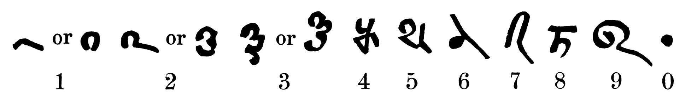
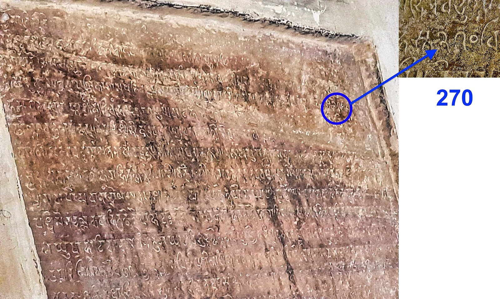

# Zero, Subject, and the Advent of Integral Logic

The history carried here begins when absence stops functioning only as a lack and acquires a place in an order of signs. It follows a second, parallel admission: the subject and its unrepresented psychic ground become explicit problems within modern philosophy and science. The histories retain their distinct objects and methods, while each follows the same operation: rationality admits a term it had treated as background, then meets the frame-disclosing consequences of that admission.

## Zero enters the count

[Kaplan](../../../sources/mathematics-logic/kaplan/kaplan-1999-nothing-that-is/kaplan-1999-nothing-that-is.md) supplies the narrative movement from Babylonian separator through astronomical absence-marker, Indian arithmetic, Arabic transmission, European reception, set-theoretic construction, and the boundary pair `0/1`, `1/0`. The source's force lies in the changing office of the sign. The empty place, the operational numeral, the empty set, and the formal boundary fraction cannot be treated as a single invention, yet each makes absence increasingly active inside calculation.

[Colebrooke's Brahmagupta and Bhāskara carrier](../../../sources/mathematics-logic/brahmagupta/colebrooke-1817-brahmagupta-bhaskara/colebrooke-1817-brahmagupta-bhaskara.md) and [Dutta's reconstruction](../../../sources/mathematics-logic/dutta/dutta-2023-zero-divided-numbers-india/dutta-2023-zero-divided-numbers-india.md) give the crucial mathematical detail. *Śūnya* becomes an arithmetic participant; zero-denominator expressions force restrictions on cancellation and cross-multiplication; the exceptional case reveals the laws of the field within which it is being read. The history therefore reaches the Return of Zero argument at [§1 · #4](../../../../../section-rooms/02-return-of-zero/movements/17-s1-p4-zero-outside-math.md): zero's mathematical life contains a point at which mathematics has to state, transform, or refuse the world it has constructed.

> Yale tablet YBC 7289, an Old Babylonian school tablet from the early second millennium BCE, obverse and reverse. It carries a square with its diagonals and an approximation of the square root of 2 in sexagesimal numerals. It shows what Kaplan's itinerary starts from: a numeration in which the value of a sign depends on its place, so that an empty place first has to be kept before it can be marked.
>
> Credit: Yale Babylonian Collection, tablet YBC 7289 (YPM BC 021354); photograph by A. Urcia, Yale Peabody Museum of Natural History, 2019. CC0 1.0.

> The numerals of the Bakhshali manuscript as Hoernle tabulated them in 1887: forms for 1 to 9 and a dot for zero. The dot marks the place where a digit would stand. The manuscript's date is disputed and this chart leaves it open; it shows the placeholder in an Indian computational text, a step before the operator that Brahmagupta and Bhāskara make of *śūnya*.
>
> Credit: A. F. Rudolf Hoernle, "On the Bakhshali Manuscript," 1887, p. 9, numeral chart. Public domain; reproduction from Wikimedia Commons.

> The inscription of 876 CE in the Chaturbhuj Temple at Gwalior Fort. The uploader's blue circle and arrow mark the numeral 270, in which the zero is written as a small circle; the inscription records the dimensions of a garden. It is an early securely dated written zero in India, the numeral form on which Brahmagupta's operations of the following centuries work.
>
> Credit: Sarah Welch, *Chaturbhuj Temple, Gwalior Fort, Madhya Pradesh* (inscription of 876 CE), photograph with annotation, 15 December 2021. CC0 1.0.

## The subject enters the rational scene

[Gebser](../../../sources/phenomenology-continental-philosophy/gebser/gebser-1985-ever-present-origin/gebser-1985-ever-present-origin.md) gives the visible historical scene. Renaissance perspective generates objectified depth-space, sectorial seeing, and an increasingly distinct ego-world. The achievement gives the mental-rational its power of analysis and technical command. It also hides the conditions of seeing behind the perspective that has rendered them. [§0/1 · #4](../../../../../section-rooms/00-integral-threshold/movements/05-s01-p4-gebser-diaphaneity.md) uses this optical history to formulate the subject-problem: the seeing condition cannot be placed inside the scene without a further act of seeing.

> Albrecht Dürer's woodcut of a draughtsman drawing a lute (1525), from his book on measurement. A cord from the lute passes through a frame to a fixed point, and each point it marks on the frame is transferred to the sheet. This is perspective as an apparatus: one eye-point, one plane, and the lute reduced to what that position can record. Gebser's account of the perspectival world rests on this operation.
>
> Credit: Albrecht Dürer, *Man Drawing a Lute*, 1525, woodcut, from *Underweysung der Messung*; Rijksmuseum, Amsterdam (RP-P-OB-1491). CC0 1.0.

The QL crossed-zero clarifies the operation without retrospectively assigning it to Gebser. `Ø` names the subject-pole when the slash of differentiation has fused with the apparent ego; `X` names the object-world that the same slash has rendered determinate. The modern subject/object relation is therefore a historical achievement of articulation and an occlusion of the relation which produces its terms. In dia-ballein the internally active zero becomes an external midpoint of `+1` and `−1`, then the cancellation which appears when those terms are treated as self-grounding opposites.

[Heidegger's "Age of the World Picture"](../../../sources/phenomenology-continental-philosophy/heidegger/heidegger-1977-question-concerning-technology/heidegger-1977-question-concerning-technology.md) gives the same historical operation its metaphysical name, from inside the tradition whose achievement it diagnoses. "World picture, when understood essentially, does not mean a picture of the world but the world conceived and grasped as picture" (Lovitt trans., p. 129); "the fundamental event of the modern age is the conquest of the world as picture" (p. 134); and that conquest is "one and the same event" as "man's becoming subiectum in the midst of that which is" (p. 132). Representation — *Vorstellen*, a setting-before that forces what is present back into relation to the representing subject as "the normative realm" — is dia-ballein's epochal form: the seeing condition converted into a fixed centre, the world converted into its determinate exterior, the relation between them hidden by its own products. Gebser and Heidegger reach this diagnosis independently, through optics and through metaphysics; no documented exchange between them has been established, and the essay's twinning of their accounts is its own Argued construction, with the *Ever-Present Origin* index check held as intake work. What the twinning earns is the integral demand in a sharper form: the answer to the world-become-picture cannot be a renunciation of pictures, but a picture that carries its own conditions — which the essay builds as the atlas of charts and the Bimba map.

## The unconscious becomes a scientific psychic fact

Freud's 1915 unconscious essay now has a selected bibliographic carrier for this history because it marks the scientific admission of what consciousness cannot own. The question is not whether the word “unconscious” existed earlier. The passage ledger remains open for the exact account of how psychoanalysis makes unconscious processes methodologically unavoidable through symptom, dream, repetition, conflict, and interpretation.

Jung carries the later pressure in another direction. His religious, symbolic, and archetypal materials are psychic facts: real events of psyche whose images can be studied without turning the determining field of their emergence into a completed object. [§4 · #1](../../../../../section-rooms/05-psychoid-flowering/movements/32-s4-p1-jung-individuation.md) gives the QL relation its psychic refraction. `X/x` is authorial QL notation—determining capacity and indefinite particular—while ego, dream, complex, image, and symbol can be read as local `x`-formations through which an `X` becomes historically and personally active.

Erich Neumann's *The Origins and History of Consciousness* is the post-Jungian bridge. It belongs here beside Jung and Gebser because it develops the historical morphology of ego formation and mythic consciousness from inside the post-Jungian field. Its source house establishes its bibliographic identity, terms, chronology, and limits; passage recovery remains necessary before detailed prose. Its place in the history is clear: it lets the emergence of consciousness become a historical psychic event parallel to zero's mathematical admission.

## Integral logic arrives

The integral mutation is higher because it can hold the mental-rational's sectorial achievement within the context from which that achievement arose. It is not a larger ego-viewpoint. The theorem's `180° → 360°` movement makes the operation readable: the first-, second-, and third-person perspectives form the determinate triangle; context makes their relations jointly available; the fourth turn opens the field in which subject, object, and mediation can appear as co-produced without losing their distinctness. [§4 · #4](../../../../../section-rooms/05-psychoid-flowering/movements/35-s4-p4-gebser-apollo-dionysus.md) gives this historical capacity its integral form.

QL gives this mutation a formal Logos. `0/1` names the ground–mark relation whose historical career mathematics has made exact. `(+1)/(−1)` names the mental-rational conversion of that relation into signed opposition. `(0/1)/(1/0)` names the relation recovered at the level where the split, its conditions, and its return can be held together. The history therefore does not grant the theorem its authority; it shows why the theorem becomes historically necessary.

## The technical threshold

Prompt, memory, model, retrieval, tools, evaluation, policy, institution, and user relation have become observable conditions of intelligence. Technical systems give context an explicit objective-internality, making the subject/predicate problem newly material. [§5→0 · #1](../../../../../section-rooms/07-instrument-returns/movements/44-s50-p1-ql-mef-bimba-harness.md) supplies the architectural response: QL carries the relation, MEF preserves its refractive conditions, Bimba holds provisional world-objects, and the harness keeps return practicable. [§5→0 · #5→0](../../../../../section-rooms/07-instrument-returns/movements/48-s50-p5-ahi-planetary-return.md) releases the historical question at planetary scale: can shared intelligence retain the conditions of its own differentiation without any local system occupying the zero as monopoly?

## Where this history bears the essay

| Movement | Historical work |
|---|---|
| [§1 · #0–#5](../../../../../section-rooms/02-return-of-zero/movements/13-s1-p0-sign-migrates.md) | Zero crosses from absence-marker to arithmetic operator, formal boundary, and the earned `0/1` return. |
| [§2 · #1–#2](../../../../../section-rooms/03-two-logics/movements/20-s2-p1-dia-ballein.md) | The mental-rational fall externalises zero as signed opposition; sym-ballein makes the concealed relation explicit. |
| [§3 · #0](../../../../../section-rooms/04-mathematical-substrate/movements/25-s3-p0-eight-determinations.md) | The eight determinations give the historical movement a native QL body, especially `X/x`, `AM/IS`, `∞/dx`, and `1/0`. |
| [§4 · #0–#4](../../../../../section-rooms/05-psychoid-flowering/movements/31-s4-p0-psychoid-problem.md) | Unconscious, individuation, psychoid field, crossed zero, and integral diaphaneity receive their psychic and historical form. |
| [§5→0 · #1–#5](../../../../../section-rooms/07-instrument-returns/movements/44-s50-p1-ql-mef-bimba-harness.md) | Hybrid intelligence becomes the new material field in which context, relation, and return must be made operational. |

The authoritative argument route is [[symbolon/episteme/maps/zero-subject-advent|The Advent of Zero, Subject, and Integral Logic — Transverse Thread]]. Source houses remain the authority for evidence; section and argument nodes remain the authority for the essay's claims.
