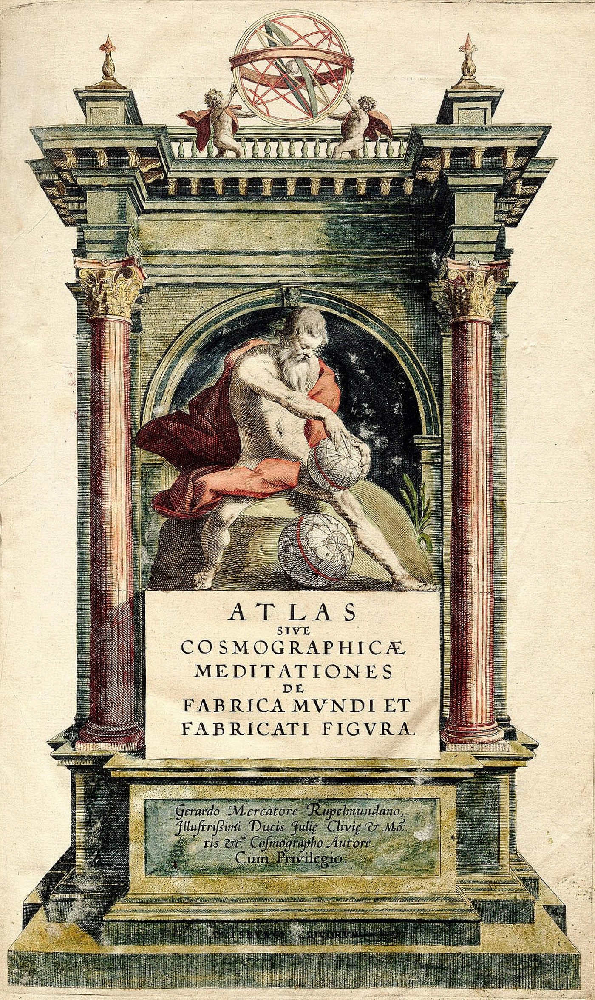

# Manifold atlas, charts and transition functions

## #0

An atlas makes one space accessible through coordinates whose changes are themselves specified. Let $M$ be a Hausdorff, second-countable topological space locally homeomorphic to $\mathbb R^n$. A chart $(U,\phi)$ consists of an open subset $U\subset M$ and a homeomorphism $\phi:U\to\phi(U)$, where $\phi(U)$ is open in $\mathbb R^n$. An atlas is a family of such charts whose domains cover $M$. The domain belongs to the manifold; its coordinate image belongs to Euclidean space. Moving between these two is already an operation with an inverse.

> The title page of Gerardus Mercator's *Atlas sive Cosmographicae Meditationes* (1595), which gave the name atlas to a book of maps. The mathematical atlas takes its vocabulary, chart and atlas, from this cartography: a world covered by sheets, each flat and bounded, with the means to pass from one to the next. The record's construction replaces the printed sheets with homeomorphisms and transition functions.
>
> Credit: Gerardus Mercator, *Atlas sive Cosmographicae Meditationes de Fabrica Mundi et Fabricati Figura* (Duisburg, 1595), frontispiece. Public domain; reproduction from Wikimedia Commons.

For a smooth manifold, the coordinate changes on overlaps must be smooth with smooth inverses. Compatibility makes differentiation independent of the chosen compatible chart. A maximal smooth atlas contains every chart compatible with this structure; maximality specifies which changes are admitted. It makes no claim that all possible objects or processes on the manifold are known.

[World-picture to world-atlas](../../../section-rooms/arguments/A22-World-Picture-to-World-Atlas.md) **extends** the construction into epistemology: a situated account becomes traversable once its overlap, its transformation and its limit are available. The mathematical construction specifies charts of one manifold and the compatible transitions between them, and the epistemic reading asks situated accounts to disclose their own overlaps and translations. [Hatcher's topological reference](../../episteme/sources/mathematics-logic/hatcher/hatcher-2002-algebraic-topology/hatcher-2002-algebraic-topology.md) **sources** the comparison at the level of paraphrase, since its exact atlas and differential-structure passages are not yet collated and no quotation is attributed to them.

## #1

The circle gives a complete small example. Write

$$
S^1=\{(x,y):x^2+y^2=1\},\qquad N=(0,1),\quad S=(0,-1).
$$

Choose $U=S^1\setminus\{N\}$ and $V=S^1\setminus\{S\}$. Their coordinates are

$$
u=\phi_U(x,y)=\frac{x}{1-y},\qquad
v=\phi_V(x,y)=\frac{x}{1+y}.
$$

Each image is all of $\mathbb R$. The inverse maps make the construction checkable:

$$
\phi_U^{-1}(u)=\left(\frac{2u}{1+u^2},\frac{u^2-1}{1+u^2}\right),
\qquad
\phi_V^{-1}(v)=\left(\frac{2v}{1+v^2},\frac{1-v^2}{1+v^2}\right).
$$

Substitution gives $x^2+y^2=1$; composing with the corresponding coordinate recovers $u$ or $v$. The missing pole is exactly where that chart's denominator vanishes. Together the domains cover the circle, including both poles.

A single global chart cannot cover this circle, because it would make the compact circle homeomorphic to a nonempty open subset of $\mathbb R$, and such a subset cannot be compact. The reason is compactness, and no rule demands several charts for every manifold: Euclidean space has a global chart. [Toroidal circulation](../../../section-rooms/arguments/A17-Toroidal-Circulation-and-the-Arche-Topos.md) **compares** a torus under the same compactness constraint, with a winding structure that needs its own construction. [Projective dimensional reframing](../../../section-rooms/04-mathematical-substrate/movements/28-s3-p3-projective-dimensional-reframing.md) **returns-to** this specified change of representation beside its distinct projective constructions.

## #2

On $U\cap V$, both poles are absent, so both coordinates are nonzero. The transition has its full domain and codomain:

$$
\tau_{VU}=\phi_V\circ\phi_U^{-1}:\mathbb R\setminus\{0\}\longrightarrow\mathbb R\setminus\{0\},
\qquad v=\frac1u.
$$

Indeed $uv=x^2/(1-y^2)=1$. Its inverse is $u=1/v$, and its derivative is $-1/u^2$, smooth and nonzero throughout the overlap. The two charts are smoothly compatible. At $(x,y)=(3/5,4/5)$, the first reports $u=3$, the second $v=1/3$. Their unequal numbers identify the same point through the declared transition.

For three overlapping charts, the transitions obey

$$
\tau_{ki}=\tau_{kj}\circ\tau_{ji}
$$

where all three are defined. Substituting their definitions cancels the intermediate $\phi_j^{-1}\circ\phi_j$; this is the cocycle condition. It ensures that changing through an intermediate chart reaches the same coordinates as changing directly. It follows from genuine charts on one manifold, and becomes a consistency requirement when local coordinate descriptions are proposed as data to be joined. Cocycle consistency alone does not ensure that a proposed glued space is Hausdorff or second-countable; those manifold assumptions still require verification.

The regularity requirement matters. On the real line, the coordinates $x$ and $x^3$ are topologically compatible, but their transition inverse is not differentiable at zero. They cannot belong together to the same smooth atlas. Compatibility must therefore name the structure being preserved. [Identification through difference](../../../section-rooms/arguments/A02-Copula-Self-Identity-through-Difference.md) **grounds** the keeping of a point identifiable through different coordinates, and [contextual transparency](../../../section-rooms/arguments/A04-Diaphaneity-Contextual-Transparency.md) **extends** it by disclosing the charts and transitions through which the identification is made. The reciprocal transition is also a neighbour of the bilinear transformations in [NIST's complex-variable house](../../episteme/sources/mathematics-logic/nist/nist-dlmf-2026-complex-variable/nist-dlmf-2026-complex-variable.md), whose complex-plane passage leaves the general atlas definition to other sources.

## #3

Coordinate independence becomes substantive when an operation agrees across the overlap. Let $f:S^1\to\mathbb R$ be height, $f(x,y)=y$. Its local expressions are

$$
f_U(u)=\frac{u^2-1}{1+u^2},\qquad
f_V(v)=\frac{1-v^2}{1+v^2}.
$$

They satisfy $f_V(1/u)=f_U(u)$. At the worked point, either expression gives $4/5$. The invariant is the scalar value at the point, while the formulas change with the coordinate.

For a differentiable path passing through that point, write its local coordinate velocities as $\dot u$ and $\dot v$. The chain rule requires

$$
\dot v=-\frac{1}{u^2}\dot u.
$$

If $u=3$ and $\dot u=2$, then $v=1/3$ and $\dot v=-2/9$. Assigning velocity 2 in both coordinates would describe different tangent motion. The derivative of height agrees: $f_U'(3)\dot u=(3/25)2=6/25$, while $f_V'(1/3)\dot v=(-27/25)(-2/9)=6/25$. Coordinates, components and formulas differ; their transformed relation preserves the same change in height.

An atlas gives the means to express dynamics consistently, and the dynamics have to be supplied separately: a vector field gives a velocity at each point, a trajectory follows that field, and an attractor needs still further dynamical conditions. In [Symbolon Dynamics](../../episteme/sources/internal-corpus/taylor/taylor-2026-symbolon-dynamics/taylor-2026-symbolon-dynamics.md) local disclosures and their transitions are distinct from trajectories and invariant organisations, and the symbolic transformer can illuminate both offices without turning a chart into an attractor. [Computational process](../../../section-rooms/arguments/A14-Computational-Process-Ontology.md) **grounds** the repetition of a specified change under retained conditions, and [objective internality](../../../section-rooms/arguments/A26-Objective-Internality-Mind-as-Worldhood.md) **extends** it to a representation that operates inside the world whose activity supports it, each keeping its own office.

## #4

The [MEF twelve-lens reference](../../../../epi-logos/resources/mef-12-lenses-sublens-reference.md) makes each lens a situated reading of the whole rotated Name/Power field, and [the recovered local compilation](../../episteme/sources/internal-corpus/taylor/taylor-2026-mef-twelve-lenses/taylor-2026-mef-twelve-lenses.md) **sources** the twelve rotations, their Day/Night grounding faces and the 72-fold pre-lens potential. It is a derived architectural synthesis, and its historical assignments, musical tables and implemented utility carry their own warrants. A lens's transformation of salience is an authorial epistemic operation. Establishing it as a literal smooth coordinate change would take a shared manifold, open domains, invertible maps and the appropriate regularity, and naming twelve lenses supplies none of these.

The passage from [world-picture to world-atlas](../../../section-rooms/arguments/A22-World-Picture-to-World-Atlas.md) makes an account answerable through four declared relations: the shared question, the overlap, the retained distinctions and the rule of translation. Two accounts can fail to overlap, can disagree on the object, or can lack a reversible translation, and recording which failure occurs advances the inquiry. The [Gebser movement](../../../section-rooms/00-integral-threshold/movements/05-s01-p4-gebser-diaphaneity.md) **returns-to** this page for contextual transparency, and [Bimba and energy fields](../../../section-rooms/06-objective-internality/movements/41-s5-p4-bimba-energy-fields.md) gives the constructed reference field a bounded Bimba office, a source-dependent determination within a wider context.

[Self and other](../../../section-rooms/arguments/A27-Self-and-Other-Unity-without-Possession.md) **grounds** the keeping of another participant's independently grounded relation, and [authored scope and positional delegation](../../../section-rooms/arguments/A28-Authored-Ground-Positional-Delegation.md) keeps the authored scope of a commission. [Objective co-internality](../../../section-rooms/arguments/A30-Objective-Co-Internality.md) **extends** their contributions into shared conditions, where a warranted change or a reasoned retention can guide the next act. These relations go beyond the coordinate theorem's premise of one already specified manifold, and their epistemic work needs encounters through which the reference field itself can change. Mapper nerves, persistent homology and sheaf gluing are separate proposed constructions with their own inputs and warrants, and an obstruction to gluing proves no ethical pledge as a mathematical necessity.

## #5→0

The atlas returns a local determination with its conditions: the point, the chart, the overlap and the transformation all stay available. [The differential field](../../../section-rooms/arguments/A16-Arche-Topos-as-Differential-Field.md) **grounds** the holding of local determinations together with the relations through which they become available, and [the arche-topos](../../../section-rooms/04-mathematical-substrate/movements/30-s3-p5-arche-topos.md) gathers their distinct placements with no single chart standing as the whole field. The passage from a picture to an accountable field of pictures is earned through an operation a reader can repeat.

The [curated core](../../episteme/sources/internal-corpus/taylor/taylor-2026-core-theorems-pithy/taylor-2026-core-theorems-pithy.md) keeps that operation within the eight determinations and their inversions. The [Matheme Two Locks](../README.md), sourced through the [Binary house](../../episteme/sources/internal-corpus/taylor/taylor-2026-binary-explication/taylor-2026-binary-explication.md), keep Definition/Quilt's `0/1 = 4+2 = 5→0 = 0/1` and Process/Music's `0/1 = 4+2 = 5→0 = 1/0 = 4′+2′ = 5′→0′ = 0/1`. Coordinate inversion supplies an explicit local operation, and File 2's inverse-phase primes and File 3's Night-pass sequence are no products of it, nor does the circle alone yield either full chain.

[Deferential intelligence](../../../section-rooms/arguments/A31-Deferential-Intelligence.md) **extends** the lesson: returned resistance reaches whichever answer, source, task or governing frame warrants reconsideration. [Epistemic cultivation](../../../section-rooms/arguments/A33-Epistemic-Cultivation-Operational-Parity.md) carries the warranted revision, or the reasoned retention, into actual work so that the next act inherits it. [Research vectors](../../../section-rooms/06-objective-internality/movements/42-s5-p5-research-vectors.md) **test** these as lens refraction and deferential return, and [the QL–MEF–Bimba harness](../../../section-rooms/07-instrument-returns/movements/44-s50-p1-ql-mef-bimba-harness.md) keeps their conditions in the proposed instrument. The mathematical example establishes exact agreement across a declared overlap, and the research programme asks how situated, revisable accounts can earn declared transitions of their own.
