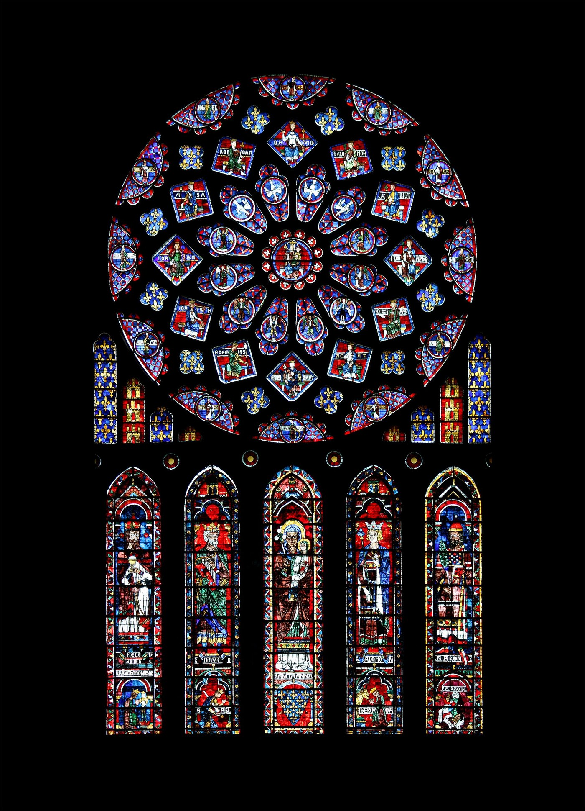

# Stained Glass — Originating Light, Spectrum, Panes, Seams, and Returning Recognition

This record serves the essay's account of how a work can be constructed so that the relation which originates it becomes perceptible through the differences of its materials. It works in the mytheme register, and its image is Frank Taylor's own, the optical movement from originating light through differentiated transmission to a situated appearance and a returning recognition. No particular historical window, cathedral programme or sacred iconography is being reconstructed. The composition comes from the [stained-glass contribution and its explicit correction](../../../../../quilt/27-07-26-QUILTING-FOR-FULL-ARGUMENT.md), in which the window becomes a way of making the argument, with each source's distinct office active in the result.

## #0 — Light entering a made aperture

Light enters a room through a window assembled from differently coloured panes. The panes give it determinate passages, the lead holds their boundaries, and an image falls into the interior where someone can meet it. Sun, aperture, glass, seams, room and viewer all belong to the event, and the visible colour does the work of relations that colour alone cannot display completely.

Priority belongs to the originating light and not to the projected image. The viewer nevertheless meets the image first and follows its differences back toward what made them possible, and that asymmetry is what gives the whole its direction: what is prior in being can be later in recognition. **Bimba** names the Original order and **pratibimba** its determinate reflected or refracted display, and the image in the room has the second office. The viewer and the maker both fail to supply the Original by finishing the picture.

## #1 — The spectrum implicated in the light

Plenitude belongs to white light, whose apparent unity holds the possibility of differentiated colour together with the relations through which the colours belong to one field, and in Taylor's optic this full ordered spectrum figures **QL**. QL belongs immanently to the originating light as its harmonic articulation, so a pane gives a difference its passage and does not first create the capacity for difference in a contentless source.

In [the native theorem field](../../../../episteme/sources/internal-corpus/taylor/taylor-2026-core-theorems-pithy/taylor-2026-core-theorems-pithy.md) the same relation unfolds formally. Its parent phases bear the complete positional field in inverse orientations, and the First Spanda joins its source-to-expression and return-to-recognition movements through their interference term, so that the achieved relation can turn back through what generated it. The optical whole makes this implicated fullness and differentiated return visible, and the derivation of the equations stays in the theorem field.

QL's sixfold body and eight-determination traversal therefore remain distinct from the number of panes in the window. The eightfold follows bare relationality, conscious circumstance, question and assertion, withdrawal and extension, determining capacity and instance, personed context, differential horizon and the return-switch, and its native `X/x` names determining capacity and local instance before any psychic reading. No pane needs to receive a permanent number, tradition or colour for these relations to hold, and the window's local sixfold follows what the light, the construction and the encounter actually do.

Taylor's spectral language is a formal and mytheme articulation. Modern spectral optics and Śaiva metaphysics keep their own historical objects and warrants, and physical light lends the image its sensuous body without deriving QL.

## #2 — Colour acquires a passage; the joins stay visible

Each pane has a material, a density, a colour and an angle. Where it is placed it permits some transmission, bends or colours what passes and obstructs something else, and the maker joins these different capacities into an aperture. Colour gives disclosure a definite form, and removing every difference in pursuit of neutrality would also remove the particular transformations through which the composition becomes articulate.

Taylor's quilt distinguishes this construction from an opaque mosaic. A mosaic arranges fragments into a surface image, whereas a window works through transmission and obstruction as well as arrangement, and its material joins take part in how light enters. That is why the window carries the method's construction from the beginning: choosing and joining its materials already determines how the source can become visible.

> The north rose and lancets of Chartres Cathedral, an early thirteenth-century window. This window shows the construction the record describes (the record names no particular window). The picture is made of coloured panes joined by lead, and the light behind it reaches the viewer only through them.
>
> Credit: Eusebius, *Chartres – cathédrale – rosace nord*, photograph, 7 February 2009. Released into the public domain by the photographer.

Lead cames carry the joins. They hold neighbouring panes in relation while they mark where one passage ends and another begins, and in the epistemic construction the seams retain source provenance, historical discontinuity, translation limits, contradiction and changes of register. A passage through a mathematical derivation differs from a passage through a lived encounter or a historical text, and their conjunction becomes informative when a reader can follow where the warrant changes and what survives the crossing.

Panes, media, angles, densities, joins and declared relations figure [MEF](../../../../../section-rooms/arguments/concepts/C39-Meta-Epistemic-Framework.md), the meta-epistemic operation of refraction. A lens changes a question, a permissible inference or an act of judgment while keeping its conditions inspectable, and a source enters the work as a pane whose exact refractive operation changes the visible whole. A tile used only to show that a position has many supporters would perform a far weaker office, and the seams let the reader tell where the light passed through Jung, through Abhinavagupta, through a mathematical derivation, through an anomalous experience or through a designed agentic experiment.

Lead holds the refractive apparatus together, while QL belongs to the light's harmonic order and MEF makes distinctions available within that order. The panes' crossings keep each source and its transformation examinable through the display, and the apparatus gains no authority exterior to the light.

## #3 — The image appears inside the room

A coloured display is produced through the relation of light and made aperture, and it appears in an interior where it is met from a position. Looking only at the glass would recover its coloured matter and arrangement and miss the event of transmission, while looking only at the cast image would conceal the glass, its joins and its placement. The whole holds both the constructed opening and the appearance it makes possible.

This situated image is **pratibimba**. A source-reading, a claim, a model or an essay section can take the same office when it displays an originating relation under determinate conditions, and its particularity makes something available to another person. The danger begins when that availability becomes a claim to possess the source, as if what falls here exhausted what can appear.

We are implicated in the display's appearing as viewers, since body, position, attention and concern enter what is seen and what becomes significant. Taylor's [P5 — Gebser](<../../../../../../../working/sources-texts-references/Epi Paper Write-ups/P5 - Gebser.md>) **sources** the authorial demand for an invested reading of text and subtext: seeing through includes being with what is seen and answerable to the situation's outcome. [Contextual transparency](../../../../../section-rooms/arguments/A04-Diaphaneity-Contextual-Transparency.md) **defines** the optical relation of the whole, in which the display shows a world and makes its conditions readable to the viewer who takes part in it.

A finished image can become a surrogate standard, so that other disclosures are admitted only where they fit it. The window keeps its conditions available so that this reversal can be recognised, and the question can then pass from the beauty or persuasiveness of the present picture to the light, the exclusions and the construction through which it gained that force. Taylor's Father/standard interpretation follows the danger of a projection taking its source's office, and that interpretation has its own authorial attribution, distinct from Gebser's historical account.

## #4 — Changing light discloses the construction

As sun, pane, angle, room and viewer change, the projected colour changes while the pattern stays recognisable, and a later display makes visible a region that was obscured before. Repositioning a lens or changing it can reveal a difference another material could not transmit, or expose an aberration the first view concealed. The changing display gives the reader something to compare: which condition changed, which relation persisted, which difference belongs to the lens, and where the earlier account failed.

What is recognisable across these transformations belongs to Bimba and QL as their order, and the successive appearances remain pratibimbas. Recognition neither averages their differences away nor adds them into a final picture. A contradiction can mark different questions or a failed transition as well as an error needing correction, and its exact location matters, so the coordinated display makes more of its originating relation legible because the transformations remain open to inspection. This is an exact image of a context that is real, constructed and revisable: the window neither invents the light nor transmits an unconditioned view, and builds a form through which origin can become diaphanous.

Taylor's contextual turn is the `180°→360°` movement. First-, second- and third-person positions stop claiming isolated completeness as their joint conditions become available, and the viewer stays situated throughout. The native account separates changing a whole perspective from recognising the field that permits more than one perspective, so that context gives the positions and their transformations a co-present relation. Gebser's historical account of perspective and aperspectivity **historicises** that pressure through his [source house](../../../../episteme/sources/phenomenology-continental-philosophy/gebser/gebser-1985-ever-present-origin/gebser-1985-ever-present-origin.md), especially its paraphrase map at pp.1–3, 11–21 and 255–58, while the geometry and its QL reckoning remain authorial.

An atlas carries a complementary discipline. Its charts specify local domains and transitions on overlaps, including obstructions to composition, and stained glass gives this plurality its lived optical body: transmission, colouring, interruption, a made aperture and a changing interior display. [Differential placing](../../../../../section-rooms/arguments/A16-Arche-Topos-as-Differential-Field.md) makes domains, orientations and paths mutually determining, and a [world-atlas](../../../../../section-rooms/arguments/A22-World-Picture-to-World-Atlas.md) states the transitions through which differently situated views can meet. A chart transition is a different operation from light passing through glass, and each whole keeps the operation the other cannot perform.

Taylor's [Symbolon Dynamics](../../../../episteme/sources/internal-corpus/taylor/taylor-2026-symbolon-dynamics/taylor-2026-symbolon-dynamics.md) **sources** a further distinction within this complement: an atlas coordinates partial disclosures, while an attractor organises trajectories in a dynamical field. Moving among readings can change the interpreter and the future possibilities of interpretation, and that does not turn the window's panes into mathematically defined attractor basins.

## #5→0 — Recognition returns to the aperture

[Taylor's Neumann encounter](../../../archetypal-ground/neumann-images/WHOLE.md#neumann-paper-eightfold) differentiates source, articulation and recognition, and here light, made passages and the changed viewer enact that relation optically: a determinate image becomes readable through what gave it form. Its cultural home is the authorial composition, and its narrated room has no geographical location. Changing illumination and the viewer's return are the image's temporal movement, distinct from the dates of the quilt and its source witnesses.

We return to the window with a changed understanding of the image. What first appeared as a self-contained pattern now discloses the source, the selected passages and the boundaries of its appearing. The image remains determinate, and recognition gives that determinacy a return, so that a seam can be examined, a source reread, a translation qualified, a lens repositioned and an exclusion allowed to affect the next judgment. The work of composition continues through what its own display has made perceptible. The quilt adds the torus as a complementary mytheme at this point: a form individuated as a coherent surface by retaining its hole, so that the window makes the unseen source visible through differential transmission and the torus keeps the unfilled centre through which return stays possible.

The Original stays prior throughout. Within a declared Context Frame an achieved map can genuinely serve as Bimba, the local original or reference field, for situated readings that occupy the pratibimba office, while the same map remains pratibimba relative to its wider sources. The [local Bimba relation](../../../../../section-rooms/arguments/concepts/C38-Bimba-Pratibimba-Bimba-Map.md) **defines** that contextual office for reference, and in its [recursive use](../../../../../section-rooms/arguments/concepts/bimba-pratibimba.md#recursive-office) comparison and correction can reach a situated reading, the relation between reference fields, or the local Bimba itself. An essay section can carry the whole relational movement from its own angle without repeating every other section's content, and QL's native recursion supplies that capacity while the optical composition gives it a sensuous office. A technical harness preserves some conditions of a refraction, namely source, permission, transformation, consequence and review, so that a result can return through them, and this infrastructural office leaves the harness neither the Original nor the exhaustion of the world that sustains it.

### The luminous image and its historical limits

[Dyczkowski's source house](../../../../episteme/sources/indian-philosophy/dyczkowski/dyczkowski-2000-doctrine-vibration/dyczkowski-2000-doctrine-vibration.md) **qualifies** the optical reading through its source-matched transcript. Its p.65 lattice-window image gives a neighbouring account of light appearing diverse through limiting conditions. On pp.66–68 the mirror analogy expressly loses the external object that ordinary reflection requires, since in the Śaiva account the power that generates the universe also hosts its appearing, and on pp.69–70 an inert mirror or crystal can display without knowing, while Vimarśa names the self-apprehending power inseparable from Prakāśa. The sun outside this authored window therefore supplies no warrant for a metaphysical source outside Consciousness, and the glass supplies no substitute for reflective awareness.

[Prakāśa–Vimarśa](../../../../../section-rooms/arguments/A05-Prakasa-Vimarsa.md) **defines** self-apprehending appearing in its metaphysical register. [Singh's Abhinavagupta source house](../../../../episteme/sources/indian-philosophy/abhinavagupta/abhinavagupta-singh-1988-paratrisika-vivarana/abhinavagupta-singh-1988-paratrisika-vivarana.md) **qualifies** the textual route: introduction, translation and commentary keep separate attribution, and notebook passages are not promoted here into edition-verified quotations. The window stays Taylor's composition, even where a traditional image gives it a precise neighbouring relation.

[Bohm's implicate/explicate source house](../../../../episteme/sources/process-systems-theory/bohm/bohm-1980-wholeness-implicate-order/bohm-1980-wholeness-implicate-order.md) **compares** the process vocabulary of implicated wholeness and differentiated display. The relation is **Resonant with**: QL is no extraction from Bohm, and his unfilled passage ledger supplies no optical or physical proof. Gebser is used through page-specific **Paraphrase / Argued from** his historical method, and Dyczkowski supplies **Paraphrased** doctrinal qualification from the local transcript. No new external quotation is claimed, and particular colours and panes remain local optical differences to which the composition assigns no fixed psychological, religious or scientific symbolism.

### Returns from the whole

[Diaphaneity](../../../../../section-rooms/arguments/concepts/C09-Diaphaneity.md) **defines** how a medium becomes readable through what it discloses. A [world-atlas](../../../../../section-rooms/arguments/concepts/C37-World-Picture-to-World-Atlas.md) **extends** the window by relating the changing pictures through their conditions and transitions, and [MEF](../../../../../section-rooms/arguments/concepts/C39-Meta-Epistemic-Framework.md) keeps each source, angle, transformation and divergence available for their comparison. When a later reading exposes an occlusion, its return can correct the selected source, lens, permission or local reference, and an adequate retained relation carries its reasons forward, so that the next display or judgment inherits the warranted decision.

The [situated aperture](../../../../../section-rooms/00-integral-threshold/movements/05-s01-p4-gebser-diaphaneity.md), [differential placement](../../../../../section-rooms/04-mathematical-substrate/movements/30-s3-p5-arche-topos.md) and [accountable refraction](../../../../../section-rooms/05-psychoid-flowering/movements/36-s4-p5-mef-prompt-thrownness.md) meet through light, construction and viewer. The window gives those relations a body someone can encounter and revisit, and optical transmission, formal chart transitions, historical interpretations and technical source-return keep the distinct operations by which each contributes to that meeting.
