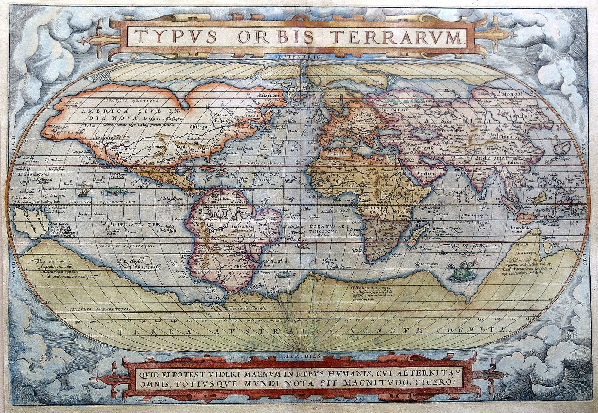
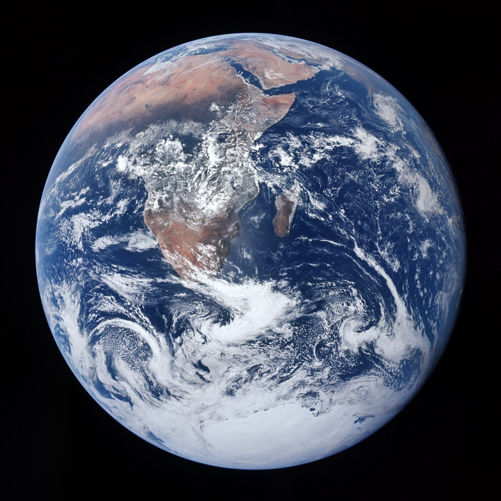

# The travelling jigsaw

This record serves the essay's account of how a world-picture becomes an atlas, and it works in the mytheme register: Frank Taylor's authored image of a puzzle that travels discloses the relation through its whole action, from box-lid to charts and back, and the mathematics of charts and of the torus is its exact witness in a different office. Narrated to carry the image, the traveller's actions report no events, and the mathematical witness proves only what its hypotheses carry.

## #0 — The picture arrives before the pieces

A jigsaw begins with its destination already visible. A picture on the box shows what the pieces will become, so the maker sets out the edges, builds the frame and sorts the remaining pieces by the marks that promise a place within it. Each successful fit confirms a small part of the anticipated whole, and the work is exact, patient and productive, since a local fragment acquires a legible relation to its neighbours.

That finished picture has nonetheless entered the work before the first piece is placed. It supplies the criterion by which every later placement is judged, so the maker can hesitate over a patch of colour while staying entirely certain what counts as completion. Its lid decides which differences belong together, which edge is outside and which apparent anomaly is only a piece still waiting for its position.

Taylor's travelling image begins from this arrangement as an authored image of inquiry and no record of a historical puzzle. In the [governing development](../../../../../../../the-return-of-zero-central-plan.md) the given box-lid yields to an atlas, and in Taylor's [reconstruction](../../../../../quilt/27-07-26-QUILTING-FOR-FULL-ARGUMENT.md) the same puzzle's existing achievements enter another relation to the world. At the start that world is approached as if all its possible appearances had already been cut into pieces by a maker whose picture needs only assembling.

[Heidegger's world-picture account](../../../../episteme/sources/phenomenology-continental-philosophy/heidegger/heidegger-1977-question-concerning-technology/heidegger-1977-question-concerning-technology.md#heidegger-1977-question-concerning-technology-q012) **sources** the diagnosis: world grasped as picture and the representer installed as its normative centre belong to one event. The puzzle gives Taylor's continuation a material form, and its lid can go unmentioned precisely because everything discussed has already been assigned a possible place beneath it.

## #1 — Travel changes what it means to fit

Now the puzzle travels into the world it claims to depict. Its maker meets a road that turns where the flat arrangement cannot follow it, a continuation beyond an edge, a building whose look changes with the position it is seen from. What presses on the image is no longer the search for one more piece: the question reaches the frame and the prior picture: what relation was lost when this domain was rendered in this way?

At first the completed assembly can take the difficulty in as an imperfection in the traveller's knowledge, so that another piece will arrive and another detail will be filled. A further piece is still judged by the same criterion, however, and only a different practice changes anything: the maker begins to record how a view was made, from where, across which region, under what projection, with which omissions and with what possibility of passing to another view.

From then on the pieces take a different office. They become local charts, whose edges mark limits of usable description and whose neighbours overlap where before they merely met along a cut. Within an overlap the maker has to be able to explain how a position described here appears there, so a difference between two reports can disclose a change of coordinates, a difference in what is being measured, or a disagreement that the available translation does not resolve. A seam has become an operative relation.

> Abraham Ortelius's *Typus Orbis Terrarum* in a 1572 printing, the world map that opened his *Theatrum Orbis Terrarum*, the first printed atlas. A single projection draws the whole world on one oval, and the volume that follows it gives each region its own sheet. The book is the historical form of the movement the record describes: from one box-lid picture to charts that carry their own limits.
>
> Credit: Abraham Ortelius, *Typus Orbis Terrarum*, 1572 printing, hand-coloured engraving, from the *Theatrum Orbis Terrarum* (Antwerp). Public domain; reproduction from Wikimedia Commons.

Though the box-lid loses its power to predetermine every fit, picturing goes on. A local view can become more accurate as its limits become better known, and the regulating whole is carried by the domain, its coverage and the rules of transition. An atlas can be worked through: one enters a chart, crosses an overlap, learns what changed and returns with the route in hand, so that its unity is realised through crossings and is no image that every piece has to reproduce.

Eventually the traveller returns to a familiar place. In the first puzzle arrival would have been one more confirmation of the lid, and in the reconstructed puzzle it also brings the history of the passage: the same local address can have been reached by a different route, and the account can keep what the route taught. Each next departure begins with an altered relation to the map.

Travelling therefore runs from a given picture and exact local assembly, through encountered limits and the disclosure of the framing activity, to a reconstruction as traversable local accounts, and the return keeps the difference that travel made. [World-Picture → World-Atlas](../../../../../section-rooms/arguments/A22-World-Picture-to-World-Atlas.md) **derives** how an inquiry can compare situated views and their transitions, and a [world-atlas](../../../../../section-rooms/arguments/concepts/C37-World-Picture-to-World-Atlas.md) makes those crossings available to another inquiry. Within the atlas it could not originally admit, the first picture remains a situated achievement.

## #2 — A crossing has a rule, and a return retains a path

[Manifold charts](../../../../matheme/topology/manifold-atlas.md) **ground** the mathematical witness: they have specified domains and transition rules, and their exact relations give the reconstruction its witness in a distinct application, since several opinions alone supply neither a smooth domain nor the coordinate transformations that charts require.

A circle makes the distinction tangible. Two charts cover the circle by omitting opposite poles. At the point `(x,y)=(3/5,4/5)` their coordinates are `u=3` and `v=1/3`, and on their overlap the rule is `v=1/u`. Reports differ numerically because the coordinates differ, and the declared transformation identifies their common point. Height is `4/5` in either account. Even motion has to be transformed: when `du/dt=2` at this point, `dv/dt=−2/9`, and both descriptions give the same change of height, whereas giving both coordinate velocities the number two would change the motion being described.

This exactness is the positive achievement of the atlas. Its local pictures can disagree in their written values while agreeing in what the values describe, and the overlap and the transformation explain the agreement. When the inverse is missing, the common domain is absent or the required regularity fails, the same conclusion does not follow. [Dimensional reframing](../../../../../section-rooms/arguments/concepts/C52-Dimensional-Reframing-at-Zero-and-Infinity.md) changes a specified space and operation, and representing a condition produces another determination within [the continuing formal limit](../../../../../section-rooms/arguments/A03-Immutable-Gap-Formal-Limit.md), while a coordinate singularity is a distinct mathematical fault and no proof of that native argument.

Compact as they are, the circle, sphere and torus cannot each be covered by one global chart into an open Euclidean coordinate domain of the same dimension, and compactness gives the obstruction. A drawing of the whole surface remains possible, and what fails is that it be a single global chart. Topology also sharpens the first puzzle. Under its disk abstraction every loop is contractible, which does not forbid walking back to a starting point and does remove the torus's independent, non-contractible winding classes. What the diagnosis names is the loss of that relation, and it bans no ordinary movement across a flat picture.

[The torus cover](../../../../matheme/topology/torus-cover-winding.md) makes the relation between a surface and its lifted journey exact:

`T² = R²/Z²`, with `(x,y) ~ (x+m,y+n)` for integers `(m,n)`.

One surface address has infinitely many representatives on the plane. A small neighbourhood is represented accurately by a local lift, and the quotient tells how its other representatives are related. Follow the loop `[2t,−t]` from `t=0` to `t=1`: it returns to `[0,0]` on the torus while its lift moves from `(0,0)` to `(2,−1)`. That pair records winding, and it records neither the traveller's whole experience nor the timing of every step. [Toroidal circulation](../../../../../section-rooms/arguments/A17-Toroidal-Circulation-and-the-Arche-Topos.md) **embodies** local closure with retained displacement, and the [arche-topos](../../../../../section-rooms/arguments/A16-Arche-Topos-as-Differential-Field.md) gives placements and paths their differential field.

A finite presentation thus keeps its relation to the infinite cover. The four sides of the presenting square and the two independent generating loops have distinct structural offices, and the quotient's Euler count uses one vertex, two edge classes and one face. These counts cannot be exchanged merely because a picture makes them look alike, and the familiar embedded doughnut is no intrinsic metric of the flat quotient. Exact differences are what make the image capable of carrying more than an attractive shape.

## #3 — The frame enters the account it makes possible

In [Taylor's core relation](../../../../episteme/sources/internal-corpus/taylor/taylor-2026-core-theorems-pithy/taylor-2026-core-theorems-pithy.md) a determinate image keeps its formal limit and can return through its conditions, as the [Definition of God](../../../../episteme/sources/internal-corpus/taylor/taylor-2026-definition-god-draft3/taylor-2026-definition-god-draft3.md) develops. The [eight determinations](../../../../../section-rooms/arguments/A18-Primordial-Symbolon-and-Its-Eight-Determinations.md) unfold as `−/− → 0/1 → ?/! → −/+ → X/x → AM/IS → ∞/dx → 1/0`, under `/ = −/−`, and the puzzle traverses this field through a change in its relation to its own determinations.

A frame first makes a particular fit possible, and under `−/−` its determining relation cannot be exhausted by one more item fitted within it. At `0/1` the local picture is real while the conditions of its appearance remain active. At `?/!` an encountered mismatch can question the rule of fit and elicit an answer that changes the inquiry. At `−/+` a definite contrast stays necessary, since the atlas must tell valid transitions from invalid ones, and reopening the frame does not abolish judgment.

`X/x` carries the particular representation without letting it exhaust the relation it expresses: a coordinate, a local chart or a pictured person stays determinate, and the native relation keeps that particular form answerable to the capacity through which it became available. `AM/IS` brings the maker and the addressed participant back into the scene, so that the account has someone to answer to, a You whose response the lid cannot supply in advance. `∞/dx` gives the local exactness a horizon it does not exhaust, and the torus lift is one mathematically specified witness within that larger field and no identity between all infinities, all derivatives and all journeys.

At `1/0` the achieved picture returns through its conditions, so that it can disclose its source, revise a relation and enter another encounter. Native parents `(0/1)/(1/0)` and `(1/0)/(0/1)` keep the complete body in inverse orientations, and the travelling action unfolds within that relation, with its six passages replacing no determination and manufacturing none from six narrative scenes. Definition/Quilt and Process/Music keep their distinct return chains in the native supporting texts.

A [context frame](../../../../../section-rooms/arguments/concepts/C08-Context-Context-Frame.md) selects sources, rules and possibilities within a world, and [Objective Internality](../../../../../section-rooms/arguments/A26-Objective-Internality-Mind-as-Worldhood.md) is the operative means through which that world becomes available. In a local inquiry the comparing agent occupies the functional knower office, its memory, projections, reference charts and rules are its means, and the views, configurations and possible transitions are what it knows. Inspecting its choices makes the local centre known to a further inquiry, and within the containing person's Life the whole map-making apparatus serves as a means of encountering the world. A larger contextual inventory stays useful through this relation and does not stand outside every condition of its production.

In [Neumann's world-parent differentiation](../../../archetypal-ground/neumann-images/WHOLE.md#neumann-world-parent-separation) a standpoint and its opposed field become available, and the heroic achievement of a standpoint can later be mistaken for possession of the whole. [Centroversion](../../../archetypal-ground/neumann-images/WHOLE.md#neumann-hero-centroversion) keeps that achievement within the more comprehensive relation from which it emerged. Taylor's [Neumann encounter](../../../../episteme/sources/psychology/neumann/neumann-1954-origins-history-consciousness/neumann-1954-origins-history-consciousness.md) joins these psychological operations to the native field and keeps the attribution distinct, and his primordial-recognition correction remains effective: the condition of appearing is not created by the later ego's successful assembly of an identity.

This common archetypal field assigns no single cartographic history to every culture. This whole has its home in Taylor's authored world, and Gebser's historical account, Heidegger's diagnosis and Bratton's contemporary programme keep their different dates and sources. Geography answers where an account is situated and time answers when it is made, transmitted and changed, so the traveller needs both and neither replaces the other.

## #4 — The planet appears, and the making of the picture returns

Blue Marble is the hinge between a final box-lid world-picture and a first diaphanous planetary image. Taylor's quilt names this image-unit and selects no particular NASA photograph, and the frame the name usually points to is the Apollo 17 photograph reproduced here. A bounded view of Earth can gather attention around a shared planet, and its intelligibility depends on the position, the instrument, the production and the measure through which the view became available.

> The photograph known as the Blue Marble, taken by the Apollo 17 crew on 7 December 1972 (NASA frame AS17-148-22727). The quilt names the image-unit without selecting a photograph; this is the frame the name usually points to. The disc is a view with a position and an instrument: the original frame has south at the top, and the reproduction is rotated to the conventional orientation.
>
> Credit: NASA, Apollo 17 crew, *The Blue Marble*, AS17-148-22727, 7 December 1972. Public domain (NASA).

As a box-lid, the planetary picture settles in advance what the world is and what its pieces must mean, and *planetary* can become the unexamined scale under which particular lives, places and claims are counted. Its apparent completeness opens to these questions, which need a situated answer: whose planet, computed by whom, on whose gauge? An image's breadth of view cannot by itself establish the authority of the account made through it.

That same image becomes diaphanous when its conditions stay readable within its use. Then the view acquires a location and a time, its production and transformations become inspectable, and what lies outside its selected account can matter to the next judgment. It goes on disclosing Earth, and what changes is the viewer's relation to the picture's power. Mission, date and credit are those of the frame shown here and come from its caption and never from the familiar name, and its processing history remains a source duty.

[Gebser's aperspectivity](../../../../episteme/sources/phenomenology-continental-philosophy/gebser/gebser-1985-ever-present-origin/gebser-1985-ever-present-origin.md) **sources** the liberation of perspective from its claim to exclusive validity, which is more than a synthesis of views, and the opening pages of the selected English work preserve perspectival articulation within the question of integrality. [Diaphaneity](../../../../../section-rooms/arguments/A04-Diaphaneity-Contextual-Transparency.md) **defines** how [the conditions of disclosure](../../../../../section-rooms/arguments/concepts/C09-Diaphaneity.md) become legible within the disclosed world. Taylor's Gebser development adds care for the outcome, being with the text and subtext, and technically active context extends that concern into consequential participation, where a view's conditions can affect its use.

An [image's authority](../../../../../section-rooms/arguments/A20-Image-Valuation-Possession.md) stays alive when what it claims to disclose can change it. The [Bimba–Pratibimba relation](../../../../../section-rooms/arguments/concepts/C38-Bimba-Pratibimba-Bimba-Map.md) and [disclosure through situated reference](../../../../../section-rooms/arguments/concepts/C61-Symbolon-Disclosure-Architecture.md) **ground** that possibility for the atlas itself. A produced world-picture is pratibimba, and within a declared Context Frame it can genuinely occupy Bimba, the local original for situated readings that are its pratibimbas. It remains pratibimba relative to wider sources, and returned evidence can revise that local original itself. Optically, the relation likewise keeps QL as the ordered spectrum and MEF as the apparatus of refraction, and neither makes the cast image its own originating light.

The [Encounter / Region / Name / Count / Countenance / Account relation](../../../../episteme/etymologies/encounter-region-name-count/WHOLE-FIELD-encounter-region-name-count.md) **defines** the planetary claim as situated and answerable through four connected operations. Encounter-in-Region places the claim before it becomes a universal report. Name-through-Count distinguishes the units and exclusions through which it becomes reckonable. Count-through-Countenance lets an addressed participant answer the scale under which they were counted, and Count-to-Account makes the criterion, provenance and consequence available to scrutiny. The [Other's irreducible reply](../../../../../section-rooms/arguments/A27-Self-and-Other-Unity-without-Possession.md) can then enter [shared conditions](../../../../../section-rooms/arguments/A30-Objective-Co-Internality.md), and the resulting account becomes another situated encounter. Taken together the four operations assert no shared lexical descent for the six terms.

## #5→0 — The atlas travels with the means to revise it

The reconstructive technical proposal starts where the first puzzle finished, with the map-making operation travelling alongside its map. A [meta-epistemic framework](../../../../../section-rooms/arguments/concepts/C39-Meta-Epistemic-Framework.md) makes the lenses and gauges consequential to salience, evidence and judgment, and the twelve-lens field retains the whole rotated Name/Power constellation on both faces. A change of lens has to change what the inquiry does, and twelve labels on the same unaltered picture do not perform twelve readings.

Taylor's proposed Mapper route has five operations: choose a filter or lens, cover its range, pull the cover back, cluster locally and construct the nerve. Keeping the lens, cover and clustering choices makes the resulting representation answerable to its construction. A Mapper nerve is not automatically a manifold atlas, and its overlaps alone do not supply invertible coordinate transitions. Sheaf methods supply local data, restriction maps and compatibility, and where specified gluing conditions fail, a genuine obstruction is a result to expose, which neither proves that no computation is possible nor mathematically entails an ethical pledge. Taylor's authored surety comparison gives the further responsibility a bearer when the current formal arrangement cannot supply the required continuation, and the quilt's phrase for it is that the obstruction is where the surety lives. An implemented comparison has to establish the technical consequence of the proposed route, and no experiment is reported here.

The [Homologia / Analogia relation](../../../../episteme/etymologies/homology-and-analogy/WHOLE-FIELD-homology-and-analogy.md) **compares** these crossings exactly. Local determination with recoverable conditions and return can be preserved across a stated transformation, and analogical proportion relates the mathematical and epistemic objects in a specified respect, so atlas, Mapper and sheaf keep different operations, and common appearance, common cause and historical descent each need a different warrant. In [Idealism's order of dependence](../../../../../section-rooms/arguments/A34-Idealism-Order-of-Dependence.md), Subject/Consciousness → Mind/Objective Internality → Object stays the essay's positive ontological argument, and a coordinate system performs a distinct construction whose independent warrant neither proves that order nor reduces the argument to uncertainty about representations.

[Bratton's Agentworld](../../../../episteme/sources/media-technology-philosophy/bratton/bratton-2026-agentworld-brief/bratton-2026-agentworld-brief.md#bratton-2026-agentworld-brief-q029) poses the contemporary problem: sufficiently divergent world-models need a common procedural grammar through which disagreement becomes legible. Explicit transitions, scope and obstruction offer a constructive response, and the representation mandate and harness discussion make the participants' means of viewing and acting part of that inquiry. Its scenarios endorse no particular atlas and establish nothing about its success, and a technical comparison has to show how participants can inspect a view's acquired force and what their actions change.

[Deferential intelligence](../../../../../section-rooms/arguments/A31-Deferential-Intelligence.md) **extends** the return by letting the encountered world reach the interpreting model. [The mirror that moves first](../../../../../section-rooms/arguments/A32-Reflective-Field-The-Mirror-That-Moves-First.md) gives [reflection](../../../../../section-rooms/arguments/concepts/C55-Reflective-Field-Mirror-That-Moves-First.md) its initiative, since the instrument exposes the conditions that made this picture compelling before it asks another to conform. [Operational parity](../../../../../section-rooms/arguments/A33-Epistemic-Cultivation-Operational-Parity.md) follows the evidence into an actual judgment, source, task, world-model, permission, evaluator, commission or relation between local reference fields, and the encounter can warrant revision at the relevant depth or give reasons to retain a fitting condition. In practice the return becomes effective when the next act inherits that correction or justified retention, and a claim of changed processing also needs the identified change it asserts.

Box-lid diagnosis and reconstructive picturing meet [Gebser / Diaphaneity](../../../../../section-rooms/00-integral-threshold/movements/05-s01-p4-gebser-diaphaneity.md), exact cover, chart and traversal belong to the [Arche-Topos](../../../../../section-rooms/04-mathematical-substrate/movements/30-s3-p5-arche-topos.md), and a made-and-avowed reference picture connects with [Bimba and Energy Fields](../../../../../section-rooms/06-objective-internality/movements/41-s5-p4-bimba-energy-fields.md). Proposed comparisons of lenses, local representations and gluing connect with [Research Vectors](../../../../../section-rooms/06-objective-internality/movements/42-s5-p5-research-vectors.md) and [the Proposed Harness](../../../../../section-rooms/07-instrument-returns/movements/44-s50-p1-ql-mef-bimba-harness.md), and their implementation requires actual tests of the distinctions just developed.

We can imagine the traveller opening the first picture again. Its colours and local fits have lost none of their achievement, and they can now be read with their frame, their missed continuations and the routes into other accounts. The atlas is carried forward as an instrument within the world, definite enough to guide the next step and answerable enough for the journey to change where it leads.

**Source and implementation standing.** Taylor's travelling reconstruction, the Blue Marble hinge, the native and Neumann relations and the recursive Bimba office give the image its authored unity. The traveller's newly written actions are illustrative and report no events; the mathematics establishes its specified constructions, the image relates those operations to inquiry, and technical success requires an implemented comparison. Heidegger print collation and flagged locators, Gebser quotation readiness and exact mathematical-source passage collation remain independent source duties, and the NASA photograph is attached as the frame the name usually points to, with no claim that the quilt selected it. No implemented result is asserted.
