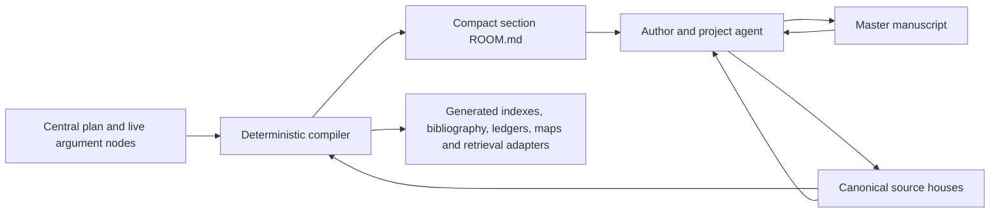

# The Return of Zero — Working-System Redesign

## Decision

The project will have one place where the essay is written, one compact support room for each section, and one canonical house for each source. Every index, ledger, matrix, retrieval adapter and propagation report will be rebuilt from those objects. The human surface becomes small because the system moves its repetition into code, not because the sources or argument have been compressed.

The three live objects are:

1. `submission-package/essay/THE-RETURN-OF-ZERO.md` — the whole essay, in its eight sections. This is where composition occurs.
2. `submission-package/essay/section-rooms/<room>/ROOM.md` — the section's earned positions, carry-forwards and exact paths into supporting material.
3. `submission-package/essay/symbolon/episteme/sources/<primary-domain>/<author>/<source-id>/SOURCE.md` — the source's bibliographic identity, reading map, passages, historical detail, worked examples, interpretation, uses and debts. Filed by the work's own epistemic domain and then by author (reorganized 2026-07-22); resolve `source_id` via `tools/source_resolver.py`.

`READING.md` and `SCRATCH.md` are optional room companions. They exist only where they add a genuine reading sequence or give Frank a temporary section pad. Neither becomes a second manuscript.

## What the present system is doing to the work

The problem is structural and measurable.

- The §0/1 pilot surrounds a 58-word draft placeholder with 15,696 words across context, reading path, dossier, scholarly edition and plate files.
- All eight room drafts together contain 436 words of frontmatter and instructions; the room system around them contains 47,946 words.
- The source bank currently has 83 source records, 43 files under `quotes/` including its template and index, and a separate Kaplan study dossier. One book is therefore distributed across record, study, future quote dossier, room reading path, ledger and generated maps.
- Six manually maintained source-wide views contain 43,098 words, including a 34,235-word evidence board. Their repeated facts can drift independently.
- The Kaplan study already contains the useful object: historical scenes, page map, mathematical workbenches, passage/provenance ledger and paragraph consumers. The source record then tells the reader to leave the source record and reconstruct the book elsewhere.
- The §0/1 reading path repeats quotations and introduces generic prohibitions around inferences the live passage was not making. Its Kaplan handoff says what Kaplan may not prove before the writer has made the prohibited claim. This is the sentence-architecture of the failure: an absent opponent occupies the room and the actual source becomes secondary.

The previous room redesign improved generated contexts while preserving the underlying premise that a section needs several parallel explanatory surfaces. The result is cleaner redundancy. This redesign removes the premise.

## The new architecture



The plan and live nodes remain the canonical argument graph. They serve retrieval and verification behind the writing surface. The master manuscript is the essay's authored body. Rooms receive the argument graph as a concise section-local refraction. Source houses retain full material depth. Generated views make the corpus searchable without becoming additional authorities.

### 1. The manuscript plane

Create `submission-package/essay/THE-RETURN-OF-ZERO.md` with the eight established section headings:

- §0/1 — Integral Threshold
- §0 — Differentiating Mind
- §1 — Return of Zero
- §2 — Two Logics
- §3 — Mathematical Substrate
- §4 — Psychoid Flowering
- §5 — Objective Internality
- §5→0 — Instrument Returns

Each heading carries a stable section anchor. Paragraph anchors are added only where active pair-writing or citation requires them; prose should never become a database dump. The current `10-FRANK-DRAFT.md` files contribute any authored prose during migration, then become `SCRATCH.md` files or retire if empty.

The manuscript is sovereign in the practical sense: generators never write into it. An agent edits it only when Frank authorises composition or revision. Source work, graph maintenance and room generation can proceed without touching its wording.

### 2. The room plane

Every room has one required file:

```text
section-rooms/<room>/
  ROOM.md          # required; compact generated-plus-protected support
  READING.md       # optional; a cross-source itinerary when sequence matters
  SCRATCH.md       # optional; Frank's temporary section pad
  VISUALS.md       # optional; only for an admitted plate or diagram
```

`ROOM.md` is a wholly generated waypoint file, not a miniature essay or tutorial. Its target is 500–900 words. The compiler reads only the central plan and canonical section/argument nodes; corrections are made at those sources and rebuilt. It performs no protected-region merge. The file contains:

1. **Arrival** — the position inherited from the preceding section.
2. **Section wager** — the positive movement this section must accomplish.
3. **Six waypoints** — for each movement:
   - incoming pressure;
   - earned position;
   - outgoing carry-forward;
   - direct links to the controlling argument node and exact source-house passage anchors.
4. **Release** — what the next section may now inherit.
5. **Live writing location** — a link to the corresponding manuscript anchor and, when present, the scratchpad.

No full quotation, reading tutorial, status table, bibliography or copied argument prose belongs in `ROOM.md`. Its summaries are concise because every detail remains one click away in a canonical node or source house.

`READING.md` is admitted when a section needs an order across several sources that no single source house can supply. It gives a short sequence of linked passage anchors and the question joining them. It does not reproduce those passages. The §0/1 path can therefore retain its real cross-source sequence while shedding copied extracts, repeated boundaries and instructions on how to operate the repository.

`SCRATCH.md` is a pad. It has no canonical status and no generator. Frank may write there at section scale, then move finished prose into the master manuscript. Agents may propose there only under the task's stated authority.

### 3. The source plane

Each recoverable work receives one directory and one canonical Markdown file, filed by the work's own epistemic domain and then by author:

```text
source-bank/sources/<primary-domain>/<author>/<source-id>/
  SOURCE.md
  attachments/     # lawful local carriers, OCR witnesses or notes where permitted
```

`SOURCE.md` begins with a compact human entry and unfolds to full depth:

```markdown
---
source_id: kaplan-1999-nothing-that-is
source_tier: main
main_source_for: [§1]
bibliographic_status: verified
citation_status: citation-ready
quotation_status: excerpts-unverified
local_carriers: [...]
---

# Robert Kaplan — The Nothing That Is

## Why this source matters here
## Edition and lawful-use state
## Reading map
## Historical route
## Mathematical workbenches
## Passages
### kaplan-1999-nothing-that-is-p001 — [descriptive title]
## Essay uses
## Qualifications and contested points
## Open acquisition and verification work
```

Every passage heading has a stable ID. A passage card records exact or paraphrased text, edition and locator, provenance, quotation state, source relation, historical context, commentary, and named manuscript/argument consumers. The source house contains the single canonical transcription. Authored manuscript prose may quote that passage while retaining its passage ID and locator; generated ledgers and parallel quote-authority files may not reproduce the transcription.

A book-length source may contain thousands of useful words. Fullness is a feature at this layer. The opening sections and table of contents keep it navigable; stable anchors let a room or agent open the needed passage directly. Progressive retrieval means opening the full canonical material when relevant, never replacing it with a lossy digest.

### Kaplan as the first migration

Merge these objects into `sources/kaplan-1999-nothing-that-is/SOURCE.md`:

- `records/kaplan-1999-nothing-that-is.md`;
- `study-dossiers/kaplan-1999-nothing-that-is-study.md`;
- any later verified Kaplan passage cards.

Preserve the present study's historical spine, printed/PDF locator map, mathematical workbenches, passage ledger, exercises, corrections and acquisition card. The merge removes navigation overhead; it does not shorten the teaching. The source house opens with “why this matters,” then allows entry by historical scene, mathematical operation, passage ID or section consumer.

Kaplan is `main_source_for: [§1]`. That field generates a human `MAIN-SOURCES.md` view organised by essay section, so the main sources no longer appear as one flat alphabetic bank. A stable source path prevents moves whenever a source later serves another section. “Main” is a declared relation to a section, not a second copy or a fragile folder class.

### 4. The generated plane

The following are projections and should be generated into a clearly marked build directory or reproduced by one command:

- source-bank index;
- main sources by section;
- working bibliography;
- quote/passage ledger;
- source-consumption matrix;
- granular section-source map;
- section evidence board;
- room source lists;
- BKMR record, passage, argument and section adapters;
- migration and integrity reports.

Generated files carry a header naming their generator, source hashes and “do not edit” status. They can be deleted and rebuilt. The repository will never ask a person or agent to update six views by hand after changing one passage.

## Authority and write rules

| Object | Authority | Edited by | Verification |
|---|---|---|---|
| Master manuscript | authored essay | Frank; agent when authorised | protected diff + prose audit |
| Central plan and live nodes | canonical argument | authorised argument work | graph and locked-expression tests |
| `ROOM.md` | section-local refraction | compiler only; edit canonical nodes and rebuild | round-trip, size, link and coverage tests |
| `READING.md` | human reading itinerary | Frank/agent | anchor resolution + nonduplication |
| `SCRATCH.md` | temporary author pad | Frank; agent when authorised | excluded from generation |
| `SOURCE.md` | source identity and learning material | source workflow | edition, locator, passage and consumer tests |
| Generated projections | disposable views | compiler only | reproducibility and freshness |

Authority distinctions remain metadata and behaviour. They do not require distinct files for source identity, quote text and study commentary. The source relation attached to each passage—extracted, paraphrased, argued from or resonant with—preserves the epistemic distinction inside one navigable house.

## Retrieval and pair-writing contract

A request made from the manuscript should return the smallest complete writing packet:

- current section, movement and paragraph function;
- incoming and outgoing earned positions;
- the exact source-house passages that bear the move;
- passage locator and quotation state;
- relevant historical or mathematical detail;
- the source's positive contribution to this paragraph;
- a live qualification only where the paragraph, argument or source makes it necessary.

The agent can then explain, retrieve, compare, propose or draft at the requested grain. It should never answer “what does Kaplan give me here?” with a list of the whole book, a generic claim boundary or a new dossier. It opens the live manuscript position, follows the room link into the relevant Kaplan anchors, and works from those materials.

## Migration sequence

### Phase 0 — establish a reversible baseline

- Record hashes and IDs for every current canonical source, quote, study and room file.
- Classify current files as canonical input, authored prose, generated view or legacy witness.
- Make no destructive deletion during the pilot.

### Phase 1 — build the source-house schema and compiler

- Define the `SOURCE.md` schema and stable passage-anchor grammar.
- Teach the compiler to derive indexes, bibliography, passage ledger, consumer maps and retrieval adapters.
- Add provenance-preserving importers for the current record, quote and study forms.
- Mark the existing projections read-only while both systems coexist.

### Phase 2 — create the master manuscript skeleton

- Create the eight-section document with stable anchors.
- Move any real prose from room drafts; preserve empty room files as migration witnesses until parity is confirmed.
- Change project tools so “current writing position” always resolves into the master document.

### Phase 3 — migrate Kaplan and §0/1 as the real pilot

- Merge Kaplan's record and study without losing a heading, exercise, locator, correction or acquisition debt.
- Convert the §0/1 context into `ROOM.md`.
- Convert only the genuinely cross-source sequence into `READING.md`, using passage links instead of copied extracts.
- Point the manuscript's §0/1 heading and the §1 Kaplan consumers at the new objects.
- Run the human and agent acceptance journeys below.

### Phase 4 — migrate sources one object at a time

- Merge each record, quote dossier and study by `source_id`.
- Compare every source and passage field against the baseline manifest.
- Regenerate all projections after every bounded wave.
- Retire old canonical forms only when the new house passes parity and retrieval tests.

### Phase 5 — simplify all rooms

- Generate the eight waypoint rooms from the plan and live nodes.
- Admit a `READING.md` only where source order does real pedagogical work.
- Preserve actual plates; retire speculative plate scaffolds.
- Replace every room-draft link with the master manuscript or optional scratchpad.

## Acceptance tests

### Deterministic integrity

The real workspace must fail when any of these conditions occurs:

- two canonical source houses declare the same `source_id`;
- a passage ID is duplicated or a room link does not resolve;
- two source/quote authority objects contain the same canonical source transcription;
- manuscript quotation copied from a source house has lost its passage ID or locator relation;
- a passage lacks the edition, locator, provenance or quotation-state fields required by its use;
- a generated projection differs from a clean rebuild;
- a generated projection is edited directly;
- an affected room, index or retrieval adapter is stale after a source change;
- a protected manuscript or Frank-authored scratch surface changes without authorisation;
- a required room exceeds its agreed size or contains embedded source quotations;
- the master manuscript lacks any of the eight section anchors.

Tests use the actual compiler, retrieval command and files in an isolated copy or worktree. Fixtures represent bounded real repository states; they are not mocked substitutes for the system.

### Kaplan parity

The migrated Kaplan house must preserve every current substantive unit: edition identity, page offset, five-stage historical spine, five guiding questions, division-by-zero proof, mediant construction, von Neumann exercise, NOR and NAND distinction, passage/provenance ledger, essay consumers and acquisition card. A heading-level and semantic parity report is inspected before the prior record and study retire.

### Human journey

From `THE-RETURN-OF-ZERO.md`, Frank can:

1. see where §1 currently stands;
2. open the §1 room and grasp its earned route without scrolling through a miniature essay;
3. follow one link into Kaplan's relevant historical scene or workbench;
4. read enough of the source to learn it;
5. return to the manuscript and write.

The pilot fails if this journey requires a command, a generated evidence board, knowledge of artifact classes, or reconstruction across source record and quote dossier.

### Agent journey

Given “I am at this paragraph; what does Kaplan give me here?”, a fresh project agent must:

1. identify the current manuscript anchor and paragraph function;
2. recover the room's incoming and outgoing positions;
3. open the correct Kaplan passage anchors;
4. return historical detail, mathematical operation, locators and quotation state;
5. relate them to the actual paragraph;
6. avoid inventing an objection or creating a new artifact class.

The score gives practical usefulness to writing and correct file placement separate tests.

## Failure modes this design must continue to resist

- A compact room slowly becomes another dossier.
- A generated index becomes an authority because it is easier to open.
- Source houses lose historical texture in the name of schema compliance.
- Passage anchors fragment a book into quote-mining rather than support sustained reading.
- “Main source” becomes a second physical copy.
- Reading paths repeat quotations and boundaries rather than link into full material.
- The master manuscript acquires metadata scaffolding that interrupts prose.
- A validator begins adjudicating philosophical relevance.
- An agent treats citation status as permission to weaken the essay's derivation.
- Migration deletes old objects before parity can be demonstrated.

The cure for these failures is a clear division of labour. Code owns identity, links, hashes, propagation and reproducibility. The agent owns source interpretation, relevance, teaching, synthesis and prose. Frank owns the essay's argument and final form.

## Completion criterion

The redesign is complete when the old room drafts and split source authorities can be retired without losing content; all repeated views rebuild from canonical objects; Kaplan and §0/1 pass both journeys; and Frank can live in one manuscript while rooms and sources remain immediately available at the grain of the paragraph he is writing.
